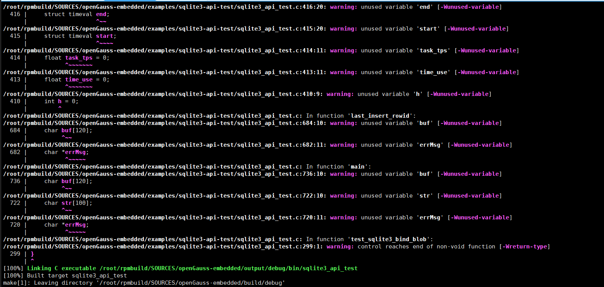

# 在Risc-V环境中make测试openGauss-embedded的sql引擎支持类型

## 一、openGauss-embedded 简介
openGauss-embedded 是基于 openGauss 数据库内核深度裁剪和轻量化改造的 嵌入式数据库版本，旨在满足 IoT、边缘计算、智能终端等对资源占用敏感、部署灵活性要求高的场景。它保留了 openGauss 在事务处理、SQL 支持和数据一致性等核心能力的同时，大幅降低运行时资源消耗，支持在多种嵌入式操作系统和国产化平台上运行。

## 核心特性：
✅ 轻量级架构：移除重型依赖，精简内核，显著减少可执行体积与内存占用

✅ 嵌入式部署支持：可集成于其他系统组件中运行，支持动态链接与静态编译

✅ 跨平台兼容性：适配多种 CPU 架构（x86_64、ARM、RISC-V），兼容主流嵌入式 Linux 系统

✅ 快速启动与低功耗运行：优化初始化流程，提升冷启动速度

✅ 数据库核心能力保留：支持标准 SQL 查询、事务隔离、数据一致性保障

✅ 丰富的构建配置选项：支持 release_lite、test_lite 等构建目标，可灵活集成测试、调试或裁剪功能

## 二、编译指导
##### 1、操作系统和软件依赖要求

操作系统：

-   riscv64 


编译工具：
-   GCC >= 7.3
-   CMAKE >= 3.15
-   jdk11

##### 2、拉取源码并进入目录
```
git clone https://gitee.com/opengauss/openGauss-embedded.git
cd openGauss-embedded
```


#### 修改多个c文件源码
具体修改差异： [RISC-V-openGauss-embedded.patch](.\RISC-V-openGauss-embedded.patch)


##### 3、在类UNIX系统编译


- make test: 编译生成debug版本，同时会编译src/compute/sql/test目录

 
 


#### 三、运行指导

编译完成后，会在工程目录下生成output目录，当前生成两个测试demo提供对嵌入式数据库的测试。

```
output目录结构如下：
├── debug   # 使用make/make debug/make test编译时debug版本存储引擎和SQL引擎的可执行文件和库文件保存路径
│   ├── bin # debug版本可执行文件保存路径
│   └── lib # debug版本库文件保存路径
├── inc     # 第三方库文件的头文件保存路径，同以前
│   ├── cJSON
│   ├── huawei_security
│   ├── libpg_query
│   ├── libutf8proc
│   ├── zlib
│   └── fmt 
└── release  # 使用make release 编译时release版本存储引擎和SQL引擎的可执行文件和库文件保存路径
    ├── bin  # release版本可执行文件保存路径
    └── lib  # release版本库文件保存路径
```
---
1.运行sql引擎单元测试用例

```
bash testshell.sh sql
```
---
 
 

测试结果说明：20个测试只有一个 **type_test** 由于时区不一致测试失败，Unix 时间戳是基于 UTC（协调世界时）的，而本系统中使用了本地时间 (CST/UTC+8)来创建时间戳，导致期望值和实际值差了8小时。
 

2. 测试sql语句支持的类型字符串
   进入build/debug/src/compute/sql/test目录   
   执行`./pg_type_test` 时，会测试固定的37种sql语句类型关键字
    
    
  
 
测试结果说明：37个测试其中有2个测试失败；

(1)BYTEA

SQL: CREATE TABLE type_test_table (t BYTEA);

结果：PostgreSQL 语法解析成功（pg parse suc）

但 OpenGauss SQL 引擎不支持 BYTEA 类型（engine 不支持）

导致断言失败：Expected: true, Actual: false

(2)VARBINARY

SQL: CREATE TABLE type_test_table (t VARBINARY);

结果：PostgreSQL 语法解析成功

但 SQL 引擎同样不支持该类型

同样断言失败
## 最终结论
✅ RISC-V make测试成功  
✅ SQL 引擎支持不支持  BYTEA和 VARBINARY两种类型
