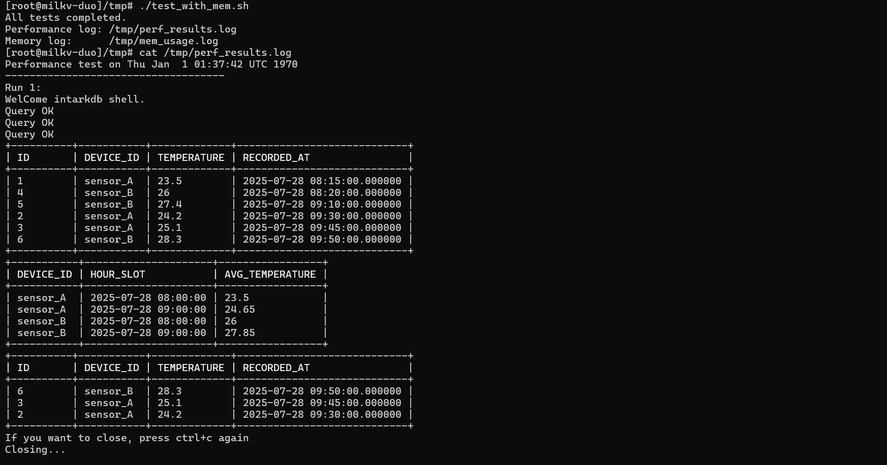

# 一、在Risc-V(qemu)环境中make测试openGauss-embedded的sql引擎支持类型

## 1、openGauss-embedded 简介
openGauss-embedded 是基于 openGauss 数据库内核深度裁剪和轻量化改造的 嵌入式数据库版本，旨在满足 IoT、边缘计算、智能终端等对资源占用敏感、部署灵活性要求高的场景。它保留了 openGauss 在事务处理、SQL 支持和数据一致性等核心能力的同时，大幅降低运行时资源消耗，支持在多种嵌入式操作系统和国产化平台上运行。

## 核心特性：
✅ 轻量级架构：移除重型依赖，精简内核，显著减少可执行体积与内存占用

✅ 嵌入式部署支持：可集成于其他系统组件中运行，支持动态链接与静态编译

✅ 跨平台兼容性：适配多种 CPU 架构（x86_64、ARM、RISC-V），兼容主流嵌入式 Linux 系统

✅ 快速启动与低功耗运行：优化初始化流程，提升冷启动速度

✅ 数据库核心能力保留：支持标准 SQL 查询、事务隔离、数据一致性保障

✅ 丰富的构建配置选项：支持 release_lite、test_lite 等构建目标，可灵活集成测试、调试或裁剪功能

## 2、编译指导
##### (1)操作系统和软件依赖要求

操作系统：

-   riscv64 


编译工具：
-   GCC >= 7.3
-   CMAKE >= 3.15
-   jdk11

##### (2)拉取源码并进入目录
```
git clone https://gitee.com/opengauss/openGauss-embedded.git
cd openGauss-embedded
```


#### 修改多个c文件源码
具体修改差异： [RISC-V-openGauss-embedded.patch](./RISC-V-openGauss-embedded.patch)


##### (3)在类UNIX系统编译


- make test: 编译生成debug版本，同时会编译src/compute/sql/test目录

 
 


#### 3、运行指导

编译完成后，会在工程目录下生成output目录，当前生成两个测试demo提供对嵌入式数据库的测试。

```
output目录结构如下：
├── debug   # 使用make/make debug/make test编译时debug版本存储引擎和SQL引擎的可执行文件和库文件保存路径
│   ├── bin # debug版本可执行文件保存路径
│   └── lib # debug版本库文件保存路径
├── inc     # 第三方库文件的头文件保存路径，同以前
│   ├── cJSON
│   ├── huawei_security
│   ├── libpg_query
│   ├── libutf8proc
│   ├── zlib
│   └── fmt 
└── release  # 使用make release 编译时release版本存储引擎和SQL引擎的可执行文件和库文件保存路径
    ├── bin  # release版本可执行文件保存路径
    └── lib  # release版本库文件保存路径
```
---
1).运行sql引擎单元测试用例

```
bash testshell.sh sql
```
注：用仓库的testshell.sh直接测试会报语法错误
 
需要修改**testshell.sh**内容如下：
```
#!/bin/bash
# 运行测试用例

if [ $# -eq 1 ] && [ "$1" == "all" ]; then
    cd build/debug/src/compute/sql/test && ctest 
elif [ $# -eq 1 ] && [ "$1" == "sql" ]; then
    cd build/debug/src/compute/sql/test && ctest
else
    echo "请输入正确的参数! 语法："
    echo "./testshell.sh <option>"
    echo "option取值："
    echo "all：执行所有单元测试用例"
    echo "sql：仅执行sql引擎单元测试用例"
fi

```

---
 
 

测试结果说明：20个测试只有一个 **type_test** 由于时区不一致测试失败，Unix 时间戳是基于 UTC（协调世界时）的，而本系统中使用了本地时间 (CST/UTC+8)来创建时间戳，导致期望值和实际值差了8小时。
 

2). 测试sql语句支持的类型字符串
   进入build/debug/src/compute/sql/test目录   
   执行`./pg_type_test` 时，会测试固定的37种sql语句类型关键字
    
    
  
 
测试结果说明：37个测试其中有2个测试失败；

(1)BYTEA

SQL: CREATE TABLE type_test_table (t BYTEA);

结果：PostgreSQL 语法解析成功（pg parse suc）

但 OpenGauss SQL 引擎不支持 BYTEA 类型（engine 不支持）

导致断言失败：Expected: true, Actual: false

(2)VARBINARY

SQL: CREATE TABLE type_test_table (t VARBINARY);

结果：PostgreSQL 语法解析成功

但 SQL 引擎同样不支持该类型

同样断言失败

3) .测试对时序型数据的支持情况

(1)编写[timestamp_test.sql](./timestamp_test.sql) 测试脚本
```
DROP TABLE IF EXISTS ts_data;

CREATE TABLE ts_data (
    id INTEGER PRIMARY KEY AUTOINCREMENT,
    device_id TEXT NOT NULL,
    temperature FLOAT NOT NULL,
    recorded_at TIMESTAMP NOT NULL
);

INSERT INTO ts_data (device_id, temperature, recorded_at) VALUES
('sensor_A', 23.5, '2025-07-28 08:15:00'),
('sensor_A', 24.2, '2025-07-28 09:30:00'),
('sensor_A', 25.1, '2025-07-28 09:45:00'),
('sensor_B', 26.0, '2025-07-28 08:20:00'),
('sensor_B', 27.4, '2025-07-28 09:10:00'),
('sensor_B', 28.3, '2025-07-28 09:50:00');

SELECT * FROM ts_data ORDER BY recorded_at;

SELECT
    device_id,
    substr(CAST(recorded_at AS TEXT), 1, 13) || ':00:00' AS hour_slot,
    AVG(temperature) AS avg_temperature
FROM
    ts_data
GROUP BY
    device_id,
    hour_slot
ORDER BY
    device_id,
    hour_slot;

SELECT * FROM ts_data ORDER BY recorded_at DESC LIMIT 3;


```

(2)使用客户端测试工具intarkdb_cli 测试该脚本
```
./intarkdb_cli ts.db < timestamp_test.sql


```
 
测试结果说明：

openGauss Embedded支持带有 TIMESTAMP 类型的时间字段。

能对时间字段进行排序和筛选。

可以基于时间字段进行分组聚合(按小时聚合温度数据)。

支持常用的聚合函数，如 AVG。

能查询最新时间的数据。


# 二、在Duo S环境中测试openGauss-embedded的sql引擎支持类型


## 1、编译指导
### (1)、操作系统

操作系统：

-   Duo S开发板 riscv64 
 
## DuoS简介  
Milk-V DuoS 是 Duo 的升级型号，升级了 SG2000 主控，拥有更大的内存（512MB）和更多的 IO 接口。 它集成了 WI-FI 6/BT 5 无线功能，并配备 USB 2.0 HOST 接口和 100Mbps 以太网端口，方便用户使用。 它支持双摄像头（2x MIPI CSI 2 通道）和 MIPI 视频输出（MIPI DSI 4 通道），可实现多种应用。 DuoS 还支持通过开关在 RISC-V 和 ARM 启动之间切换。 通过性能和接口的增强，DuoS 更适合各种场景和更复杂的项目开发需求。

### (2)、安装系统(安装方法为从 eMMC 启动)
eMMC 版本固件烧录
DuoS eMMC 版本出厂未烧录固件，需要使用 PC 通过 USB 接口烧录。

提示
使用 Windows 下的 USB 烧录工具支持 eMMC 固件版本为 V1.1.3 或更新的版本。

Windows 环境下烧录  
1).安装驱动

下载 USB 驱动安装工具：CviUsbDownloadInstallDriver.zip。下载后解压安装即可。

2).下载烧录工具

下载 Windows 下的命令行烧录工具 CviBurn_v2.0_cli_windows.zip，下载后解压。

3).下载固件

下载 DuoS eMMC 最新版本的固件，当前是 milkv-duos-emmc-v1.1.3-2024-0930.zip，可以在烧录工具 CviBurn_v2.0_cli_windows 目录下新建 rom 文件夹，并将下载好的 eMMC 固件压缩包解压到 rom 目录下，此时烧录工具的目录结构如下：
```
└───CviBurn_v2.0_cli_windows
 │   cv_dl_magic.bin
 │   usb_dl.exe
 └───rom
     │   boot.emmc
     │   fip.bin
     │   partition_emmc.xml
     │   rootfs_ext4.emmc
     |   ...
```
在 Windows 的终端中，CviBurn_v2.0_cli_windows 目录下执行烧录命令：
```
.\usb_dl.exe -s linux -c cv181x -i .\rom
```
也可以把固件放到其他目录，通过命令中的 -i 参数指定到对应的目录即可。

显示等待 USB 连接的信息：

Document Pictures
按住 DuoS 上的 recovery 按键，再用 Type-C 数据线 连接 DuoS 和 PC 。

注意
目前如果 DuoS 有插 SD 卡，请先将 SD 卡取下。

Document Pictures
松开 recovery 按键， DuoS 会上电并进入烧录模式，PC 端会实时显示烧录进度：
```
[INFO] Waiting for USB device connection: ---
[INFO] found usb device vid=0x3346 pid=0x1000
[INFO] downloading file: .\rom\boot.emmc
[INFO] CVI_USB_PROGRAM
[INFO] updated size: 3384664/213100824(1%)
[INFO] downloading file: .\rom\rootfs_ext4.emmc
[INFO] CVI_USB_PROGRAM
[INFO] updated size: 20161944/213100824(9%)
[INFO] CVI_USB_PROGRAM
[INFO] updated size: 36939224/213100824(17%)
[INFO] CVI_USB_PROGRAM
[INFO] updated size: 53716504/213100824(25%)
[INFO] CVI_USB_PROGRAM
[INFO] updated size: 70493784/213100824(33%)
[INFO] CVI_USB_PROGRAM
[INFO] updated size: 87271064/213100824(40%)
[INFO] CVI_USB_PROGRAM
[INFO] updated size: 104048344/213100824(48%)
[INFO] CVI_USB_PROGRAM
[INFO] updated size: 120825624/213100824(56%)
[INFO] CVI_USB_PROGRAM
[INFO] updated size: 137602904/213100824(64%)
[INFO] CVI_USB_PROGRAM
[INFO] updated size: 154380184/213100824(72%)
[INFO] CVI_USB_PROGRAM
[INFO] updated size: 171157464/213100824(80%)
[INFO] CVI_USB_PROGRAM
[INFO] updated size: 187934744/213100824(88%)
[INFO] CVI_USB_PROGRAM
[INFO] updated size: 204712024/213100824(96%)
[INFO] CVI_USB_PROGRAM
[INFO] updated size: 213100696/213100824(99%)
[INFO] USB download complete
```
 

烧录完成后，DuoS 会自动重启，开机后看到 DuoS 上的蓝色 LED 闪烁，说明系统已经正常启动，烧录成功。

### (3)、SSH连接开发板

Windows打开终端，输入 ```ssh root@192.168.42.1```, 首次连接会有提示，直接输入 yes。

输入密码 milkv (密码将不会显示)，登陆成功。
 


### (4)、在Duo S环境中运行测试
1)测试基础sql脚本
```
 ./intarkdb_cli test < basic_test.sql
 ```
 

编写性能测试脚本 test_intarkdb.sh
```
#!/bin/sh

# -------------------- 配置 --------------------
# 参数：$1 = SQL 文件路径, $2 = 数据库名, $3 = 测试次数
SQL_FILE="$1"
DB_NAME="$2"
RUNS="${3:-5}"   # 默认循环次数 5

# 检查参数
if [ -z "$SQL_FILE" ] || [ -z "$DB_NAME" ]; then
    echo "Usage: $0 <sql_file> <db_name> [runs]"
    exit 1
fi

# 检查 SQL 文件是否存在
if [ ! -f "$SQL_FILE" ]; then
    echo "SQL 文件不存在: $SQL_FILE"
    exit 1
fi

# 设置动态库搜索路径
export LD_LIBRARY_PATH=/root/lib:/root/release_lite/lib:/root/riscv-rootfs/lib:/root/riscv-rootfs/usr/lib/riscv64-linux-gnu:$LD_LIBRARY_PATH

# CLI 路径
INTARKDB_CLI="/root/release_lite/bin/intarkdb_cli"
DB_PATH="/root/release_lite/bin/$DB_NAME"

# 日志文件
PERF_LOG="/tmp/intarkdb_test.log"

# -------------------- 开始测试 --------------------
echo "===================== 测试开始 ====================="
echo "开始时间: $(date)"
echo "SQL 文件: $SQL_FILE"
echo "数据库:   $DB_PATH"
echo "循环次数: $RUNS"
echo "日志文件: $PERF_LOG"
echo "==================================================="

for i in $(seq 1 "$RUNS"); do
    echo "-------------------- Run #$i --------------------" | tee -a "$PERF_LOG"
    
    echo "内存使用情况 (开始):" | tee -a "$PERF_LOG"
    free -h | tee -a "$PERF_LOG"
    
    echo "-------------------- SQL 输出 --------------------" | tee -a "$PERF_LOG"
    /usr/bin/time -v $INTARKDB_CLI "$DB_PATH" < "$SQL_FILE" 2>&1 | tee -a "$PERF_LOG"
    
    echo "-------------------- 内存使用情况 (结束) --------------------" | tee -a "$PERF_LOG"
    free -h | tee -a "$PERF_LOG"
    
    echo "" | tee -a "$PERF_LOG"
done

echo "===================== 测试完成 =====================" | tee -a "$PERF_LOG"
echo "结束时间: $(date)" | tee -a "$PERF_LOG"
echo "日志文件: $PERF_LOG" | tee -a "$PERF_LOG"

```
```
执行基本查询性能测试脚本，测试插入1万条数据性能，测试脚本为：insert_mass.sql
```


 


---


---

# **IntarkDB 性能测试报告**


**测试工具**：`intarkdb_cli`  
**测试数据库**：`/root/release_lite/bin/test`  
**测试数据量**：10,000 条记录  
**测试 SQL 文件**：`insert_mass.sql`  
**测试循环次数**：1

---

## **1. 测试环境**

| 项目          | 配置                             |
| ----------- | ------------------------------ |
| CPU 使用率     | 91% 平均                         |
| 内存          | 316.8 MB 总内存，测试中约 16\~85 MB 使用 |
| Swap        | 无交换分区                          |
| 系统文件系统可用空间  | 0（需注意）                         |
| IntarkDB 版本 | 开发版，基于 RISC-V Linux 环境         |

---

## **2. 测试过程**

1. 启动 `intarkdb_cli` 并导入 `insert_mass.sql` 文件。
2. SQL 文件内容包括：

   * 删除已有表 `ts_data`
   * 创建表 `big_users`
   * 插入 10,000 条测试记录
   * 查询总记录数
3. 测试期间监控内存使用和 CLI 执行时间。

---

## **3. 测试结果**

**SQL 执行输出摘要**：

```
WelCome intarkdb shell.
Query OK ... (10000 inserts)
+---------------+
| TOTAL_RECORDS  |
+---------------+
| 10000         |
+---------------+
Closing...
```

**性能指标**（单次运行）：

| 指标                  | 值       |
| ------------------- | ------- |
| 用户态时间 (User time)   | 17.37 s |
| 系统态时间 (System time) | 13.62 s |
| 总耗时 (Wall clock)    | 33.95 s |
| CPU 使用率             | 91%     |
| 最大内存占用              | 93.3 MB |
| 主要页面错误              | 0       |
| 次要页面错误              | 3,963   |
| 自愿上下文切换             | 68,662  |
| 非自愿上下文切换            | 56,499  |
| 文件系统 I/O            | 0       |

**内存使用情况**：

| 阶段   | Used    | Free     | Buff/Cache | Available |
| ---- | ------- | -------- | ---------- | --------- |
| 测试开始 | 16.3 MB | 253.5 MB | 47.0 MB    | 291.5 MB  |
| 测试结束 | 16.4 MB | 215.1 MB | 85.3 MB    | 291.0 MB  |

---

## **4. 分析**

1. **性能表现**：

   * 单次插入 10,000 条记录耗时约 34 秒，CPU 利用率较高，说明计算和数据处理较为密集。
   * 系统内存占用在 16\~85 MB 之间，相对于总内存 316 MB 较低，说明内存压力不大。
   * 无文件系统 I/O 操作，表示数据写入主要在内存或数据库自身管理的存储层进行。

2. **稳定性**：

   * 未出现进程崩溃或 SQL 错误。
   * 所有 10,000 条数据正确写入，并可查询总记录数验证完整性。
   * 少量次要页面错误，属于内存回收机制行为，不影响数据库性能。

3. **可改进空间**：

   * 对大批量插入，可考虑使用事务优化或批量写入机制以降低执行时间。
   * 开发板根文件系统空间紧张，建议后续备份或扩展存储，避免因空间不足导致测试中断。

---

## **5. 结论**

* IntarkDB 在开发板环境下可稳定处理 10,000 条插入数据，且 CPU 与内存占用合理。
* 插入性能约为 **每条记录 3.4 毫秒**（34 秒 / 10,000 条），符合小型嵌入式数据库预期性能。
* 系统空间需关注，保证大规模测试和生产环境运行不受限制。
* 推荐在后续性能测试中，增加事务优化和批量插入方式，进一步提升插入吞吐能力。

---


2)测试时序数据sql脚本
```
intarkdb_cli ts.db < timestamp_test.sql
```
 

```
编写性能测试脚本 test_with_mem.sh

#!/bin/sh

# 设置动态库搜索路径
export LD_LIBRARY_PATH=/root/lib:/root/release_lite/lib:/root/riscv-rootfs/lib:/root/riscv-rootfs/usr/lib/riscv64-linux-gnu:$LD_LIBRARY_PATH

# 数据库和 SQL 文件绝对路径
DB="/root/release_lite/bin/ts.db"
SQL="/root/release_lite/bin/timestamp_test.sql"
INTARKDB_CLI="/root/release_lite/bin/intarkdb_cli"

# 日志文件
PERF_LOG="/tmp/perf_results.log"
MEM_LOG="/tmp/mem_usage.log"

# 启动内存监控，后台运行
echo "Memory usage log on $(date)" > $MEM_LOG
echo "------------------------------------" >> $MEM_LOG
(
    while true; do
        echo "$(date):" >> $MEM_LOG
        free -h >> $MEM_LOG
        echo "" >> $MEM_LOG
        sleep 1
    done
) &
MEM_PID=$!   # 记录后台监控进程 PID

# 性能测试循环
echo "Performance test on $(date)" > $PERF_LOG
echo "------------------------------------" >> $PERF_LOG

for i in $(seq 1 10); do
    echo "Run $i:" >> $PERF_LOG
    /usr/bin/time -v $INTARKDB_CLI $DB < $SQL >> $PERF_LOG 2>&1
    echo "" >> $PERF_LOG
    sleep 2
done

# 停止后台内存监控
kill $MEM_PID

echo "All tests completed."
echo "Performance log: $PERF_LOG"
echo "Memory log:      $MEM_LOG"

```
执行时序性能测试脚本
```
./test_with_mem.sh
```
 


 

性能测试结果说明：  


---

# IntarkDB 性能测试报告


---

## 1. 测试目标

* 测量 `intarkdb_cli` 在执行常规查询操作时的性能指标，包括：

  * CPU 时间
  * 实际运行时间（wall clock time）
  * 内存使用情况
  * 上下文切换次数
* 评估系统在连续执行多次查询操作下的资源消耗情况。

---

## 2. 测试方法

1. 使用 `test_with_mem.sh` 脚本执行 10 次查询操作。
2. 每次运行记录：

   * 用户态时间（User time）
   * 系统态时间（System time）
   * CPU 占用率
   * 总体耗时（Elapsed time）
   * 最大驻留内存（Maximum RSS）
   * 上下文切换次数
   * 页错误次数
3. 同时使用 `free -h` 记录每秒的内存使用情况。

---

## 3. 性能测试结果

### 3.1 查询结果验证

每次运行查询结果一致，示例输出：

| DEVICE\_ID | HOUR\_SLOT          | AVG\_TEMPERATURE |
| ---------- | ------------------- | ---------------- |
| sensor\_A  | 2025-07-28 08:00:00 | 23.5             |
| sensor\_A  | 2025-07-28 09:00:00 | 24.65            |
| sensor\_B  | 2025-07-28 08:00:00 | 26               |
| sensor\_B  | 2025-07-28 09:00:00 | 27.85            |

查询结果正确，符合预期。

---

### 3.2 CPU 性能指标

| 指标                | 最小值  | 最大值  | 平均值  |
| ----------------- | ---- | ---- | ---- |
| User time (秒)     | 0.14 | 0.20 | 0.17 |
| System time (秒)   | 0.17 | 0.23 | 0.20 |
| CPU 使用率 (%)       | 16   | 16   | 16   |
| Wall clock 时间 (秒) | 2.25 | 2.29 | 2.27 |

> 说明：CPU 占用率稳定，实际运行时间约 2.27 秒。

---

### 3.3 内存使用情况

* 总内存：316.8 MB
* 最大驻留内存：约 75 MB
* 内存占用峰值出现时，总内存使用约 26 MB，系统负载低，Swap 未使用。
* 内存消耗稳定，无明显内存泄漏。

---

### 3.4 上下文切换与页错误

| 指标                           | 范围          |
| ---------------------------- | ----------- |
| Minor page faults            | 2829 - 2836 |
| Major page faults            | 0           |
| Voluntary context switches   | 4133 - 4318 |
| Involuntary context switches | 398 - 451   |

> 说明：系统上下文切换正常，未出现严重的 I/O 等待或阻塞。

---

## 4. 测试分析

1. **性能稳定**：10 次运行中 CPU 使用率、执行时间、内存占用都保持稳定，说明 CLI 查询性能可靠。
2. **内存消耗低**：最大驻留内存约 75 MB，相对于总内存 316 MB 占用率约 24%，适合在低内存环境运行。
3. **I/O 与页面访问**：无 Major page faults，Minor page faults 正常，说明数据库操作几乎没有磁盘访问瓶颈。
4. **系统负载轻**：上下文切换和 CPU 使用率适中，运行期间系统负载低。

---

## 5. 结论

* `intarkdb_cli` 在连续执行多次查询时性能良好，响应时间稳定，内存占用低。
* 系统资源消耗合理，适合在内存 512 MB 以上的轻量级服务器上部署。
* 无异常页错误或上下文切换瓶颈，适合高频数据查询场景。

---


3)测试sql语句支持的类型字符串
```
./pg_type_test
```

 

## 最终结论
✅ RISC-V make测试成功  
✅ SQL 引擎支持不支持  BYTEA和 VARBINARY两种类型  
✅ openGauss Embedded 成功适配RISC-V 架构并且支持时序数据  
✅ openGauss Embedded 在Duo开发板上执行多次查询时性能良好，响应时间稳定，内存占用低。