# 一、DataVec向量数据库
openGauss DataVec 向量数据库是一个基于openGauss的向量引擎， 提供向量数据类型的存储、检索。在处理大规模高维向量数据时，能够提供快速、准确的检索结果。适用于智能知识检索、 检索增强生成 RAG(Retrieval-Augmented Generation) 等各种复杂应用场景的智能应用。

DataVec目前支持的向量功能有：精确和近似的最近邻搜索、L2距离&余弦距离&内积、向量索引、向量操作函数和操作符。作为openGauss的内核特性，DataVec使用熟悉的SQL语法操作向量，简化了用户使用向量数据库的过程。


## 1.编译安装
DataVec向量数据库可通过容器镜像安装快速部署，并快速对接大模型，打造本地RAG智能问答服务。

DataVec向量数据库可通过安装spqplugin_v2插件，在大数据量场景下获得数据库分布式存储检索能力。
## 2.SQL参考
### (1)向量数据库快速入门
创建向量表

```
示例1：创建一个带有3维向量的表。

openGauss=# CREATE TABLE items (val vector(3));
```
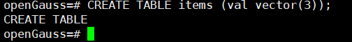

数据插入
```
示例2：向量数据的插入。

openGauss=# INSERT INTO items (val) VALUES ('[1,2,3]'), ('[4,5,6]');
```
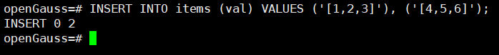


向量索引创建
```
示例3：索引创建。

openGauss=# CREATE INDEX ON items USING ivfflat (val vector_l2_ops) WITH (lists = 100);
openGauss=# CREATE INDEX ON items USING hnsw (val vector_cosine_ops) WITH (m = 16, ef_construction=200);

```


向量检索
```
示例4：计算最近邻。

openGauss=# SELECT * FROM items ORDER BY val <-> '[3,1,2]' LIMIT 5;
openGauss=# SELECT * FROM items ORDER BY val <#> '[3,1,2]' LIMIT 5;
openGauss=# SELECT * FROM items ORDER BY val <=> '[3,1,2]' LIMIT 5;
```
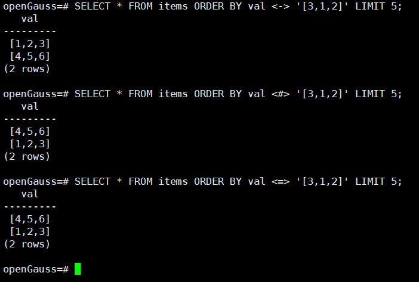

### (2)向量数据类型
Vector
```
示例1：

openGauss=# SELECT '[1,2,3]'::vector;
 vector  
---------
 [1,2,3]
(1 row)
```


Bit
```
示例2：

openGauss=# SELECT B'110';
 ?column? 
----------
 110
(1 row)
```
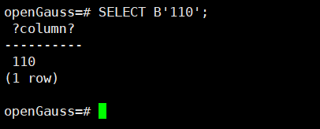


Sparsevec
```
示例3：

openGauss=# SELECT '{1:1.5,3:3.5}/5'::sparsevec;
    sparsevec    
-----------------
 {1:1.5,3:3.5}/5
(1 row)
```
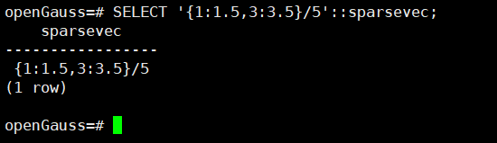


维度限制
```
示例4：
# vector指定维度
openGauss=# CREATE TABLE test1(val vector(3));
CREATE TABLE
openGauss=# INSERT INTO test1 (val) VALUES ('[1,2,3]');
INSERT 0 1
openGauss=# INSERT INTO test1 (val) VALUES ('[1,2,3,4]');
ERROR:  expected 3 dimensions, not 4
CONTEXT:  referenced column: val

# vector不指定维度
openGauss=# CREATE TABLE test2(val vector);
CREATE TABLE
openGauss=# INSERT INTO test2 (val) VALUES ('[1,2,3]');
INSERT 0 1
openGauss=# INSERT INTO test2 (val) VALUES ('[1,2,3,4]');
INSERT 0 1


# bit指定维度
openGauss=# CREATE TABLE test1(val bit(3));
CREATE TABLE
openGauss=# INSERT INTO test1 (val) VALUES ('101');
INSERT 0 1
openGauss=# INSERT INTO test1 (val) VALUES ('1010');
ERROR:  bit string length 4 does not match type bit(3)
CONTEXT:  referenced column: val

# bit不指定维度
openGauss=# CREATE TABLE test2(val bit);
CREATE TABLE
openGauss=# INSERT INTO test2 (val) VALUES ('1');
INSERT 0 1
openGauss=# INSERT INTO test2 (val) VALUES ('101');
ERROR:  bit string length 4 does not match type bit(1)
CONTEXT:  referenced column: val


# sparsevec指定维度
openGauss=# CREATE TABLE test1(val sparsevec(3));
CREATE TABLE
openGauss=# INSERT INTO test1 (val) VALUES ('{1:1,2:1,3:1}/3');
INSERT 0 1
openGauss=# INSERT INTO test1 (val) VALUES ('{1:1,2:1,3:1,4:1}/4');
ERROR:  expected 3 dimensions, not 4
CONTEXT:  referenced column: val

# sparsevec不指定维度
openGauss=# CREATE TABLE test2(val sparsevec);
CREATE TABLE
openGauss=# INSERT INTO test2 (val) VALUES ('{1:1,2:1,3:1}/3');
INSERT 0 1
openGauss=# INSERT INTO test2 (val) VALUES ('{1:1,2:1,3:1,4:1}/4');
INSERT 0 1

```
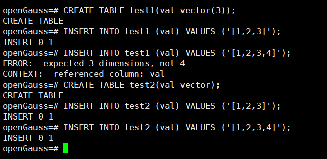
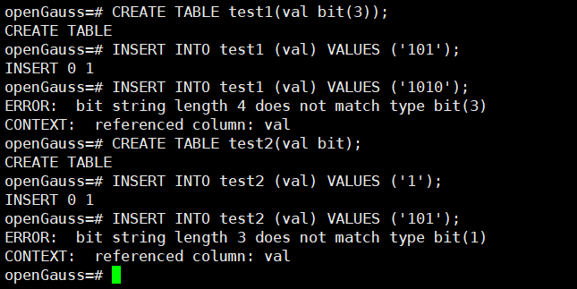
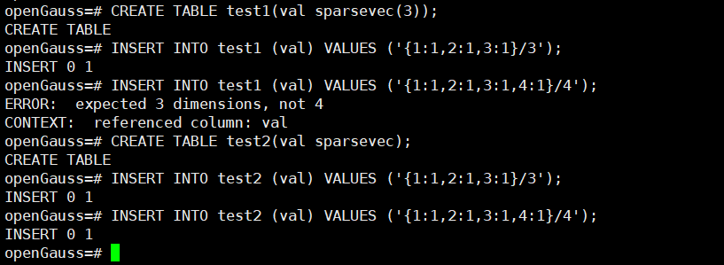

### (3)向量函数和操作符

Vector
```
描述：元素级加法。

示例：

openGauss=> select '[1,2,3]'::vector + '[4,5,6]';
 ?column? 
----------
 [5,7,9]
(1 row)


```
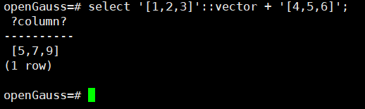


```
描述：元素级减法。

示例：

openGauss=> select '[1,2,3]'::vector - '[4,5,6]';
  ?column?  
------------
 [-3,-3,-3]
(1 row)
```
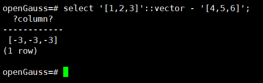


```
描述：元素级乘法。

示例：

openGauss=> select '[1,2,3]'::vector * '[4,5,6]';
 ?column?  
-----------
 [4,10,18]
(1 row)
```
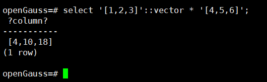


```
描述：等于。

示例：

openGauss=# select '[1,2,3]'::vector = '[4,5,6]';
 ?column? 
----------
 f
(1 row)
```
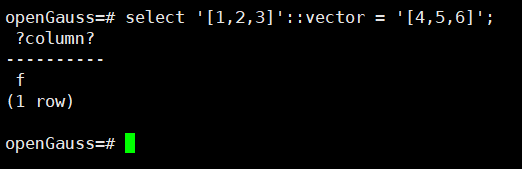


```
描述：不等于。

示例：

openGauss=# select '[1,2,3]'::vector <> '[4,5,6]';
 ?column? 
----------
 t
(1 row)
```
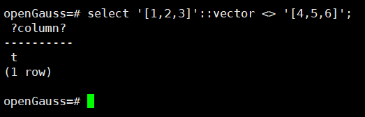


```
描述：向量拼接。

示例：

openGauss=> select '[1,2,3]'::vector || '[4,5,6]';
   ?column?    
---------------
 [1,2,3,4,5,6]
(1 row)
```
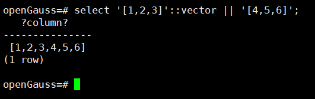


```
描述：欧几里得距离 (L2)。

示例：

openGauss=# SELECT '[0,0]'::vector <-> '[3,4]';
 ?column? 
----------
        5
(1 row)
```
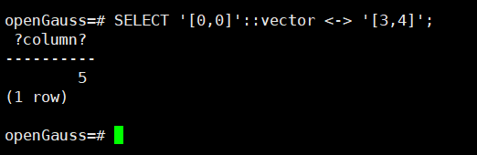


```
描述：负内积。

示例：

openGauss=# SELECT '[1,2]'::vector <#> '[3,4]';
 ?column? 
----------
      -11
(1 row)
```
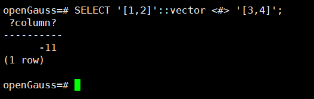


```
描述：余弦距离。

示例：

openGauss=# SELECT '[1,2]'::vector <=> '[2,4]';
 ?column? 
----------
        0
(1 row)
```
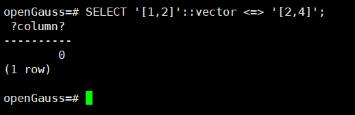


```
描述：曼哈顿距离。

示例：

openGauss=# SELECT '[0,0]'::vector <+> '[3,4]';
 ?column? 
----------
        7
(1 row)
```
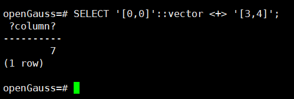


```
binary_quantize

描述：二进制量化，若元素大于0，则量化为1；若元素小于或等于0，则量化为0。

返回类型：bit

示例：

openGauss=# SELECT binary_quantize('[1,0,-1]'::vector);
 binary_quantize 
-----------------
 100
(1 row)
```
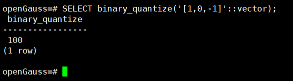


```
cosine_distance

描述：余弦距离。

返回类型：float8

示例：

openGauss=# SELECT cosine_distance('[1,2]'::vector, '[2,4]');
 cosine_distance 
-----------------
               0
(1 row)
```
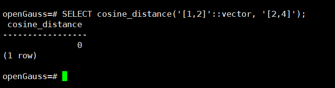


```
inner_product

描述：内积。

返回类型：float8

示例：

openGauss=# SELECT inner_product('[1,2]'::vector, '[3,4]');
 inner_product 
---------------
            11
(1 row)
```
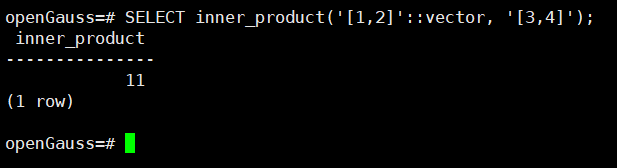


```
l1_distance

描述：曼哈顿距离 (L1)。

返回类型：float8

示例：

openGauss=# SELECT l1_distance('[0,0]'::vector, '[3,4]');
 l1_distance 
-------------
           7
(1 row)
```
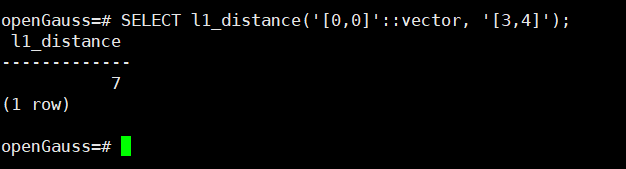


```
l2_distance

描述：欧几里得距离 (L2)。

返回类型：float8

示例：

openGauss=# SELECT l2_distance('[0,0]'::vector, '[3,4]');
 l2_distance 
-------------
           5
(1 row)
```
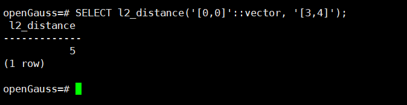


```
l2_normalize

描述：归一化（使用L2距离）。

返回类型：vector

示例：

openGauss=# SELECT l2_normalize('[3,4]'::vector);
 l2_normalize 
--------------
 [0.6,0.8]
(1 row)
```
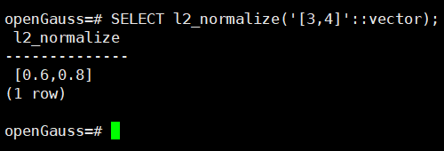


```
subvector

描述：截取子向量。

返回类型：vector

示例：

openGauss=# SELECT subvector('[1,2,3,4,5]'::vector, 1, 3);
 subvector 
-----------
 [1,2,3]
(1 row)
```
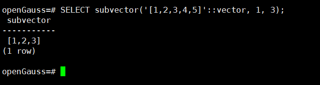


```
vector_dims

描述：向量的维度数。

返回类型：int

示例：

openGauss=# SELECT vector_dims('[1,2,3]'::vector);
 vector_dims 
-------------
           3
(1 row)
```
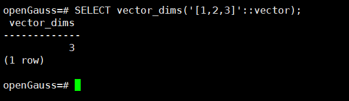


```
vector_norm

描述：欧几里得范数。

返回类型：float8

示例：

openGauss=# SELECT vector_norm('[3,4]');
 vector_norm 
-------------
           5
(1 row)
```
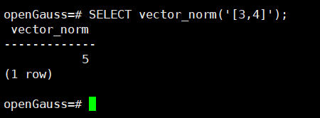


```
avg

描述：平均值。

返回类型：vector

示例：

openGauss=# SELECT avg(v) FROM unnest(ARRAY['[1,2,3]'::vector, '[3,5,7]']) v;
    avg    
-----------
 [2,3.5,5]
(1 row)
```
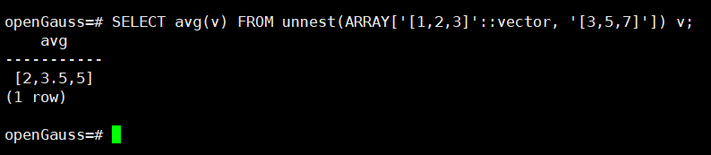


```
sum

描述：求和。

返回类型：vector

示例：

openGauss=# SELECT sum(v) FROM unnest(ARRAY['[1,2,3]'::vector, '[3,5,7]', NULL]) v;
   sum    
----------
 [4,7,10]
(1 row)
```
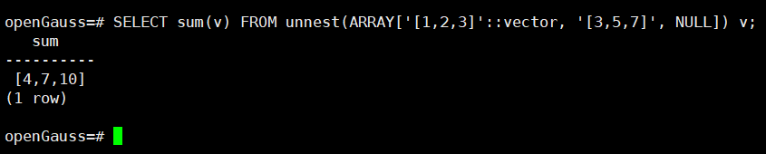


```
TEXT/VARCHAR 转 vector
示例：
openGauss=# SELECT '[1,2,3]'::vector;
 vector  
---------
 [1,2,3]
(1 row)

openGauss=# select vector('[4,5,6]');
 vector  
---------
 [4,5,6]
(1 row)

openGauss=# SELECT cast(ARRAY[1,2,3] AS vector);
  array  
---------
 [1,2,3]
(1 row)
```
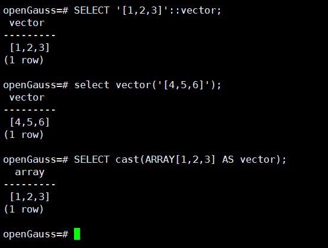


```
Int Array 转 vector
示例：
openGauss=# SELECT ARRAY[1,2,3]::vector;
  array  
---------
 [1,2,3]
(1 row)
```


```
Real Array 转 vector
示例：
openGauss=# SELECT ARRAY[1,2,3]::float4[]::vector(3);
  array  
---------
 [1,2,3]
(1 row)
```
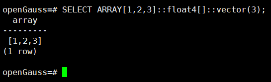


```
Double Array 转 vector
示例：
openGauss=# SELECT ARRAY[1,2,3]::float8[]::vector;
  array  
---------
 [1,2,3]
(1 row)
```
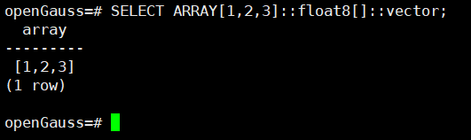


```
Numeric Array 转 vector
示例：
openGauss=# SELECT ARRAY[1,2,3]::numeric[]::vector;
  array  
---------
 [1,2,3]
(1 row)
```
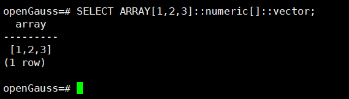


```
Vector 转 Int Array
示例：
openGauss=# SELECT '[1,2,3]'::vector::int[];
  int4   
---------
 {1,2,3}
(1 row)
```
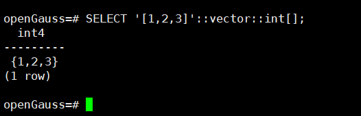


```
Vector 转 Real Array
示例：
openGauss=# SELECT '[1,2,3]'::vector::real[];
 float4  
---------
 {1,2,3}
(1 row)
```
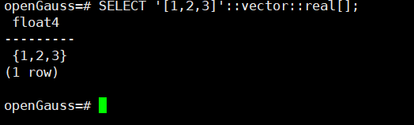


```
Vector 转 Double Array
示例：
openGauss=# SELECT '[1,2,3]'::vector::float8[];
 float8  
---------
 {1,2,3}
(1 row)
```
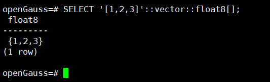


```
Vector 转 Numeric Array
示例：
openGauss=# SELECT '[1,2,3]'::vector::numeric(10,3)[];
       numeric       
---------------------
 {1.000,2.000,3.000}
(1 row)
```
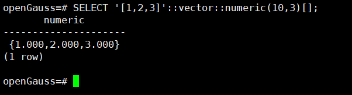


```
Vector 转 Text Array
示例：
openGauss=# SELECT '[1,2,3]'::vector::text[];
    text       
---------
 {1,2,3}
(1 row)
```
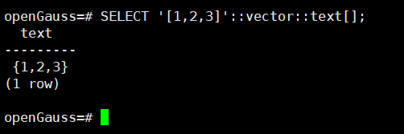


```
Vector 转 Varchar Array
示例：
openGauss=# SELECT '[1.21,2.32,3]'::vector::varchar(3)[];
    varchar       
--------------
 {1.2,2.3,3}
(1 row)
```
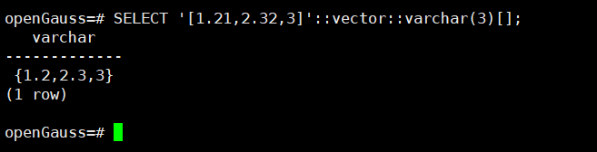


Bit
```
<~>

描述：汉明距离。

返回类型：uint64

示例：

openGauss=# SELECT '111' <~> '110';
 ?column? 
----------
        1
(1 row)
```
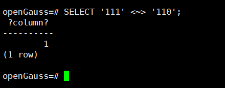


```
<%>

描述：杰卡德距离。

返回类型：double

示例：

openGauss=# SELECT '1111' <%>  '1000';
 ?column? 
----------
      .75
(1 row)
```
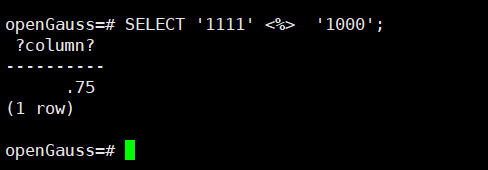


```
hamming_distance

描述：汉明距离。

返回类型：uint64

示例：

openGauss=# SELECT hamming_distance('111', '110');
 hamming_distance 
------------------
                1
(1 row)
```
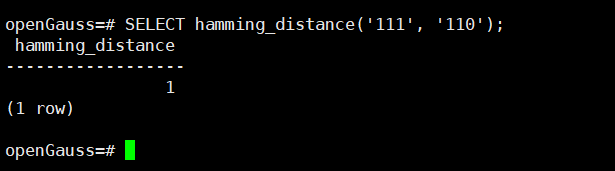


```
jaccard_distance

描述：杰卡德距离。

返回类型：double

示例：

openGauss=# SELECT jaccard_distance('1111', '1110');
 jaccard_distance 
------------------
              .25
(1 row)
```
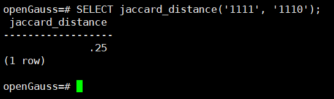


Sparsevec
```
<->

描述：欧几里得距离 (L2)。

返回类型：float8

示例：

openGauss=# SELECT '{}/2'::sparsevec <-> '{1:3,2:4}/2';
 ?column? 
----------
        5
(1 row)
```
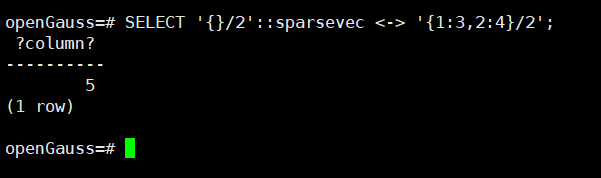


```
<#>

描述：负内积。

返回类型：float8

示例：

openGauss=# SELECT '{1:1,2:2}/2'::sparsevec <#> '{1:3,2:4}/2';
 ?column? 
----------
      -11
(1 row)
```


```
<=>

描述：余弦距离。

返回类型：float8

示例：

openGauss=# SELECT '{1:1,2:2}/2'::sparsevec <=> '{1:2,2:4}/2';
 ?column? 
----------
        0
(1 row)
```
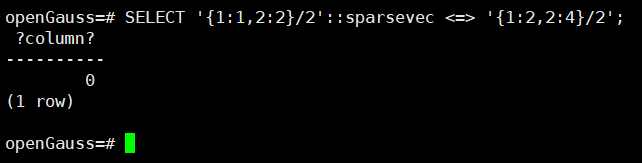


```
<+>

描述：曼哈顿距离 (L1)。

返回类型：float8

示例：

openGauss=# SELECT '{}/2'::sparsevec <+> '{1:3,2:4}/2';
 ?column? 
----------
        7
(1 row)
```
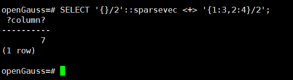


```
=

描述：等于。

示例：

openGauss=# SELECT '{1:1,2:2,3:3}/3'::sparsevec = '{1:1,2:2,3:3}/3';
 ?column? 
----------
 t
(1 row)
```
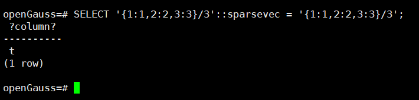


```
<>

描述：不等于。

示例：

openGauss=# SELECT '{1:1,2:2,3:3}/3'::sparsevec <> '{1:1,2:2,3:3}/3';
 ?column? 
----------
 f
(1 row)
```
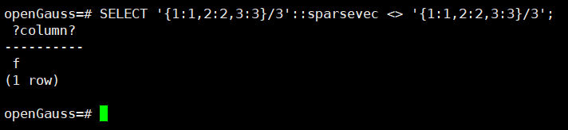


```
cosine_distance

描述：余弦距离。

返回类型：float8

示例：

openGauss=# SELECT cosine_distance('{1:1,2:2}/2'::sparsevec, '{1:2,2:4}/2');
 cosine_distance 
-----------------
               0
(1 row)
```
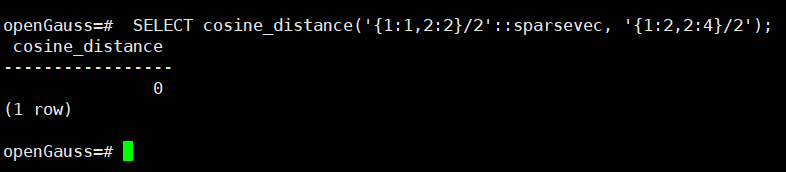


```
inner_product

描述：内积。

返回类型：float8

示例：

openGauss=# SELECT inner_product('{1:1,2:2}/2'::sparsevec, '{1:2,2:4}/2');
 inner_product 
---------------
            10
(1 row)
```
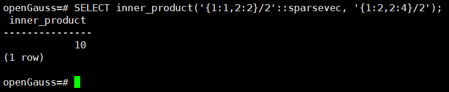


```
l1_distance

描述：曼哈顿距离 (L1)。

返回类型：float8

示例：

openGauss=# SELECT l1_distance('{}/2'::sparsevec, '{1:3,2:4}/2');
 l1_distance 
-------------
           7
(1 row)
```


```
l2_distance

描述：欧几里得距离 (L2)。

返回类型：float8

示例：

openGauss=# SELECT l2_distance('{}/2'::sparsevec, '{1:3,2:4}/2');
 l2_distance 
-------------
           5
(1 row)
```


```
l2_norm

描述：欧几里得范数。

返回类型：float8

示例：

openGauss=# SELECT l2_norm('{1:3,2:4}/2'::sparsevec);
 l2_norm 
---------
       5
(1 row)
```


```
l2_normalize

描述：归一化（使用L2距离）。

返回类型：sparsevec

示例：

openGauss=# SELECT l2_normalize('{1:3,2:4}/2'::sparsevec);
  l2_normalize   
-----------------
 {1:0.6,2:0.8}/2
(1 row)
```


```
TEXT/VARCHAR 转 sparsevec
示例：
openGauss=# SELECT '{1:1.5,3:3.5}/5'::sparsevec;
    sparsevec    
-----------------
 {1:1.5,3:3.5}/5
(1 row)
Vector 转 sparsevec
示例：
openGauss=# SELECT '[0,1.5,0,3.5,0]'::vector::sparsevec;
    sparsevec    
-----------------
 {2:1.5,4:3.5}/5
(1 row)
Sparsevec 转 Vector
示例：
openGauss=# SELECT '{2:1.5,4:3.5}/5'::sparsevec::vector(5);
     vector      
-----------------
 [0,1.5,0,3.5,0]
(1 row)
```


### (4)向量索引
```
示例3： 使用L2距离计算创建HNSW索引并设置m = 16, ef_construction = 64。

openGauss=# CREATE INDEX items_val_l2_idx ON items
             USING hnsw (val vector_l2_ops)
             WITH (m = 16, ef_construction = 64);
```


```
示例4： 设置当前会话中ef_search=100。

openGauss=# SET hnsw_ef_search = 100;
```


```
示例5： 构建索引并行数设置为32。

openGauss=# ALTER TABLE items SET(parallel_workers=32);
```


```
示例6： 使用L2距离计算创建IVFFlat索引并设置lists = 200。

openGauss=# CREATE INDEX ON items
             USING ivfflat (val vector_l2_ops)
             WITH (lists = 200);
```


```
probe - 查询时候选集的大小（默认为1），详情请参考DataVec向量引擎参数。
openGauss=# SET ivfflat_probes = 10;
```


```
示例7： 构建索引并行数设置为32。

openGauss=# ALTER TABLE items SET(parallel_workers=32);
```


```
示例6： 使用L2距离计算创建DISKANN索引并设置index_size = 50。

openGauss=# CREATE INDEX ON items USING diskann (val vector_l2_ops) WITH (index_size = 50);
```


```
diskann_probes - 查询时候选集的大小（默认为128），详情请参考DataVec向量引擎参数。
openGauss=# SET diskann_probes = 256;
```


```
示例7： 构建索引并行数设置为32。

openGauss=# ALTER TABLE items SET(parallel_workers=32);
```


```
示例8： 构建btree索引。

openGauss=# CREATE INDEX ON items (val vector_ops);
```


```
示例9： 构建索引并行数设置为8。

openGauss=# ALTER TABLE items SET (parallel_workers = 8);
```


```
示例10： 修改向量索引选项

openGauss=# ALTER INDEX items_val_idx1 SET (m=24, ef_construction=200);
openGauss=# REINDEX INDEX items_val_idx1;
```


### (5)融合查询使用指南
```
2.1 创建表格
openGauss=# CREATE TABLE gist_info (
    id int,
    src_location varchar(64),
    dist_location varchar(64),
    update_time timestamp,
    distance float,
    feature vector(6)
);

--设置向量索引
openGauss=# CREATE INDEX ON gist_info USING HNSW(feature vector_l2_ops);
```


```
2.2 融合查询
openGauss=# SELECT dist_location 
FROM gist_info 
WHERE src_location = 'zhejiang'
AND distance > 10 AND distance < 20
ORDER BY feature <-> '[0,1,2,3,4,5]';
```


