# 一、dolphin
openGauss提供dolphin Extension（版本为dolphin-1.0.0）。dolphin Extension是openGauss的MySQL兼容性数据库（dbcompatibility='B'）扩展，从关键字、数据类型、常量与宏、函数和操作符、表达式、类型转换、DDL/DML/DCL语法、存储过程/自定义函数、系统视图等方面兼容MySQL数据库。dolphin插件继承内核原有SQL语法，在dolphin语法介绍中，将主要介绍对于内核语法有新增、修改的内容，和内核保持一致的语法等将不再额外写出。
## 1.编译安装
编译安装openGauss。

将dolphin源码拷贝到openGauss-server源码的contrib目录下。

进入dolphin目录执行make install。

创建B库并使用初始用户连接B库。

```
openGauss=# create database db_name dbcompatibility 'B';
\c db_name
```
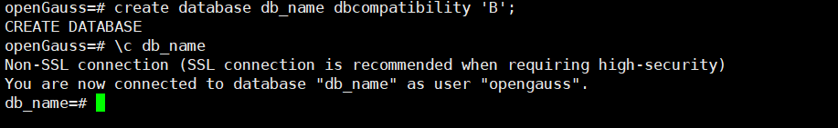
## 2.SQL参考
### (1)数据类型
①数值类型
示例：
```
--创建具有TINYINT(n), SMALLINT(n), MEDIUMINT(n), BIGINT(n)类型数据的表。
openGauss=# CREATE TABLE int_type_t1
           (
            IT_COL1 TINYINT(10),
            IT_COL2 SMALLINT(20),
            IT_COL3 MEDIUMINT(30),
            IT_COL4 BIGINT(40),
            IT_COL5 INTEGER(50)
           );
```
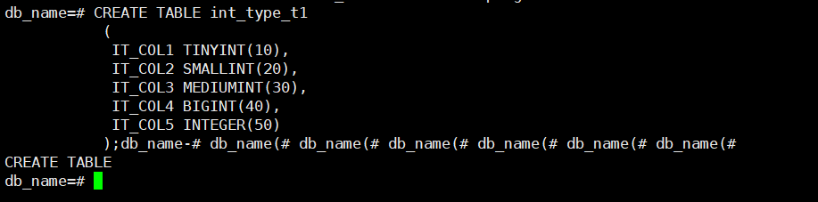

```
--查看表结构。
openGauss=# \d int_type_t1
     Table "public.int_type_t1"
 Column  |     Type     | Modifiers
---------+--------------+-----------
 IT_COL1 | tinyint(10)  |
 IT_COL2 | smallint(20) |
 IT_COL3 | integer(30)  |
 IT_COL4 | bigint(40)   |
 IT_COL5 | integer(50)  |
```
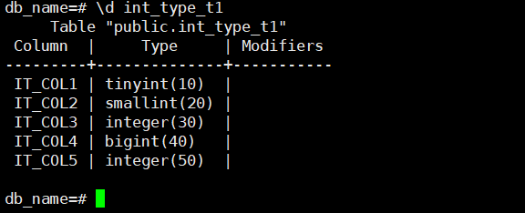

```
--创建带zerofill属性字段的表。
openGauss=# CREATE TABLE int_type_t2
           (
            IT_COL1 TINYINT(10) zerofill,
            IT_COL2 SMALLINT(20) unsigned zerofill,
            IT_COL3 MEDIUMINT(30) unsigned,
            IT_COL4 BIGINT(40) zerofill,
            IT_COL5 INTEGER(50) zerofill
           );
```
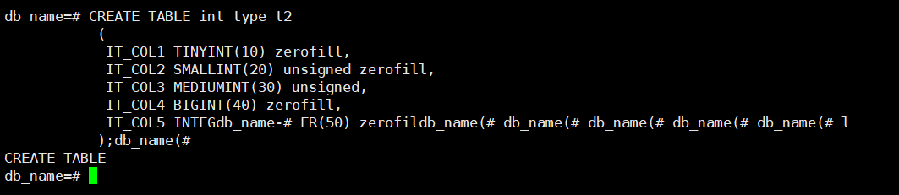

```
--查看表结构。
openGauss=# \d int_type_t2
   Table "public.int_type_t2"
 Column  |   Type    | Modifiers
---------+-----------+-----------
 IT_COL1 | uint1(10) |
 IT_COL2 | uint2(20) |
 IT_COL3 | uint4(30) |
 IT_COL4 | uint8(40) |
 IT_COL5 | uint4(50) |
```
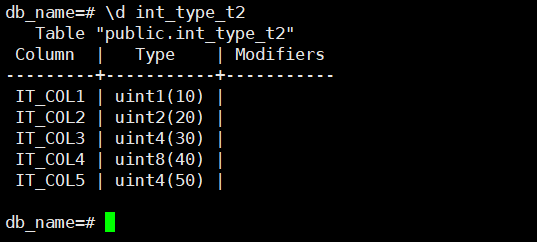

```
--删除表。
openGauss=# DROP TABLE int_type_t1, int_type_t2;
```


```
--利用cast unsigned将表达式转换为uint8类型
openGauss=# select cast(1 - 2 as unsigned);
        uint8
----------------------
 18446744073709551615
(1 row)
```
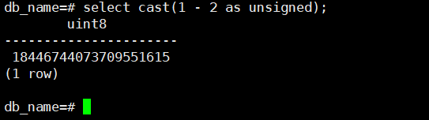

```
--利用cast signed将表达式转换为int8类型
openGauss=# select cast(1 - 2 as signed);
 int8
------
   -1
(1 row)
```


```
--创建具有FIXED(p,s), FIXED, decimal, number类型数据的表。
openGauss=# CREATE TABLE dec_type_t1
           (
            DEC_COL1 FIXED,
            DEC_COL2 FIXED(20,5),
            DEC_COL3 DECIMAL,
            DEC_COL4 NUMBER
           );
```


```
--查看表结构。
openGauss=# \d dec_type_t1
      Table "public.dec_type_t1"
  Column  |     Type      | Modifiers
----------+---------------+-----------
 dec_col1 | numeric(10,0) |
 dec_col2 | numeric(20,5) |
 dec_col3 | numeric(10,0) |
 dec_col4 | **numeric **       |
```
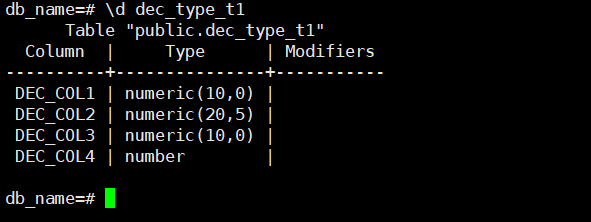


```
--删除表。
openGauss=# DROP TABLE dec_type_t1;
```


```
--创建具有float4(p,s), double, float4(n), float(n)类型数据的表。
openGauss=# CREATE TABLE float_type_t1
           (
            F_COL1 FLOAT4(10,4),
            F_COL2 DOUBLE,
            F_COL3 float4(10),
            F_COL4 float4(30),
            F_COL5 float(10),
            F_COL6 float(30)
           );
```
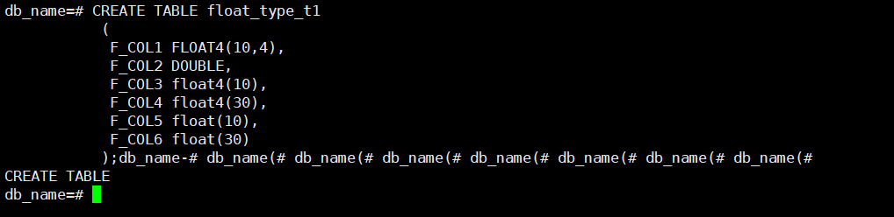

```
--查看表结构。
openGauss=# \d float_type_t1
     Table "public.float_type_t1"
 Column |       Type       | Modifiers
--------+------------------+-----------
 f_col1 | numeric(10,4)    |
 f_col2 | double precision |
 f_col3 | real             |
 f_col4 | double precision |
 f_col5 | real             |
 f_col6 | double precision |
```
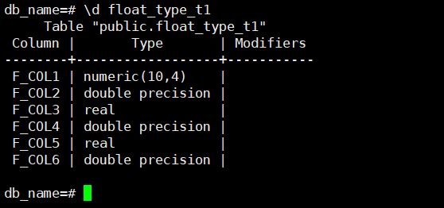

```
--删除表。
openGauss=# DROP TABLE float_type_t1;
```


```
--创建具有float(p,s), double(p,s), real(p,s), double precision(p,s)类型数据的表。
openGauss=# CREATE TABLE test_float_double_real_double_precision
           (
            a FLOAT(20,2),
            b DOUBLE(20,2),
            c REAL(20,2),
            d DOUBLE PRECISION(20,2)
           );
```
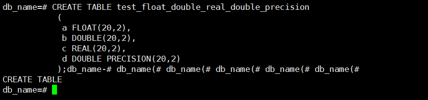

```
--查看表结构。
openGauss=# \d test_float_double_real_double_precision        
    Table "public.test_float_double_real_double_precision"
 Column |     Type      | Modifiers 
--------+---------------+-----------
 a      | numeric(20,2) | 
 b      | numeric(20,2) | 
 c      | numeric(20,2) | 
 d      | numeric(20,2) |
```
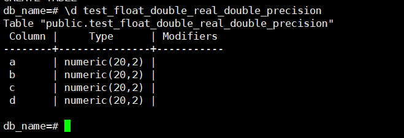


```
--删除表
openGauss=# DROP TABLE test_float_double_real_double_precision;
```
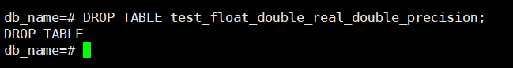

### (2)字符类型

```
--创建表。
openGauss=# CREATE TABLE char_type_t1 
(
    CT_COL1 CHARACTER(4),
    CT_COL2 TEXT(10),
    CT_COL3 TINYTEXT(11),
    CT_COL4 MEDIUMTEXT(12),
    CT_COL5 LONGTEXT(13)
);
```
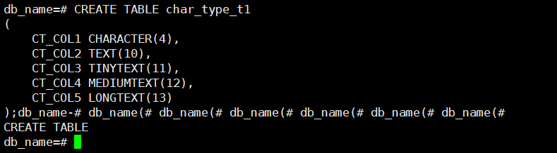

```
--查看表结构
openGauss=# \d char_type_t1 
    Table "public.char_type_t1"
 Column  |     Type     | Modifiers
---------+--------------+-----------
 ct_col1 | character(4) |
 ct_col2 | text         |
 ct_col3 | text         |
 ct_col4 | text         |
 ct_col5 | text         |

```
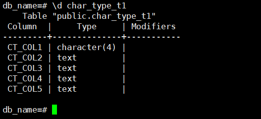

```
--插入数据
openGauss=# INSERT INTO char_type_t1 VALUES('四个字符');
openGauss=# INSERT INTO char_type_t1 VALUES('e   ');

```


```
--查看数据
openGauss=# SELECT CT_COL1,length(CT_COL1) FROM char_type_t1;
 ct_col1  | length
----------+--------
 四个字符 |      **4**
 e        |      **1**
(2 rows)
```
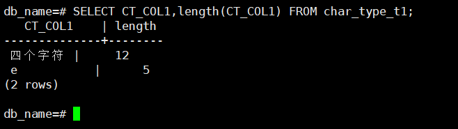


```
--过滤数据
openGauss=# SELECT CT_COL1 FROM char_type_t1 WHERE CT_COL1 = 'e';
 ct_col1
---------
 e
(1 row)
```
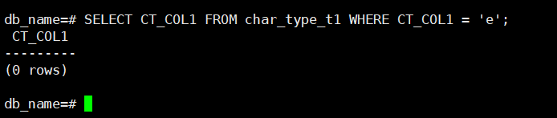

```
--删除表
openGauss=# DROP TABLE char_type_t1;
```


### (3)时间类型

```
--创建表。
openGauss=# CREATE TABLE test_date(dt date);
CREATE TABLE
```


```
--插入数据。
openGauss=# INSERT INTO test_date VALUES ('2020-12-21');
INSERT 0 1
openGauss=# INSERT INTO test_date VALUES ('141221');
INSERT 0 1
openGauss=# INSERT INTO test_date VALUES (20151022);
INSERT 0 1
```


```
--查看数据。
openGauss=# SELECT * FROM test_date;
     dt     
------------
 2020-12-21
 2014-12-21
 2015-10-22
(3 rows)
```
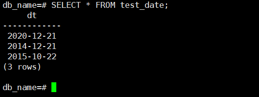

```
--创建表。
openGauss=# CREATE TABLE test_time(ti time(2));
CREATE TABLE
```
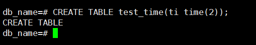


```
--插入数据。
openGauss=# INSERT INTO test_time VALUES ('2 9:12:24.1234');
INSERT 0 1
openGauss=# INSERT INTO test_time VALUES ('-34:56:59.1234');
INSERT 0 1
openGauss=# INSERT INTO test_time VALUES (561234);
INSERT 0 1
```
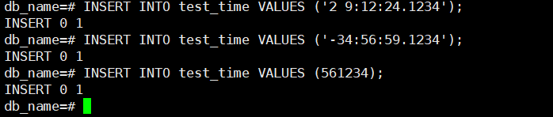


```
--查看数据。
openGauss=# SELECT * FROM test_time;
      ti      
--------------
 57:12:24.12
 -34:56:59.12
 56:12:34
(3 rows)
```


```
--创建表。
openGauss=# CREATE TABLE test_datetime(dt datetime(2));
CREATE TABLE
```


```
--插入数据。
openGauss=# INSERT INTO test_datetime VALUES ('2020-11-08 02:31:25.961');
INSERT 0 1
openGauss=# INSERT INTO test_datetime VALUES (201112234512);
INSERT 0 1
```


```
--查看数据。
openGauss=# SELECT * FROM test_datetime;
           dt           
------------------------
 2020-11-08 02:31:25.96
 2020-11-12 23:45:12
(2 rows)
```


```
--设置时区。
openGauss=# SET TIME ZONE PRC;
SET
```


```
--创建表。
openGauss=# CREATE TABLE test_timestamp(ts timestamp(2));
CREATE TABLE
```


```
--插入数据。
openGauss=# INSERT INTO test_timestamp VALUES ('2012-10-21 23:55:23-12:12');
INSERT 0 1
openGauss=# INSERT INTO test_timestamp VALUES (201112234512);
INSERT 0 1
```
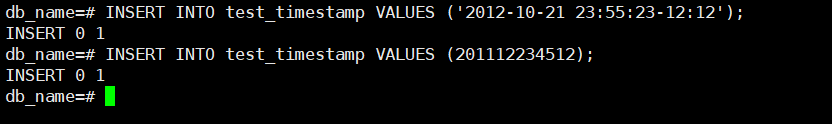


```
--查看数据。
openGauss=# SELECT * FROM test_timestamp;
           ts           
------------------------
 2012-10-22 20:07:23+08
 2020-11-12 23:45:12+08
(2 rows)
```


```
--变更时区。
openGauss=# SET TIME ZONE UTC;
SET
--查看数据。
openGauss=# SELECT * FROM test_timestamp;
           ts           
------------------------
 2012-10-22 12:07:23+00
 2020-11-12 15:45:12+00
(2 rows)
```


```
create table t1(`year` year, `date` date);
insert into t1 values ('2024', '2024-01-01');

-- 将DATE类型赋值为YEAR类型，MySQL执行失败，但是openGauss执行成功
update t1 set `year` = `date`;
```


```
--创建表。
openGauss=# CREATE TABLE test_year( y year,  y2 year(2));
CREATE TABLE
```


```
--插入数据。
openGauss=# INSERT INTO test_year VALUES ('70', '70');
INSERT 0 1
openGauss=# INSERT INTO test_year VALUES ('69', '69');
INSERT 0 1
openGauss=# INSERT INTO test_year VALUES ('2069', '2069');
INSERT 0 1
openGauss=# INSERT INTO test_year VALUES ('1970', '1970');
INSERT 0 1
```
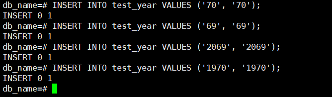


```
--查看数据。
openGauss=# SELECT * FROM test_year;
  y   | y2 
------+----
 1970 | 70
 2069 | 69
 2069 | 69
 1970 | 70
(4 rows)
```
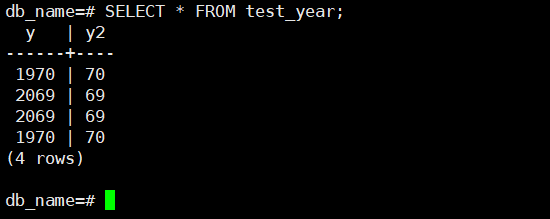


### (4)位串类型
```
--创建表。
openGauss=# CREATE TABLE bit_type_t1 
(
    BT_COL1 INTEGER,
    BT_COL2 BIT(3),
    BT_COL3 BIT VARYING(5)
) ;
```


```
--将不符合类型长度的数据进行转换。先取消严格模式设置
openGauss=# set dolphin.sql_mode ='';
openGauss=# INSERT INTO bit_type_t1 VALUES(2, B'1000'::bit(3), B'101');

--查看数据。
openGauss=# SELECT * FROM bit_type_t1;
 bt_col1 | bt_col2 | bt_col3 
---------+---------+---------
       2 | 111     | 101
(2 rows)
```
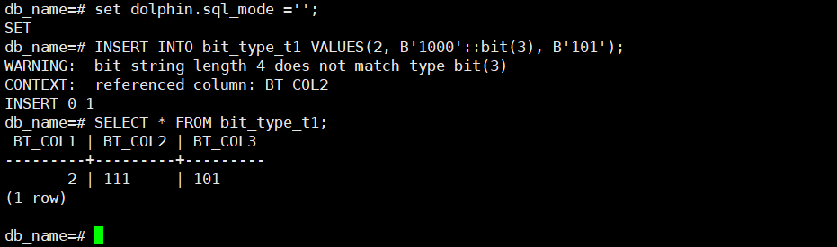


```
--对长度不足的未串转换为bit(n)，会在最左侧补齐零。
openGauss=# SELECT B'10'::bit(4);
  bit   
--------
 0010
(1 row)

--删除表。
openGauss=# DROP TABLE bit_type_t1;
```


### (5)ENUM类型

```
CREATE TABLE staff (
  name VARCHAR(40),
  gender ENUM('male', 'female')
);
INSERT INTO staff (name, gender) VALUES ('Tom','male'), ('Jenny','female');
SELECT name, gender FROM staff WHERE gender = 'male';
  name   | gender  
---------+--------
  Tom    |  male
(1 row)

```
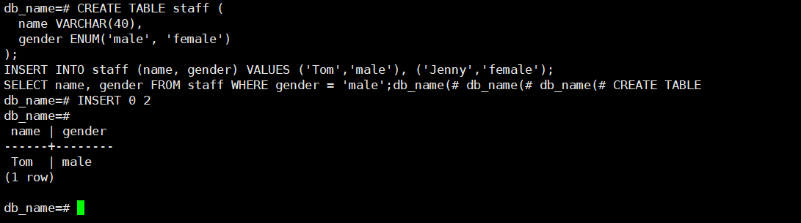

```
CREATE TYPE country_anonymous_enum_1 AS enum('CHINA','USA');
ERROR: enum type name "country_anonymous_enum_1" can't contain "anonymous_enum" 
```
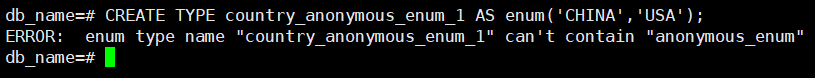


```
INSERT INTO staff (name, gender) VALUES ('Jone',1);
SELECT name, gender FROM staff WHERE gender = 1;
   name    | gender  
------------+-------
   Tom     | male
   Jone    | male
(2 rows)

```
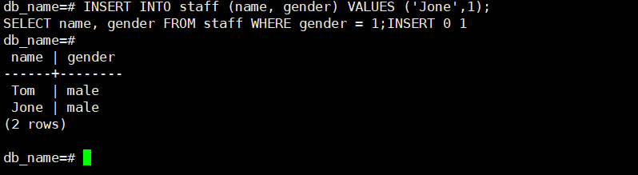

```
--如果使用的索引值超过了枚举值的个数或者为负值，则会出现错误。
INSERT INTO staff (name, gender) VALUES ('Lara',4);
ERROR:  enum order 4 out of the enum value size: 2
LINE 1: INSERT INTO staff (name, gender) VALUES ('Lara',4);
                                                         ^
CONTEXT:  referenced column: size


```


### (6)布尔类型
```
--gsql中，布尔类型回显仍是't'和'f'。
openGauss=# SELECT true;
 bool
------
 t
(1 row)
```


```
openGauss=# SELECT false;
 bool
------
 f
(1 row)
```


```
openGauss=# set dolphin.b_compatibility_mode = on;

openGauss=# select 'true' is true;
WARNING:  Truncated incorrect DOUBLE value: true
 ?column?
----------
 f
(1 row)
```


### (7)二进制类型
```
--创建表。
openGauss=#  CREATE TABLE blob_type_t1 
(
    BT_COL1 INTEGER,
    BT_COL2 BLOB,
    BT_COL3 RAW,
    BT_COL4 BYTEA
) ;
```


```
--插入数据。
openGauss=#  INSERT INTO blob_type_t1 VALUES(10,empty_blob(),
HEXTORAW('DEADBEEF'),E'\\xDEADBEEF');

--查询表中的数据。
openGauss=#  SELECT * FROM blob_type_t1;
 bt_col1 | bt_col2 | bt_col3  |  bt_col4   
---------+---------+----------+------------
      10 |         | DEADBEEF | \xdeadbeef
(1 row)
```


```
--删除表。
openGauss=#  DROP TABLE blob_type_t1;

--使用BINARY转化
openGauss=# select 'a\t'::binary;
 binary
--------
 \x6109
(1 row)

openGauss=# select binary 'a\b';
 binary
--------
 \x6108
(1 row)
```


### (8)字面值
```
openGauss=# select 'a string' as col;
   col
----------
 a string
(1 row)

openGauss=# select 'a' ' ' 'string' as col;
   col
----------
 a string
(1 row)

```
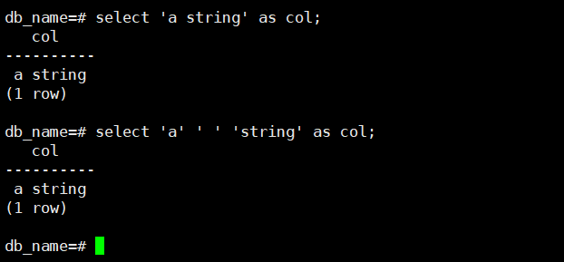

### (9)赋值操作符
```
UPDATE table_name SET col_name := new_val;
```
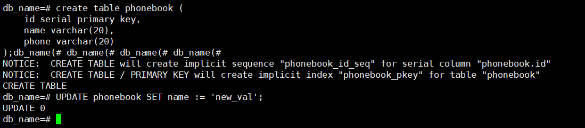

### (10)字符处理函数和操作符
```
openGauss=# SELECT bit_length('world');
 bit_length
------------
         40
(1 row)

openGauss=# SELECT bit_length(b'010');
 bit_length
------------
          8
(1 row)

```


```
openGauss=# select insert('abcdefg', 2, 4, 'yyy');
insert
--------
ayyyfg
(1 row)

```


```
openGauss=# SELECT lcase('TOM');
 lcase
-------
 tom
(1 row)


```


```
openGauss=# SELECT length('abcd');
 length 
--------
      4
(1 row)

openGauss=# SELECT length('中文');
 length 
--------
      6
(1 row)

```


```
openGauss=# CREATE DATABASE B_COMPATIBILITY_DATABASE DBCOMPATIBILITY 'B';
CREATE DATABASE
openGauss=# \c B_COMPATIBILITY_DATABASE
b_compatibility_database=# CREATE Extension dolphin;
CREATE Extension
b_compatibility_database=# SET dolphin.b_compatibility_mode = TRUE;
SET
b_compatibility_database=# select format(1234.4567,2);
  format
-----------
 1,234.46
(1 row)

b_compatibility_database=# select format(1234.5,4);
  format
-----------
 1,234.5000
(1 row)

b_compatibility_database=# select format(1234.5,0);
  format
-----------
 1,235
(1 row)

b_compatibility_database=# select format(1234.5,2,'de_DE');
  format
-----------
 1.234,50
(1 row)


```
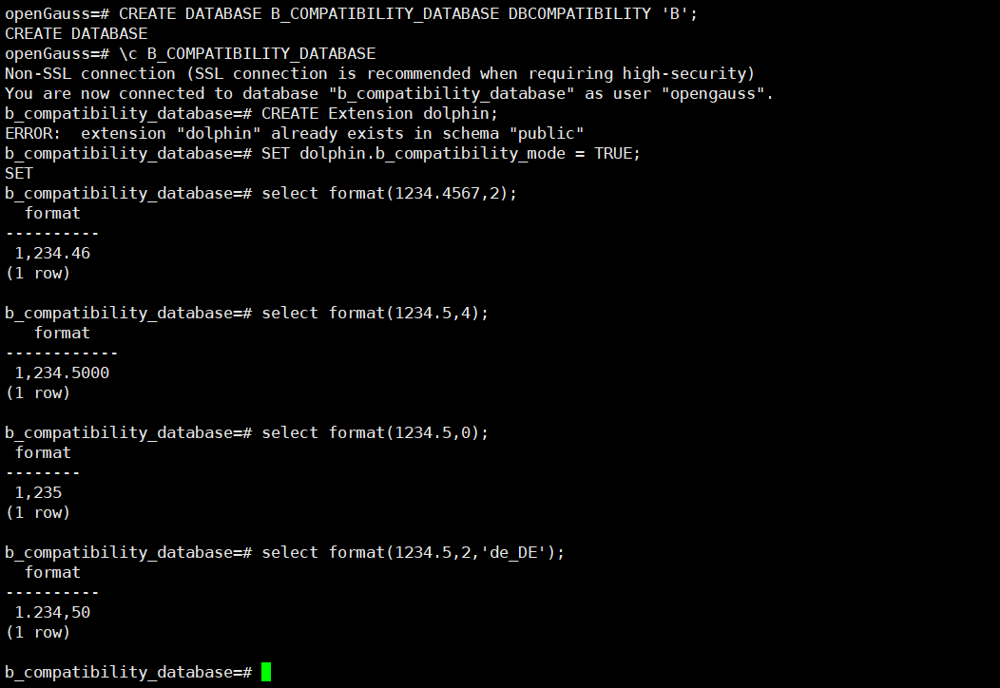

```
openGauss=# SELECT hex(256);
 hex
-----
 100
(1 row)

openGauss=# select hex('abc');
 hex
--------
 616263
(1 row)

openGauss=# select hex('abc'::bytea);
 hex
--------
 616263
(1 row)

openGauss=# select hex(b'1111');
 hex
-----
 0F
(1 row)

openGauss=# select hex('\n');
 hex
-------
 5C6E
(1 row)

```
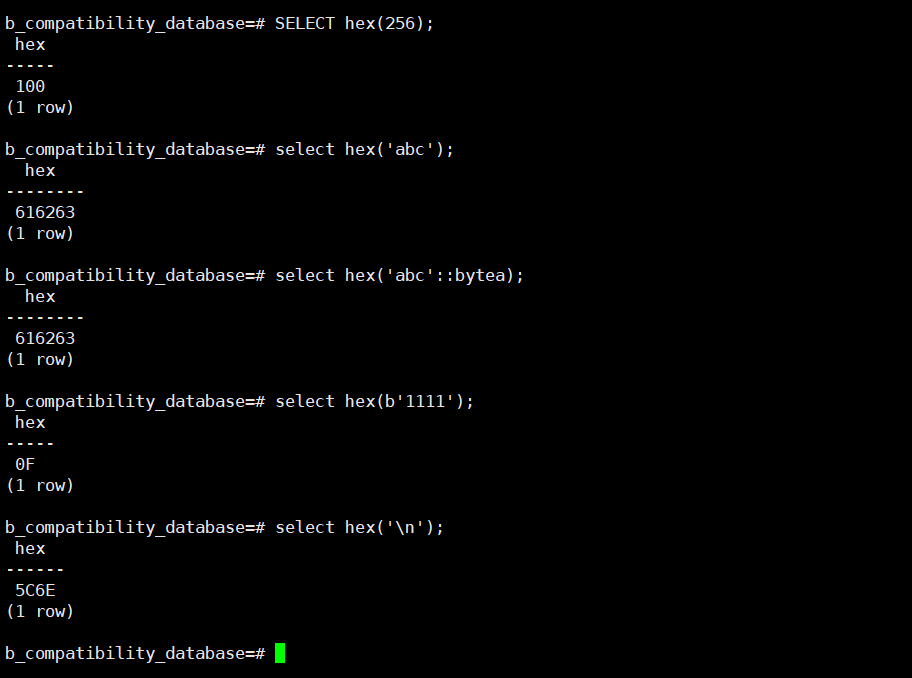


```
openGauss=# set dolphin.b_compatibility_mode to on; -- 需要打开dolphin.b_compatibility_mode让blob可以适配B兼容模式下的输入
SET
openGauss=# create table t1 (c1 tinyblob, c2 blob, c3 mediumblob, c4 longblob);
CREATE TABLE
openGauss=# insert into t1 values('aa', 'aa', 'aa', 'aa');
INSERT 0 1
openGauss=# insert into t1 values(12312, 12312, 12312, 12312);
INSERT 0 1
openGauss=# select hex(c1) as "tinyblob_result", hex(c2) as "blob_result", hex(c3) as "mediumblob_result", hex(c4) as "longblob_result" from t1;
tinyblob_result | blob_result | mediumblob_result | longblob_result
-----------------+-------------+-------------------+-----------------
6161            | 6161        | 6161              | 6161
3132333132      | 3132333132  | 3132333132        | 3132333132
(2 rows)

openGauss=# set dolphin.b_compatibility_mode to on;
SET
openGauss=# create table enum_to_hex(c enum('a','b','c'));
CREATE TABLE
openGauss=# insert into enum_to_hex values(1);
INSERT 0 1
openGauss=# insert into enum_to_hex values(2);
INSERT 0 1
openGauss=# insert into enum_to_hex values(3);
INSERT 0 1
openGauss=# select hex(c) from enum_to_hex;
 hex 
-----
 61
 62
 63
(3 rows)
```

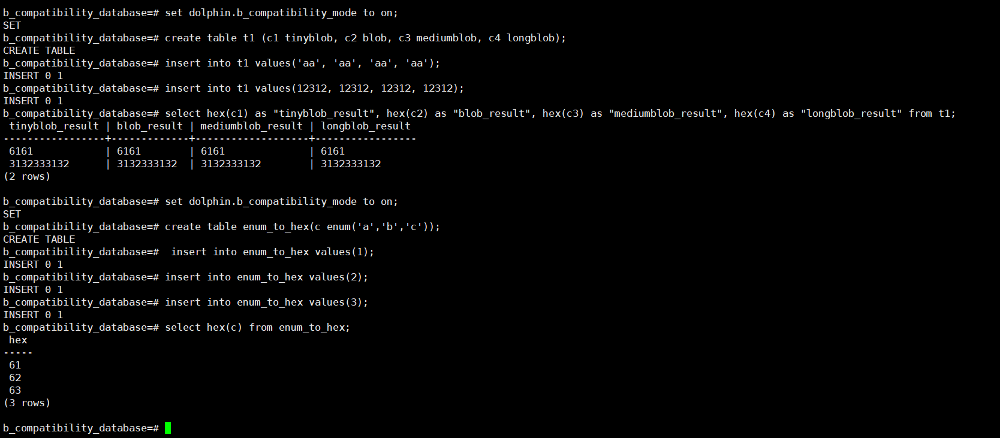


```
openGauss=# SELECT uuid();
                 uuid                 
--------------------------------------
 ea2beb80-0d1c-11cb-d2f8-5267477de699
(1 row)

```


```
openGauss=# SELECT locate('ing', 'string');
 locate
--------
      4
(1 row)

openGauss=# SELECT locate('ing', 'string', 0);
 locate
--------
      0
(1 row)

openGauss=# SELECT locate('ing', 'string', 5);
 locate
--------
      0
(1 row)


```


```
openGauss=# SELECT octet_length('中文');
 octet_length
--------------
            6
(1 row)

```
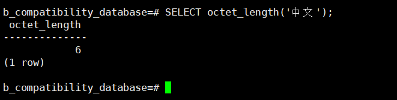

```
openGauss=# SELECT 'str' regexp '[ac]' AS RESULT;
 result
--------
      0
(1 row)


```


```
openGauss=# SELECT 'str' not regexp '[ac]' AS RESULT;
 result
--------
      1
(1 row)

```
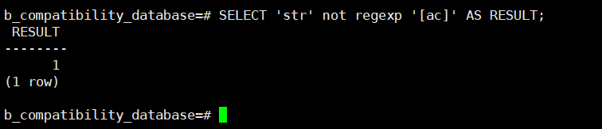

```
openGauss=# SELECT 'str' rlike '[ac]' AS RESULT;
 result
--------
      0
(1 row)

```
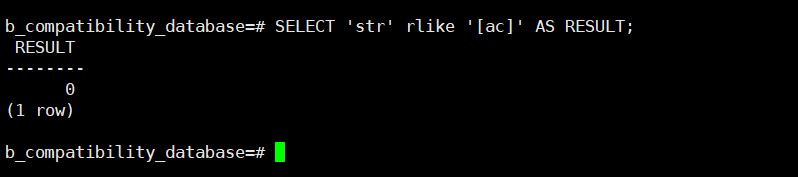

```
openGauss=# SELECT ucase('tom');
 ucase
-------
 TOM
(1 row)

```


```
b_compatibility_database=# SELECT bin('309');
bin
------------
100110101
(1 row)

b_compatibility_database=# SELECT bin('你好'); 
bin
---
0 
(1 row)

```
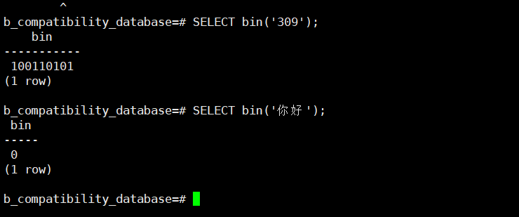


```
b_compatibility_database=# select char(77,77.3,'77.3','78.8',78.8);
char
-------
\x4d4d4d4e4f
(1 row)
b_compatibility_database=# set bytea_output = escape;
SET
b_compatibility_database=# select char(77,77.3,'77.3','78.8',78.8);
char
-------
MMMNO
(1 row)


```
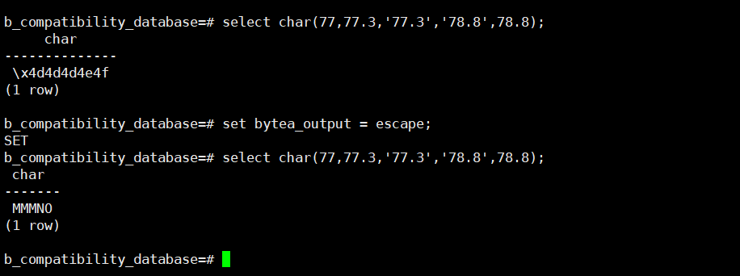


```
b_compatibility_database=# select chara(77,77.3,'77.3','78.8',78.8);
chara
-------
\x4d4d4d4e4f
(1 row)
b_compatibility_database=# set bytea_output = escape;
SET
b_compatibility_database=# select chara(77,77.3,'77.3','78.8',78.8);
chara
-------
MMMNO
(1 row)

```
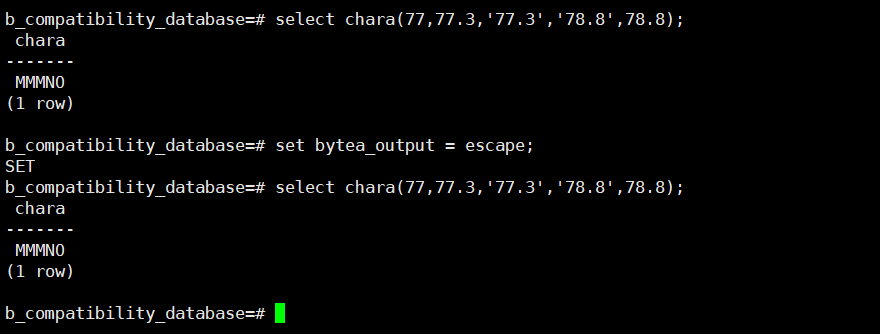

```
openGauss=# SELECT char_length('hello');
char_length
-------------
        5
(1 row)
b_compatibility_database=# SELECT char_length(B'101');
char_length
-------------
        1
(1 row)


```
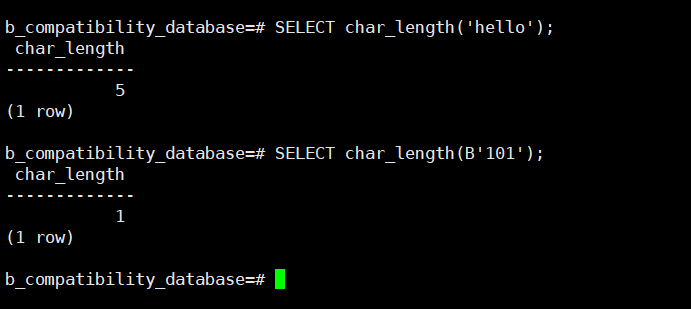

```
b_compatibility_database=# select convert('a' using 'utf8');
convert
---------
a 
(1 row)

b_compatibility_database=# select convert('a' using utf8);
convert
---------
a 
(1 row)

```
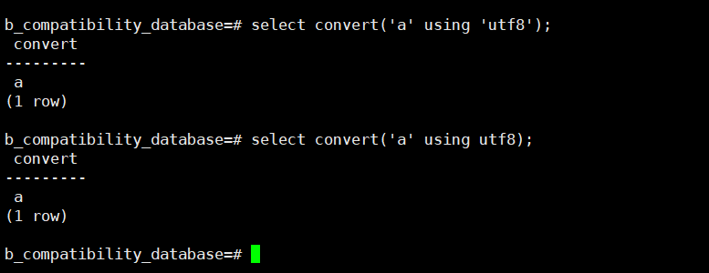


```
b_compatibility_database=# select convert('a', bytea); 
  bytea   
----------
 **\x61**
(1 row)

```
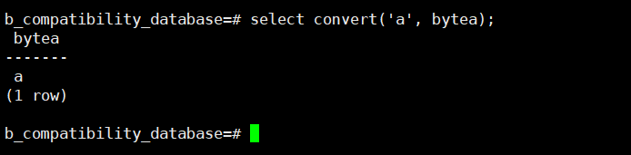

```
b_compatibility_database=# select elt(3,'wo','ceshi','disange');
elt   
---------
disange
(1 row)

```


```
test_db=# select left('abcde', 2);
left
------
ab
(1 row)

test_db=# select left('abcde', 0);
left
------

(1 row)

test_db=# select left('abcde', -2);
left
------

(1 row)

```
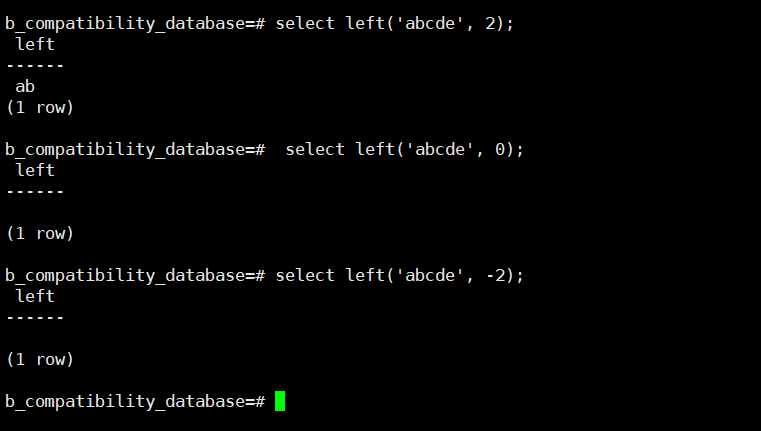

```
test_db=# select right('abcde', 2);
right
-------
de
(1 row)

test_db=# select right('abcde', 0);
right
-------

(1 row)

test_db=# select right('abcde', -2);
right
-------

(1 row)

```
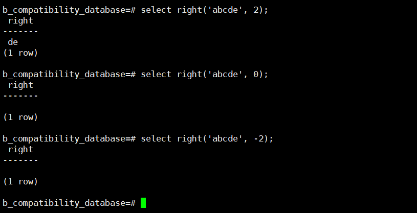


```
db_m=# select mid('abcdef', 2, 2);
 mid
-----
 bc
(1 row)

db_m=# select mid('abcdef', -2, 2);
 mid
-----
 ef
(1 row)


```
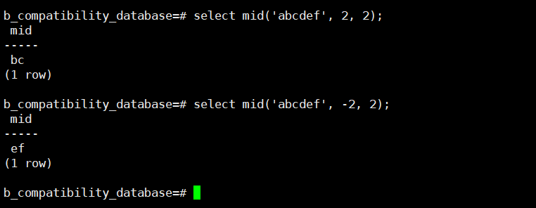


```
b_compatibility_database=# select field('ceshi','wo','ceshi','disange');
field 
-------
    2
(1 row)

```


```
b_compatibility_database=# select find_in_set('wo','ceshi,ni,wo,ta');
find_in_set 
-------------
        3
(1 row)


```


```
b_compatibility_database=# select space('5');
space 
-------

(1 row)

```


```
b_compatibility_database=# select soundex('abcqwcaa');
soundex 
---------
A120
(1 row)

```


```
select make_set(1|4, 'one', 'two', NULL, 'four');
 make_set 
----------
 one
(1 row)

```


```
openGauss=# SELECT '123a'^'123';
?column?
---------
      0
(1 row)

```


```
openGauss=# SELECT 'abc' like 'a' as result;
 result
------------
          f
(1 row)

openGauss=# SELECT 'abc' like 'a%' as result;
 result
------------
          t
(1 row)

openGauss=# SELECT true like true as result;
 result
------------
          t
(1 row)

```
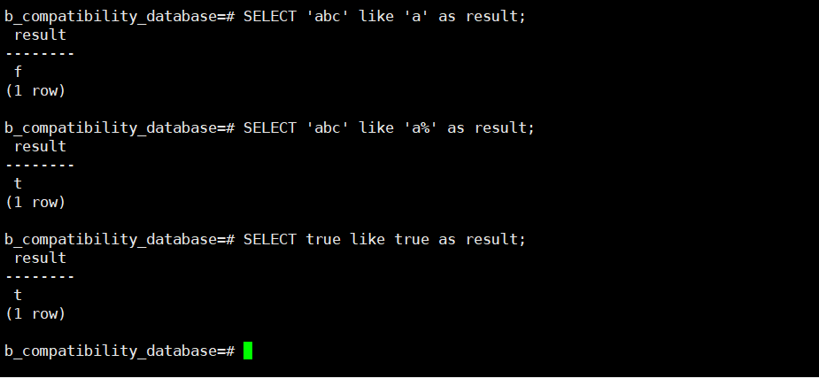


```
openGauss=# SELECT 'a' like binary 'A' as result;
 result
------------
         f
(1 row)

openGauss=# SELECT 'a' like binary 'a' as result;
 result
------------
         t
(1 row)

openGauss=# SELECT 'abc' like binary 'a' as result;
 result
------------
          f
(1 row)

openGauss=# SELECT 'abc' like binary 'a%' as result;
 result
------------
          t
(1 row)


```
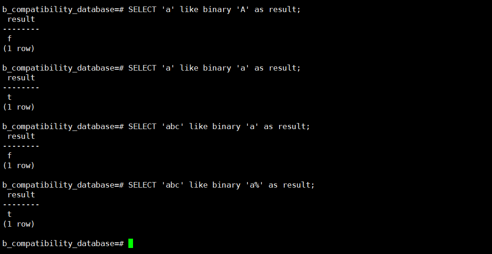


```
  openGauss=# SELECT substring_index('abcdabcdabcd', 'bcd', 2);
   substring_index 
  -----------------
   abcda
  (1 row)

```
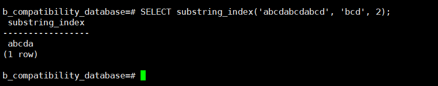


```
openGauss=# SELECT EXPORT_SET(5,'Y','N',',',5);
 export_set 
-------------
 Y,N,Y,N,N
(1 row)


```
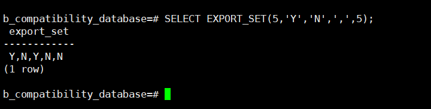

```
    openGauss=# SELECT FROM_BASE64('YWJj');
     from_base64 
    -------------
     abc
    (1 row)

```


```
-- test 1 byte
openGauss=# select ord('1111');
ord 
-----
  49
(1 row)

openGauss=# select ord('sss111');
ord 
-----
115
(1 row)

-- test 2 byte
openGauss=# select ord('Ŷ1111');
  ord  
-------
50614
(1 row)

openGauss=# select ord('߷1111');
  ord  
-------
57271
(1 row)

-- test 3 byte
openGauss=# select ord('অ1111');
  ord    
----------
14722693
(1 row)

openGauss=# select ord('ꬤ1111');
  ord    
----------
15379620
(1 row)

-- test 4 byte
openGauss=# select ord('𒁖1111');
    ord     
------------
4036133270
(1 row)

openGauss=# select ord('𓃔1111');
    ord     
------------
4036199316
(1 row)

```
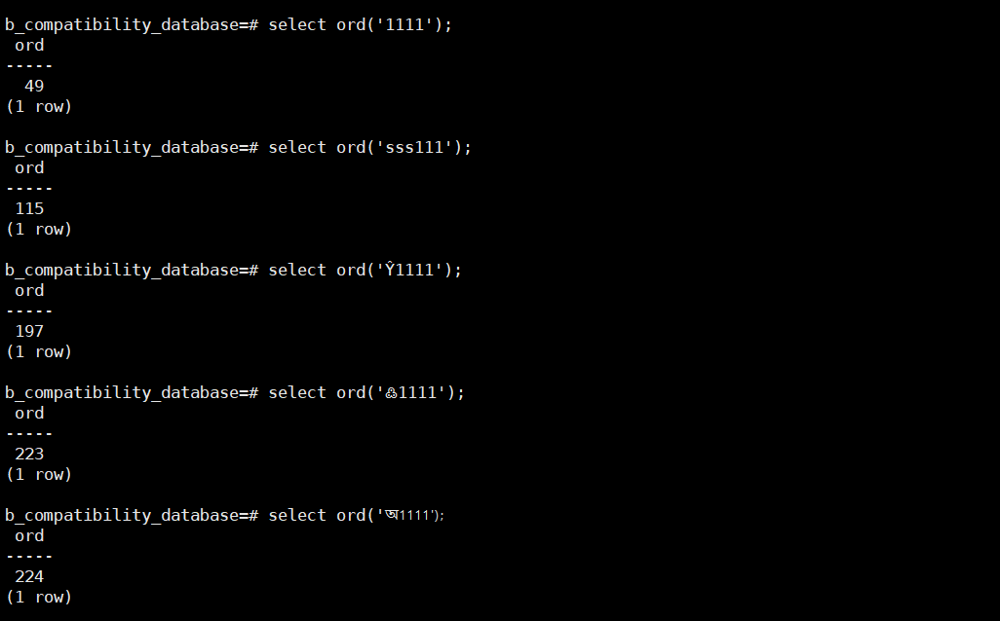
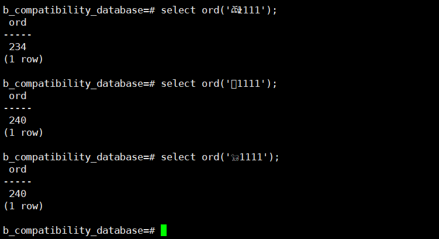


```
  SELECT TO_BASE64('to_base64');
    to_base64   
  --------------
  dG9fYmFzZTY0
  (1 row)
  SELECT TO_BASE64('123456');
   to_base64 
  -----------
   MTIzNDU2
  (1 row)

  SELECT TO_BASE64('12345');
   to_base64 
  -----------
   MTIzNDU=
  (1 row)

  SELECT TO_BASE64('1234');
   to_base64 
  -----------
   MTIzNA==
  (1 row)

```
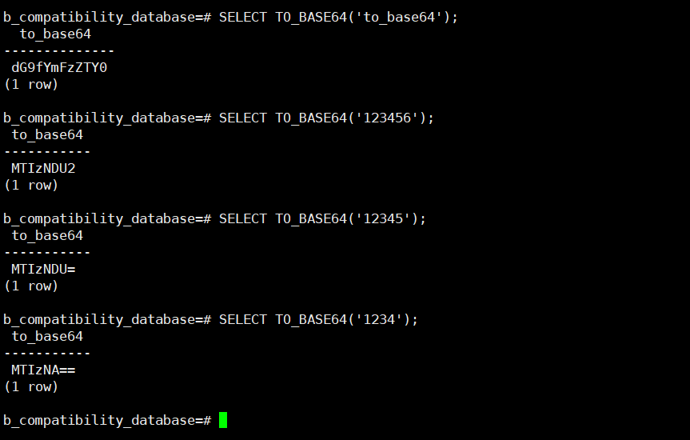

```
  SET bytea_output to 'escape';
  SELECT UNHEX('6f70656e4761757373');
    unhex   
  -----------
  openGauss
  (1 row)

  SELECT UNHEX(HEX('string'));
   unhex  
  --------
   string
  (1 row)

  SELECT HEX(UNHEX('1267'));
   hex  
  ------
   1267
  (1 row)

```
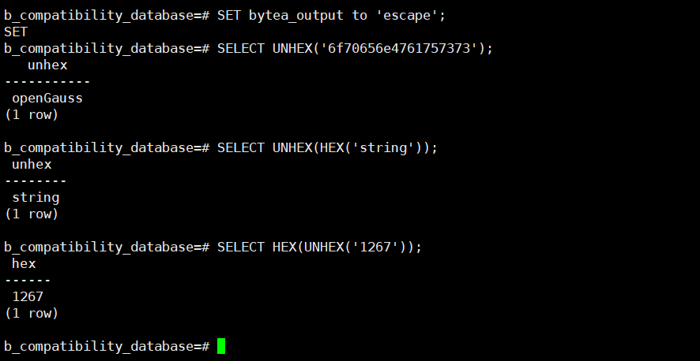


```
openGauss=# set b_compatibility_mode = 1;
**SET**
openGauss=# select !10;
 ?column?
----------
 f
(1 row)

openGauss=# select !true;
 ?column?
----------
 f
(1 row)

openGauss=# select !!10;
ERROR:  Operator '!!' is deprecated when b_compatibility_mode is on. Please use function factorial().

openGauss=# select 10!;
ERROR:  syntax error at or near ";"
LINE 1: select 10!;
                  ^

```
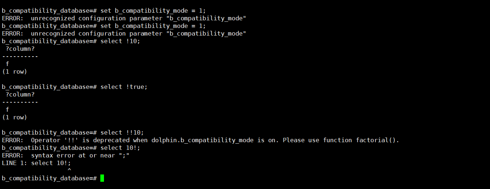

```
openGauss=# select text_bool('-0.01abc');
 text_bool 
-----------
 t
(1 row)
openGauss=# select text_bool('0abc');
 text_bool 
-----------
 f
(1 row)
openGauss=# select text_bool('abc');
 text_bool 
-----------
 f
(1 row)

```
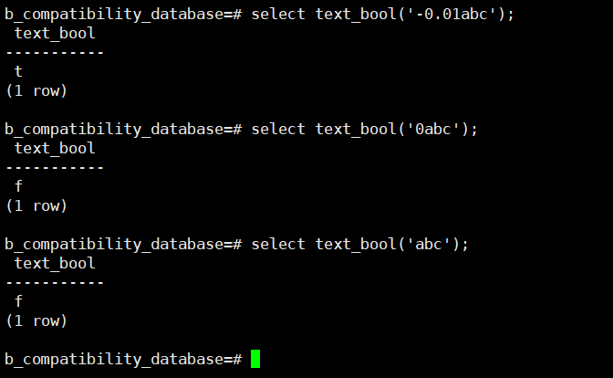


```
openGauss=# select varchar_bool('-0.0100abc');
 varchar_bool 
--------------
 t
(1 row)
openGauss=# select varchar_bool('0abc');
 varchar_bool 
--------------
 f
(1 row)
openGauss=# select varchar_bool('abc');
 varchar_bool 
--------------
 f
(1 row)

```
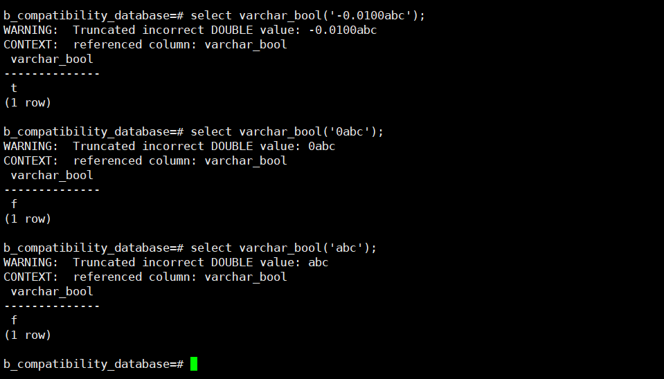

```
openGauss=# select char_bool('-0.0100abc');
 char_bool 
-----------
 t
(1 row)
openGauss=# select char_bool('0abc');
 char_bool 
-----------
 f
(1 row)
openGauss=# select char_bool('abc');
 char_bool 
-----------
 f
(1 row)

```
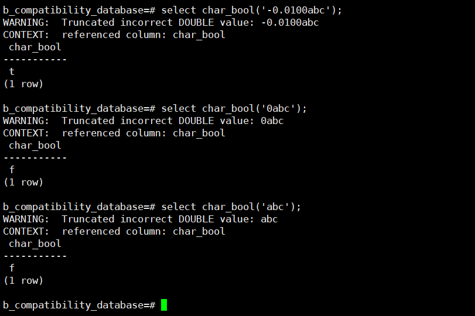


```
openGauss=# SELECT name_const('abc', 123);
 abc 
-----
 123
(1 row)

```


```
SELECT HEX(COMPRESS('2022-05-12 10:30:00'));
                              hex                               
----------------------------------------------------------------
 13000000789C33323032D23530D53534523034B03236B032300000240B03A1
(1 row)


```


```
SELECT UNCOMPRESS(COMPRESS('2022-05-12 10:30:00'));
     uncompress      
---------------------
 2022-05-12 10:30:00
(1 row)

```
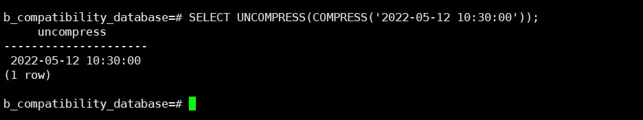


```
select hex(weight_string('abc' as binary(2)));
 hex  
------
 6162
(1 row)

select hex(weight_string('abc' as char(2) LEVEL 1 ));
   hex    
----------
 00410042
(1 row)

select hex(weight_string('abc' as char(2) LEVEL 1 DESC));
   hex    
----------
 FFBEFFBD
(1 row)

select hex(weight_string('abc' as char(2) LEVEL 1 REVERSE));
   hex    
----------
 42004100
(1 row)

```
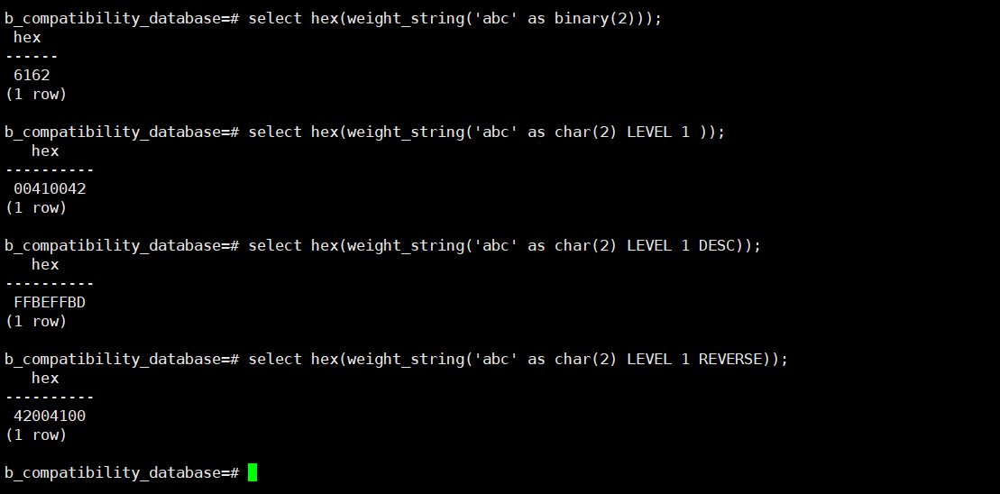


### (11)数字操作函数和操作符

```
openGauss=# SELECT 8 DIV 3 AS RESULT;
 result 
--------
      2
(1 row)

```
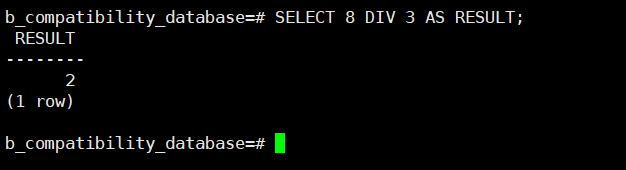

```
openGauss=# SELECT 4 MOD 3 AS RESULT;
 result 
--------
      1
(1 row)

```
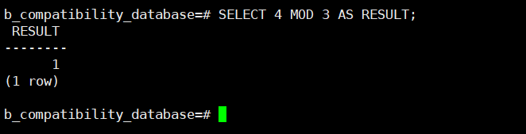


```
openGauss=# SELECT 4 XOR 3 AS RESULT;
 result 
--------
      0
(1 row)

```
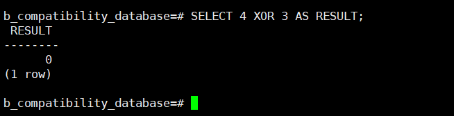

```
openGauss=# SELECT truncate(42.4382, 2);
 truncate
----------
    42.43
(1 row)

```


```
openGauss=# SELECT rand();
       rand
-------------------
 0.254671605769545
(1 row)

```


```
openGauss=# SELECT rand(1);
       rand
-------------------
 0.0416303444653749
(1 row)

```


```
openGauss=# SELECT random_bytes(1);
 random_bytes
--------------
 1F
(1 row)

```


```
openGauss=# SELECT crc32('abc');
   crc32
-----------
 891568578
(1 row)

```


```
openGauss=# SELECT conv(20, 10, 2);
 conv
-------
 10100
(1 row)

openGauss=# SELECT conv('8D', 16, 10);
 conv
------
 141
(1 row)

```


```
openGauss=# SELECT 1^1;
?column?
----------
       0
（1 row）

openGauss=# SELECT 2 ^ 3;
 ?column? 
----------
        1
(1 row)

openGauss=# SELECT power(2,3);
 power 
-------
     8
(1 row)

```
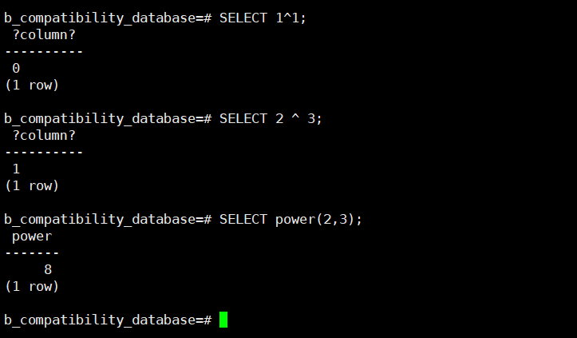

```
openGauss=# select 0.5678::float^1.1234::float;
 ?column? 
----------
        0
(1 row)

```


```
openGauss=# select float8_bool(0.1);
 float8_bool 
-------------
 t
(1 row)
openGauss=# select float8_bool(0.0);
 float8_bool 
-------------
 f
(1 row)

```
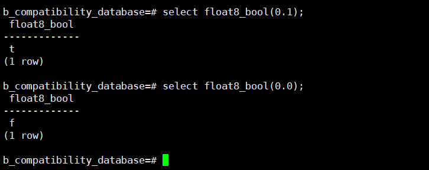


```
openGauss=# SELECT OCT(10);
 oct 
-----
12
(1 row)

openGauss=# SELECT OCT('10');
 oct 
-----
12
(1 row)

```
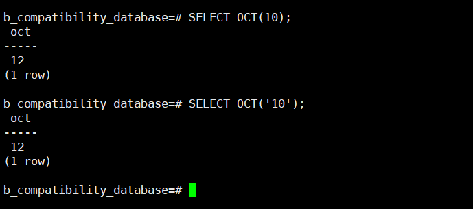

```
openGauss=# select float4_bool(0.1);
 float4_bool 
-------------
 t
(1 row)
openGauss=# select float4_bool(0.0);
 float4_bool 
-------------
 f
(1 row)

```
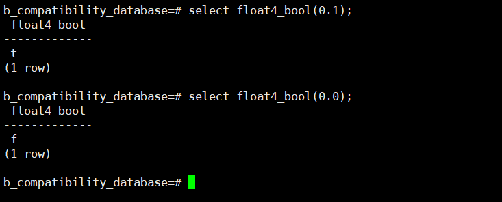

```
openGauss=# SELECT atan(2, 1);
      atan
------------------
 1.10714871779409
(1 row)

```
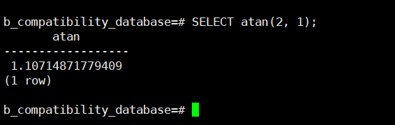

```
openGauss=# SELECT exp(1.0);
        exp
--------------------
 2.7182818284590452
(1 row)
openGauss=# set dolphin.b_compatibility_mode = on;
SET
openGauss=# SELECT exp(-1000);
 exp
-----
   0
(1 row)

```
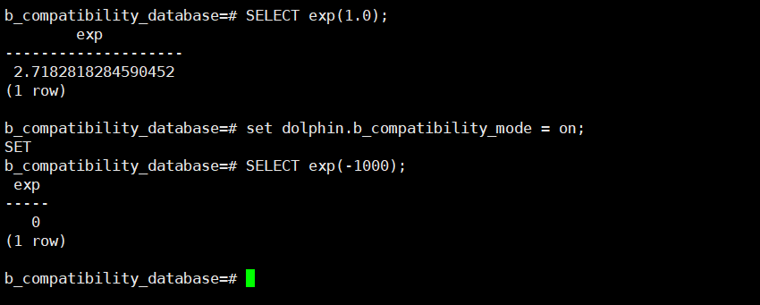


### (12)B数据库锁

```
--创建示例表格。
openGauss=# CREATE TABLE graderecord  
             (  
             number INTEGER,  
             name CHAR(20),  
             class CHAR(20),  
             grade INTEGER
             );
--插入数据。
openGauss=# insert into graderecord values('210101','Alan','21.01',92);  

--给示例表格。
openGauss=# LOCK TABLES graderecord WRITE;

--删除示例表格。
openGauss=# DELETE FROM graderecord WHERE name ='Alan';

openGauss=# UNLOCK TABLES;

```
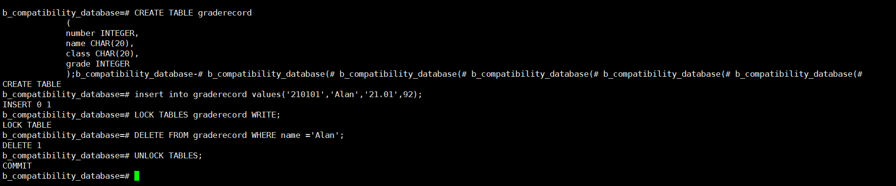

```
--创建示例表格。
openGauss=# CREATE TABLE graderecord  
             (  
             number INTEGER,  
             name CHAR(20),  
             class CHAR(20),  
             grade INTEGER
             );
--插入数据。
openGauss=# insert into graderecord values('210101','Alan','21.01',92);  

--给示例表格。
openGauss=# LOCK TABLES graderecord WRITE;

--删除示例表格。
openGauss=# DELETE FROM graderecord WHERE name ='Alan';

openGauss=# UNLOCK TABLES;

```
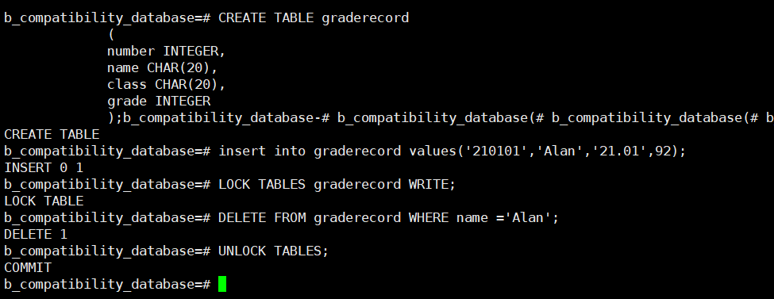


### (13)时间和日期处理函数和操作符
```
openGauss=# select curdate();
curdate
------------
2022-07-21
(1 row)
openGauss=# select current_time;
current_time
--------------
16:56:02
(1 row)
openGauss=# select current_time(3);
 current_time(3)
-----------------
16:57:23.255
(1 row)

openGauss=# select current_time();
 current_time()
----------------
17:05:01
(1 row)

```
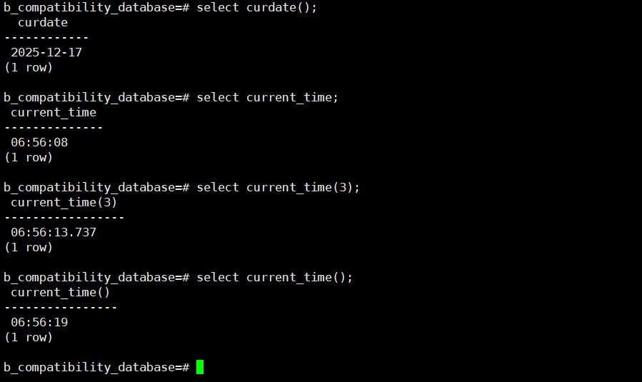


```
openGauss=# select curtime(3);
curtime(3)
--------------
17:45:33.844
(1 row)

openGauss=# select curtime();
curtime()
-----------
17:45:54
(1 row)

```
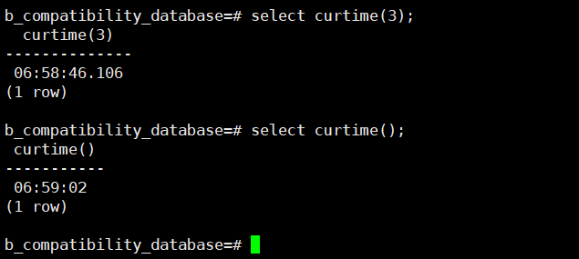

```
openGauss=# select current_timestamp;
  current_timestamp
---------------------
2022-07-21 16:59:38
(1 row)

```
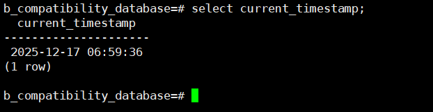

```
openGauss=# select current_timestamp(3);
  current_timestamp(3)
-------------------------
2022-07-21 17:00:41.251
(1 row)

openGauss=# select current_timestamp();
 current_timestamp()
---------------------
2022-07-21 17:06:06
(1 row)

```
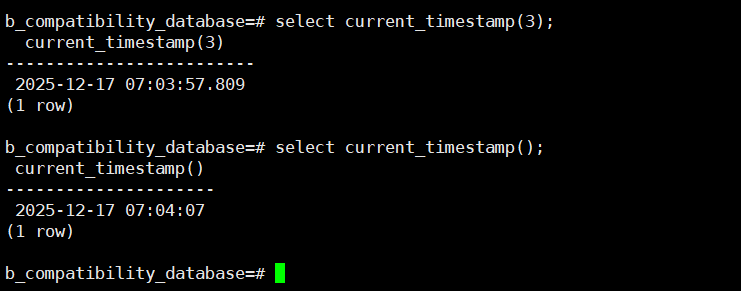


```
openGauss=# select curtime(3);
curtime(3)
--------------
17:45:33.844
(1 row)

openGauss=# select curtime();
curtime()
-----------
17:45:54
(1 row)

```
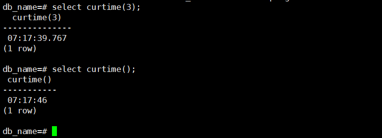


```
openGauss=# select current_timestamp;
  current_timestamp
---------------------
2022-07-21 16:59:38
(1 row)

```


```
openGauss=# select current_timestamp(3);
  current_timestamp(3)
-------------------------
2022-07-21 17:00:41.251
(1 row)

openGauss=# select current_timestamp();
 current_timestamp()
---------------------
2022-07-21 17:06:06
(1 row)

```


```
openGauss=# SELECT dayofmonth(timestamp '2001-02-16 20:38:40');
 date_part
-----------
        16
(1 row)
openGauss=# SELECT dayofweek(timestamp '2001-02-16 20:38:40');
 ?column?
----------
        6
(1 row)
openGauss=# SELECT dayofyear(timestamp '2001-02-16 20:38:40');
 date_part
-----------
        47
(1 row)
openGauss=# SELECT hour(timestamp '2001-02-16 20:38:40');
 date_part
-----------
        20
(1 row)
openGauss=# select localtime;
    localtime
---------------------
2022-07-21 17:02:04
(1 row)

```
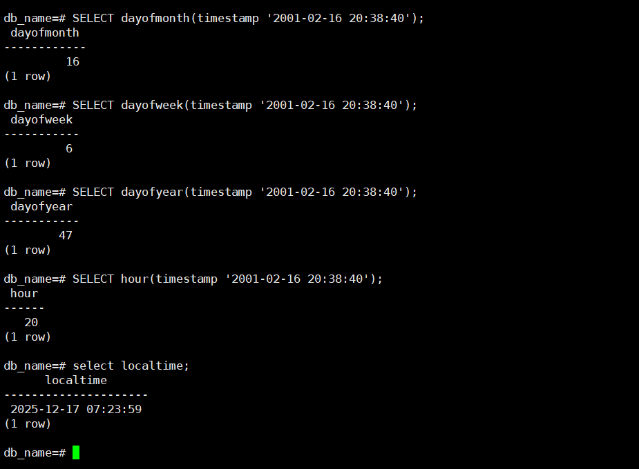


```
openGauss=# select localtime(3);
    localtime
---------------------
2022-07-21 17:02:04
(1 row)

openGauss=# select localtime();
    localtime()
---------------------
2022-07-21 17:14:22
(1 row)

```


```
openGauss=# select localtimestamp;
localtimestamp
---------------------
2022-07-21 17:17:20
(1 row)
openGauss=# select localtimestamp(3);
    localtimestamp(3)
-------------------------
2022-07-21 17:28:02.013
(1 row)

openGauss=# select localtimestamp();
localtimestamp()
---------------------
2022-07-21 17:28:49
(1 row)

```
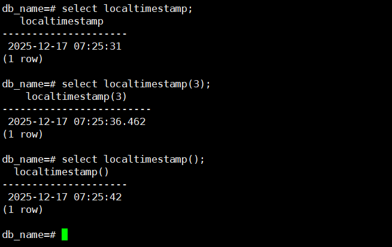

```
 openGauss=# SELECT MAKEDATE(2022,31), MAKEDATE(2022,32);
   makedate  |  makedate  
------------+------------
 2022-01-31 | 2022-02-01
(1 row)

-- 0<= year < 70 以及 70 <= year < 100
 openGauss=# SELECT MAKEDATE(0,31), MAKEDATE(70,32);
  makedate  |  makedate  
------------+------------
 2000-01-31 | 1970-02-01
(1 row)

-- dayofyear <= 0 以及 超出范围 的情况
 openGauss=# SELECT MAKEDATE(2022,0), MAKEDATE(9999,366);
  makedate | makedate 
----------+----------
          | 
(1 row)

```
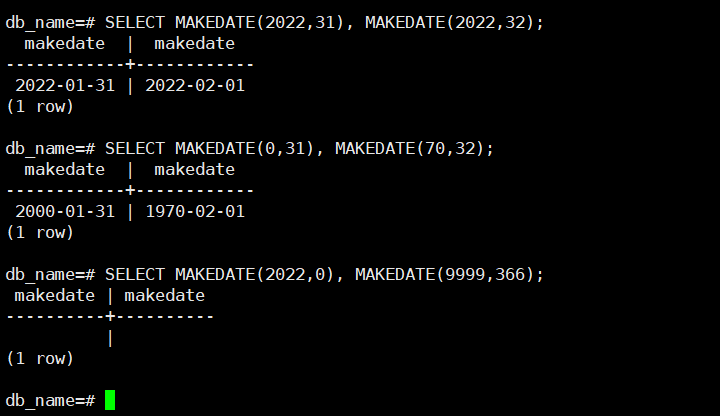

```
  openGauss=# SELECT MAKETIME(15, 15, 15.5);
  maketime  
------------
 15:15:15.5
(1 row)

-- 四舍五入进位
 openGauss=# SELECT MAKETIME(10, 15, 20.5000005);
    maketime     
-----------------
 10:15:20.500001
(1 row)

-- 超出边界值
 openGauss=# SELECT MAKETIME(839,0,0);
 maketime  
-----------
 838:59:59
(1 row)

```
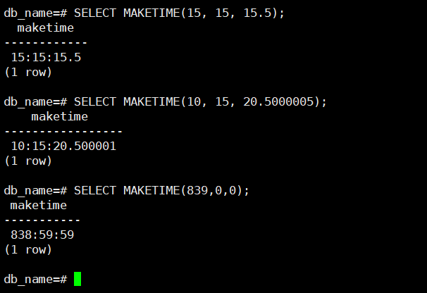

```
openGauss=# SELECT microsecond(timestamp '2001-02-16 20:38:40.123');
 date_part
-----------
    123000
(1 row)
openGauss=# SELECT minute(timestamp '2001-02-16 20:38:40.123');
 date_part
-----------
        38
(1 row)
openGauss=# select now(3);
        now(3)
-------------------------
2022-07-21 17:30:18.037
(1 row)

openGauss=# select now();
        now()
---------------------
2022-07-21 17:30:51
(1 row)

```
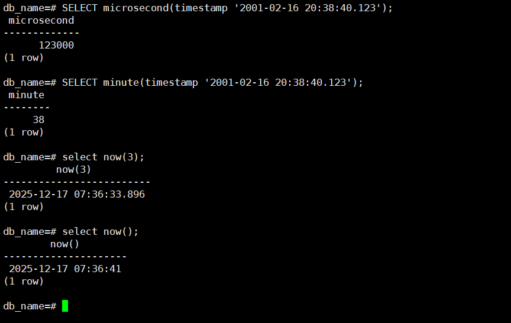

```
 openGauss=# SELECT PERIOD_ADD(202201, 2);
  period_add 
------------
     202203
(1 row)
 
 -- p = 0
 openGauss=# SELECT PERIOD_ADD(0, 2);
 period_add 
------------
          0
(1 row)

 -- 时期的年份处于[0,70) 或 [70, 100)范围内
 openGauss=# SELECT PERIOD_ADD(0101, 2), PERIOD_ADD(7001, 2);
 period_add | period_add 
------------+------------
     200103 |     197003
(1 row)

```
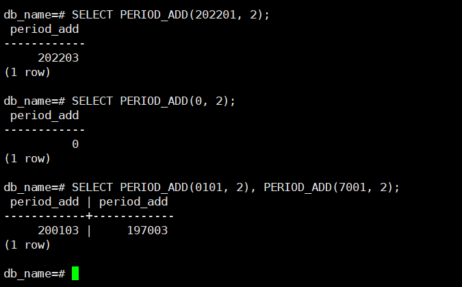

```
 openGauss=# SELECT PERIOD_DIFF(202201,202003);
  period_diff 
-------------
          22
(1 row)

 openGauss=# SELECT PERIOD_DIFF(0101,7001);
 period_diff 
-------------
         372
(1 row)

```
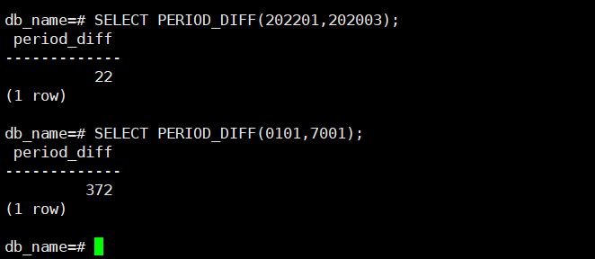

```
openGauss=# SELECT quarter(timestamp '2001-02-16 20:38:40.123');
 date_part
-----------
        1
(1 row)

```
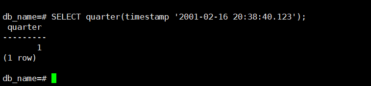

```
openGauss=# SELECT second(timestamp '2001-02-16 20:38:40.123');
 date_part
-----------
       40
(1 row)

```
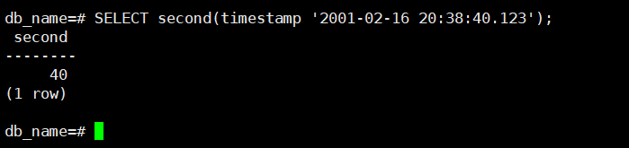

```
 openGauss=# SELECT SEC_TO_TIME(4396);
 sec_to_time 
-------------
 01:13:16
(1 row)

-- 四舍五入进位
 openGauss=# SELECT SEC_TO_TIME(2378.2222225);
   sec_to_time   
-----------------
 00:39:38.222223
(1 row)

-- 返回结果超出范围
 openGauss=# SELECT SEC_TO_TIME(3888888);
 sec_to_time 
-------------
 838:59:59
(1 row)

```
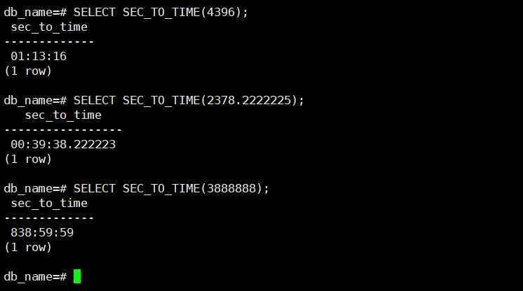

```
 openGauss=# SELECT SUBDATE('2022-01-01', INTERVAL 31 DAY), SUBDATE('2022-01-01', 31);
  subdate   |  subdate   
------------+------------
 2021-12-01 | 2021-12-01
(1 row)

-- 第一参数为DATE
 openGauss=# SELECT SUBDATE('2022-01-01', INTERVAL 1 YEAR);
  subdate   
------------
 2021-01-01
(1 row)

-- 第一参数为DATETIME
 openGauss=# SELECT SUBDATE('2022-01-01 01:01:01', INTERVAL 1 YEAR);
       subdate       
---------------------
 2021-01-01 01:01:01
(1 row)

-- 第一参数为DATE但是INTERVAL的单位包含TIME部分
 openGauss=# SELECT SUBDATE('2022-01-01', INTERVAL 1 SECOND);
       subdate       
---------------------
 2021-12-31 23:59:59
(1 row)

```
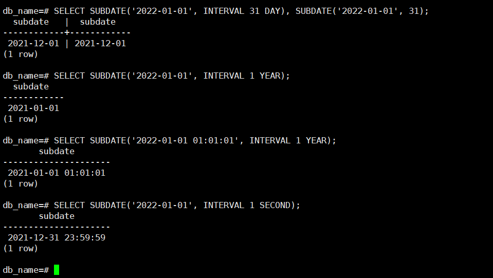


```
  openGauss=# SELECT SUBDATE(time'10:15:20', INTERVAL '1' DAY), SUBDATE(time'10:15:20', 1);
   subdate  |  subdate  
-----------+-----------
 -13:44:40 | -13:44:40
(1 row)

-- 第二参数的INTERVAL单位不能包含年或月部分
 openGauss=# SELECT SUBDATE(time'838:00:00', INTERVAL '1' MONTH);
WARNING:  time field value out of range
CONTEXT:  referenced column: subdate
 subdate
---------

(1 row)

-- 结果超出范围
 openGauss=# SELECT SUBDATE(time'838:59:59', INTERVAL '-1' SECOND);
WARNING:  time field value out of range
CONTEXT:  referenced column: subdate
 subdate
---------

(1 row)

```
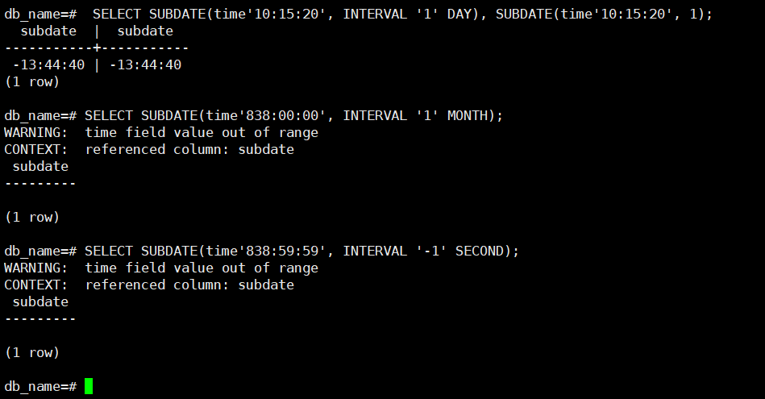


```
openGauss=# select subtime('11:22:33','10:20:30');
subtime  
----------
01:02:03
(1 row)

openGauss=# select SUBTIME('2020-03-04 11:22:33', '-10:20:30');
    subtime       
---------------------
2020-03-04 21:43:03
(1 row)

```
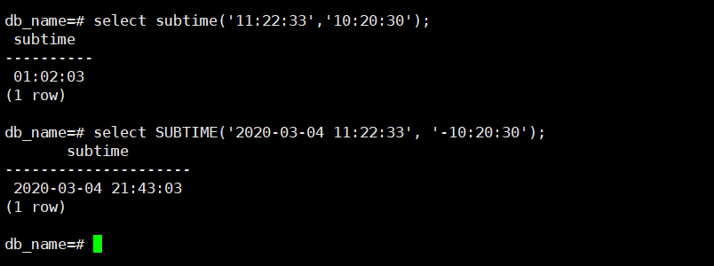

```
openGauss=# select sysdate(3);
    sysdate(3)
-------------------------
2022-07-21 17:38:23.442
(1 row)

openGauss=# select sysdate();
    sysdate()
---------------------
2022-07-21 17:39:02
(1 row)

```


```
openGauss=# select time('2022-1-1 1:1:1.1111116'), time('25:25:25');
      time       |   time   
-----------------+----------
01:01:01.111112 | 25:25:25
(1 row)

openGauss=# select time(date'2022-1-1');
  time   
----------
00:00:00
(1 row)

```
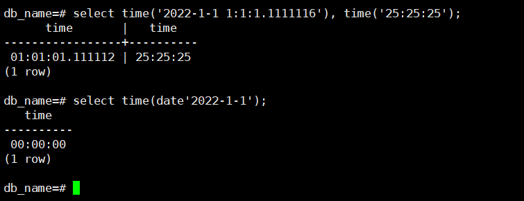

```
openGauss=# select TIMEDIFF(time'23:59:59',time'01:01:01'), TIMEDIFF(datetime'2008-12-31 23:59:59',datetime'2008-12-30 01:01:01');
 timediff | timediff
----------+----------
 22:58:58 | 46:58:58
(1 row)

-- 两参数对应类型不一致
opengauss=# select timediff('2000-1-1 0:0:0', '0:0:0'), timediff(time'0:0:0', datetime'2000-1-1 0:0:0');
 timediff | timediff 
----------+----------
          | 
(1 row)

-- 返回值超出范围时报错。
openGauss=# select timediff(time'-830:00:00', time'10:20:30');
ERROR:  time field value out of range
CONTEXT:  referenced column: timediff

```
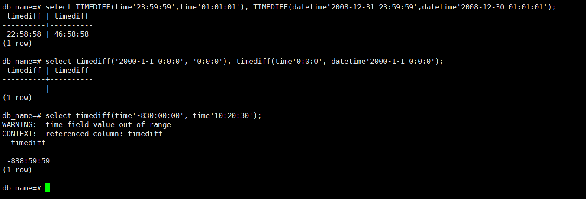

```
openGauss=# select TIMESTAMP('2022-01-01'), TIMESTAMP('20220101');
      timestamp      |      timestamp      
---------------------+---------------------
2022-01-01 00:00:00 | 2022-01-01 00:00:00
(1 row)

openGauss=# select TIMESTAMP('2022-01-31 12:00:00.123456'), TIMESTAMP('20000229120000.1234567');
        timestamp          |         timestamp          
----------------------------+----------------------------
2022-01-31 12:00:00.123456 | 2000-02-29 12:00:00.123457
(1 row)

openGauss=# select TIMESTAMP('2022-01-31','12:00:00.123456'), TIMESTAMP('2022-01-31 12:00:00','-32:00:00');
        timestamp          |      timestamp      
----------------------------+---------------------
2022-01-31 12:00:00.123456 | 2022-01-30 04:00:00
(1 row)

openGauss=# select TIMESTAMP('20000229','100:00:00'), TIMESTAMP('20000229120000.123','100:00:00');
     timestamp      |       timestamp
---------------------+-------------------------
 2000-03-04 04:00:00 | 2000-03-04 16:00:00.123
(1 row)

```
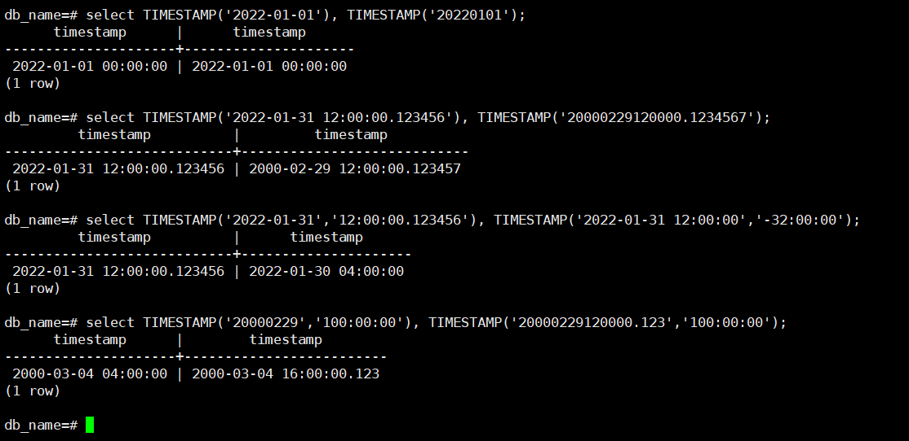


```
openGauss=# select timestampadd(day, 1, '2022-09-01');
 timestampadd 
--------------
 2022-09-02
(1 row)

openGauss=# select timestampadd(hour, 1, '2022-09-01 08:00:00');
    timestampadd     
---------------------
 2022-09-01 09:00:00
(1 row)

```
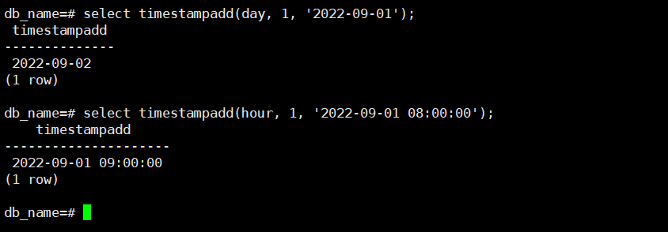

```
opengauss=# select time_format('100:59:59', '%H|%k|%T|%I');
    time_format      
----------------------
100|100|100:59:59|04
(1 row)
openGauss=# select TIME_FORMAT('83:59:59.0000009', '%T|%r|%H|%h|%I|%i|%S|%f|%p|%k');
                  time_format                    
--------------------------------------------------
83:59:59|11:59:59 AM|83|11|11|59|59|000001|AM|83
(1 row)

openGauss=# select TIME_FORMAT('2022-1-1 23:59:59.0000009', '%T|%r|%H|%h|%I|%i|%S|%f|%p|%k');
                  time_format                    
--------------------------------------------------
23:59:59|11:59:59 PM|23|11|11|59|59|000001|PM|23

```
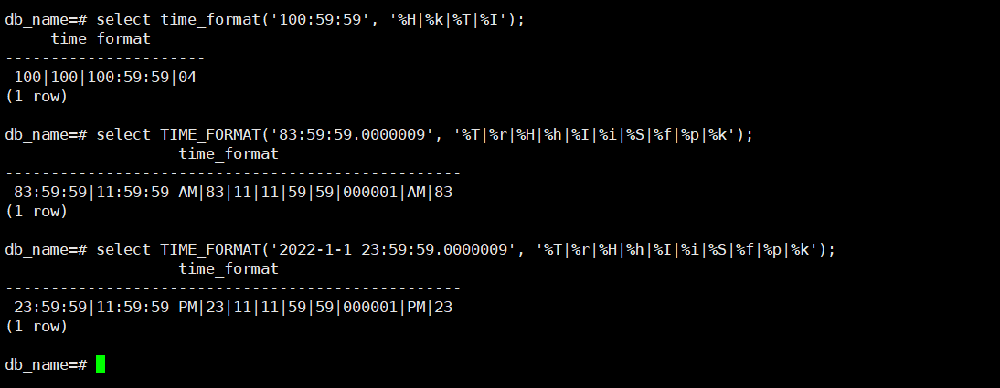

```
openGauss=# SELECT weekday(timestamp '2001-02-16 20:38:40.123');
 ?column?
----------
        4
(1 row)
openGauss=# SELECT weekofyear(timestamp '2001-02-16 20:38:40.123');
 date_part
-----------
        7
(1 row)
openGauss=# SELECT year(timestamp '2001-02-16 20:38:40.123');
 year
------
 2001
(1 row)

```
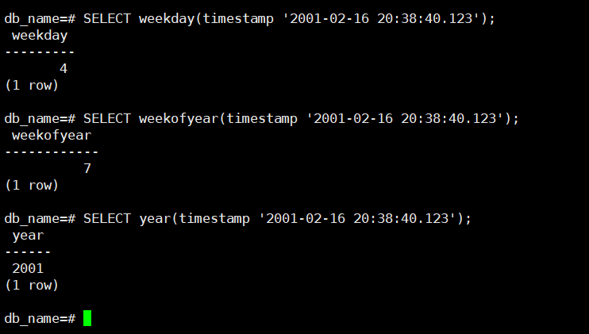

```
opengauss=# select to_days('0000-01-01');
 to_days
---------
       0
(1 row)

opengauss=# select to_days('2022-09-05 23:59:59.5');
 to_days
---------
  738768
(1 row)

-- 当前日期为: 2022-09-05
opengauss=# select to_days(time'25:00:00');
 to_days
---------
  738769
(1 row)

```
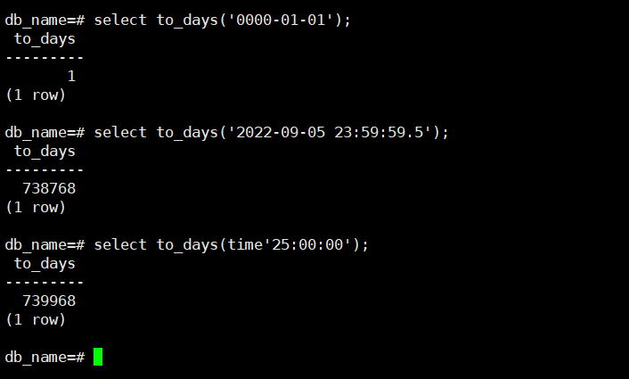

```
opengauss=# select to_seconds('2022-09-01');
 to_seconds
-------------
 63829209600
(1 row)

opengauss=# select to_seconds('2022-09-01 12:30:30.888');
 to_seconds
-------------
 63829254630
(1 row)

opengauss=# select to_seconds(20220901123030);
 to_seconds
-------------
 63829254630
(1 row)

```
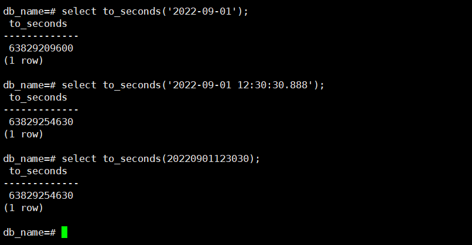

```
opengauss=# select unix_timestamp('2022-09-01');
 unix_timestamp 
----------------
     1661961600
(1 row)

opengauss=# select unix_timestamp('2022-09-01 12:30:30.888');
 unix_timestamp 
----------------
 1662006630.888
(1 row)

opengauss=# select unix_timestamp(20220901123030.6);
 unix_timestamp 
----------------
   1662006630.6
(1 row)

```
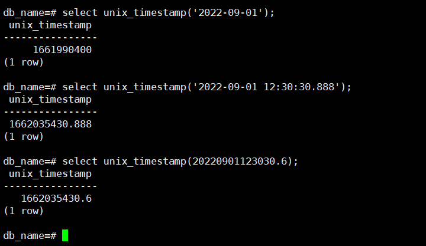

```
opengauss=# select UTC_DATE();
  utc_date  
------------
 2022-09-06
(1 row)

opengauss=# select UTC_DATE;
  utc_date  
------------
 2022-09-06
(1 row)

```
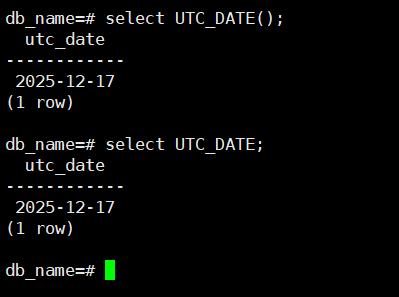

```
opengauss=# select UTC_TIME();
 utc_time 
----------
 15:13:54
(1 row)

opengauss=# select UTC_TIME(6);
    utc_time    
----------------
 15:13:56.59698
(1 row)

opengauss=# select UTC_TIME;
 utc_time 
----------
 15:14:01
(1 row)

```
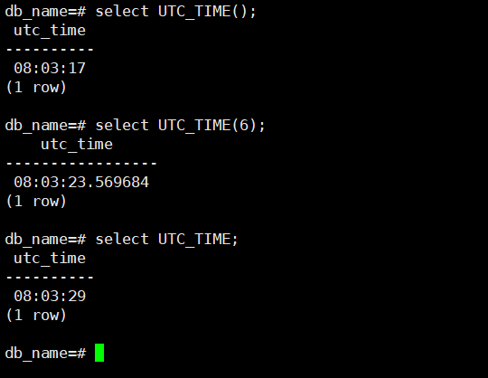

```
opengauss=# select UTC_TIMESTAMP();
    utc_timestamp    
---------------------
 2022-09-06 15:16:28
(1 row)

opengauss=# select UTC_TIMESTAMP(6);
       utc_timestamp        
----------------------------
 2022-09-06 15:16:34.691118
(1 row)

opengauss=# select UTC_TIMESTAMP;
    utc_timestamp    
---------------------
 2022-09-06 15:16:39

```
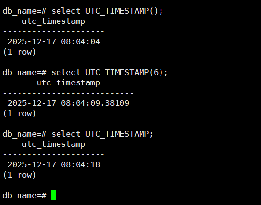

```
openGauss=# select date_bool('2022-08-20');
 date_bool 
-----------
 t
(1 row)
openGauss=# select date_bool('0000-00-00');
 date_bool 
-----------
 **f**
(1 row)

```
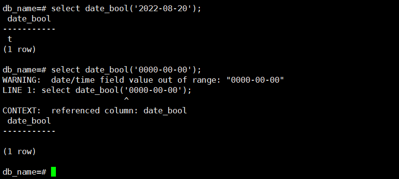

```
openGauss=# select time_bool('18:50:00');
 time_bool 
-----------
 t
(1 row)
openGauss=# select time_bool('00:00:00');
 time_bool 
-----------
 f
(1 row)

```
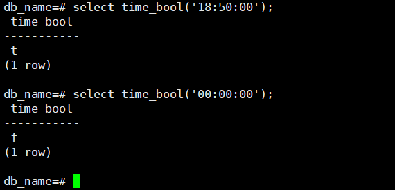

```
openGauss=# select dayname('2000-1-1');
dayname
----------
Saturday
(1 row)

openGauss=# alter system set dolphin.lc_time_names = 'zh_CN';
ALTER SYSTEM SET

openGauss=# select dayname('2000-1-1');
dayname
---------
星期六
(1 row)

```
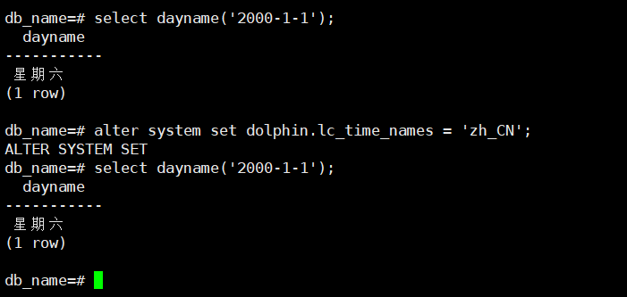

```
openGauss=# select monthname('2000-1-1');
monthname
-----------
January
(1 row)

openGauss=# alter system set dolphin.lc_time_names = 'zh_CN';
ALTER SYSTEM SET

openGauss=# select monthname('2000-1-1');
monthname
-----------
一月
(1 row)

```
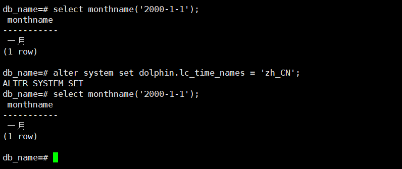

```
openGauss=# select time_to_sec('838:59:59');
time_to_sec
-------------
    3020399
(1 row)

openGauss=# select time_to_sec('-838:59:59');
time_to_sec
-------------
    -3020399
(1 row)

```
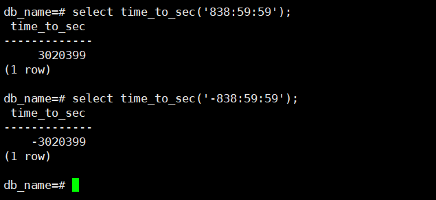

```
openGauss=# select month('2021-11-12');
month
-------
    11
(1 row)
openGauss=# select day('2021-11-12');
day
-----
12
(1 row)
openGauss=# select date('2021-11-12');
    date
------------
2021-11-12
(1 row)

openGauss=# select date('2021-11-12 23:59:59.9999999');
    date
------------
2021-11-13
(1 row)

```
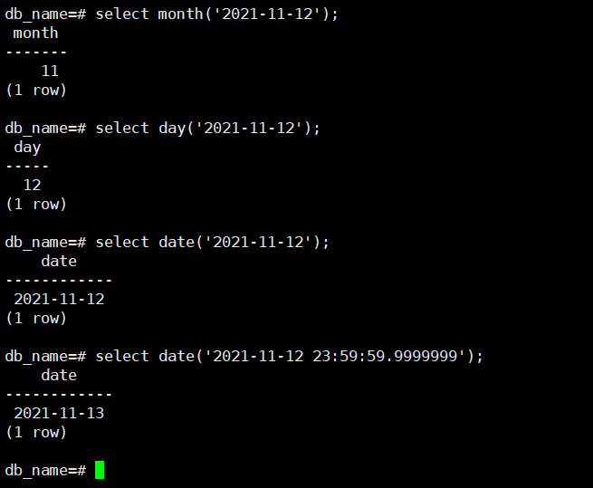

```
openGauss=# set dolphin.b_compatibility_mode = true;
SET

openGauss=# select last_day('2021-1-30');
last_day
------------
2021-01-31
(1 row)

```
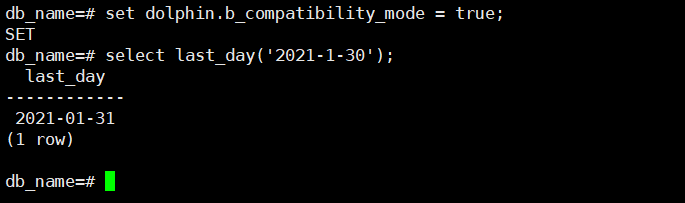

```
openGauss=# show dolphin.default_week_format;
dolphin.default_week_format
---------------------
0
(1 row)

-- 给定日期位于前一年的最后一周内，mode为0
openGauss=# select week('2000-1-1');
week
------
    0
(1 row)

openGauss=# alter system set dolphin.default_week_format = 2;
ALTER SYSTEM SET

-- 给定日期位于前一年的最后一周内，mode为2
openGauss=# select week('2000-1-1');
week
------
52
(1 row)

openGauss=# select week('2000-1-1', 2);
week
------
52
(1 row)


```
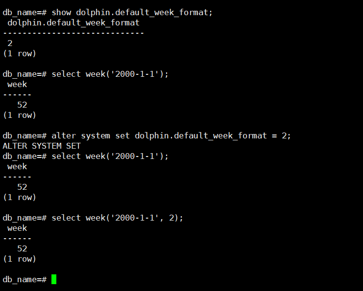

```
openGauss=# select week('1987-01-01', 0);
week
------
    0
(1 row)

openGauss=# select yearweek('1987-01-01', 0);
yearweek
----------
198652
(1 row)


```


```
openGauss=# select datediff('2001-01-01','321-02-02');
  datediff 
----------
  613576
(1 row)

```
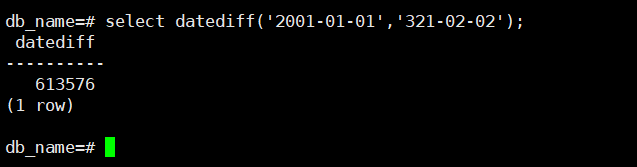

```
openGauss=# select from_days(365);
from_days  
------------
0000-00-00
(1 row)

openGauss=# select from_days(366);
from_days  
------------
0001-01-01
(1 row)

```
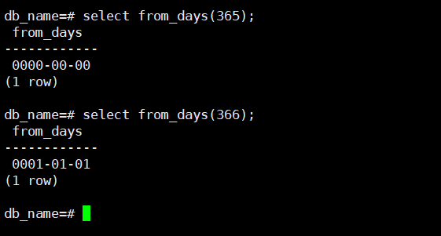

```
openGauss=# set dolphin.b_compatibility_mode = true;
SET

openGauss=# select timestampdiff(SECOND,'2001-01-01 12:12:12','2001-01-01 12:12:11');
timestampdiff
---------------
            -1
(1 row)

openGauss=# select timestampdiff(MONTH,'2001-01-01 12:12:12','2001-02-01 12:12:12');
timestampdiff
---------------
            1
(1 row)

```
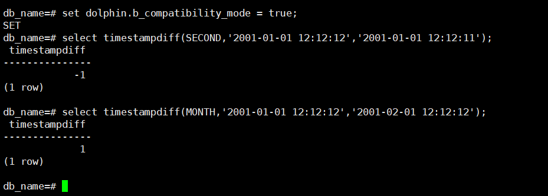

```
openGauss=# SELECT CONVERT_TZ('2004-01-01 12:00:00','GMT','MET');
      convert_tz
---------------------
  2004-01-01 13:00:00
(1 row)
openGauss=# SELECT DATE_ADD('2022-01-01', INTERVAL 31 DAY);
  date_add
------------
2022-02-01
(1 row)

openGauss=# SELECT DATE_ADD('2022-01-01 01:01:01', INTERVAL 1 YEAR);
    date_add       
---------------------
2023-01-01 01:01:01
(1 row)

openGauss=# SELECT DATE_ADD('2022-01-01', INTERVAL 1 SECOND);
    date_add       
---------------------
2022-01-01 00:00:01
(1 row)

```
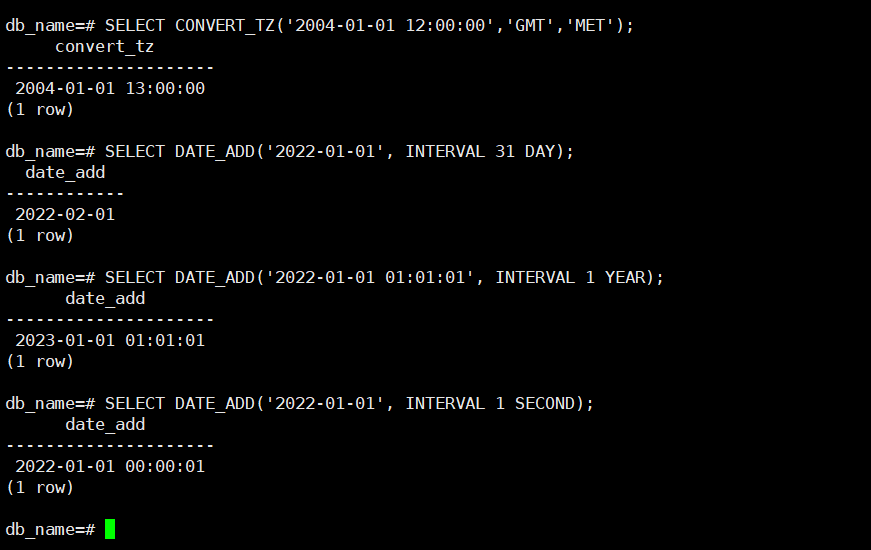

```
openGauss=# SELECT DATE_ADD(datetime'2022-01-01 01:01:01', INTERVAL 1 YEAR);
    date_add
---------------------
2023-01-01 01:01:01
(1 row)
openGauss=# SELECT DATE_SUB('2022-01-01', INTERVAL 31 DAY);
  date_sub
------------
2021-12-01
(1 row)

openGauss=# SELECT DATE_SUB('2022-01-01 01:01:01', INTERVAL 1 YEAR);
    date_sub       
---------------------
2021-01-01 01:01:01
(1 row)

openGauss=# SELECT DATE_SUB('2022-01-01', INTERVAL 1 SECOND);
    date_sub       
---------------------
2021-12-31 23:59:59
(1 row)

```
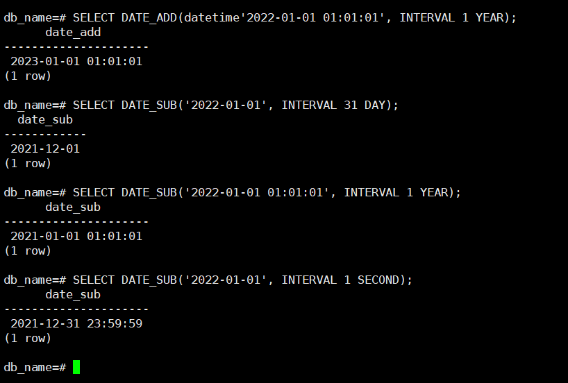

```
openGauss=# SELECT DATE_SUB(datetime'2022-01-01 01:01:01', INTERVAL 1 YEAR);
    date_add
---------------------
2021-01-01 01:01:01
(1 row)
openGauss=# SELECT ADDDATE('2021-11-12', INTERVAL 1 SECOND);
      adddate
---------------------
2021-11-12 00:00:01
(1 row)

openGauss=# SELECT ADDDATE(time'12:12:12', INTERVAL 1 DAY);
adddate
----------
36:12:12
(1 row)

openGauss=# SELECT ADDDATE('2021-11-12', 1);
  adddate
------------
2021-11-13
(1 row)

openGauss=# SELECT ADDDATE(time'12:12:12', 1);
adddate
----------
36:12:12
(1 row)

```
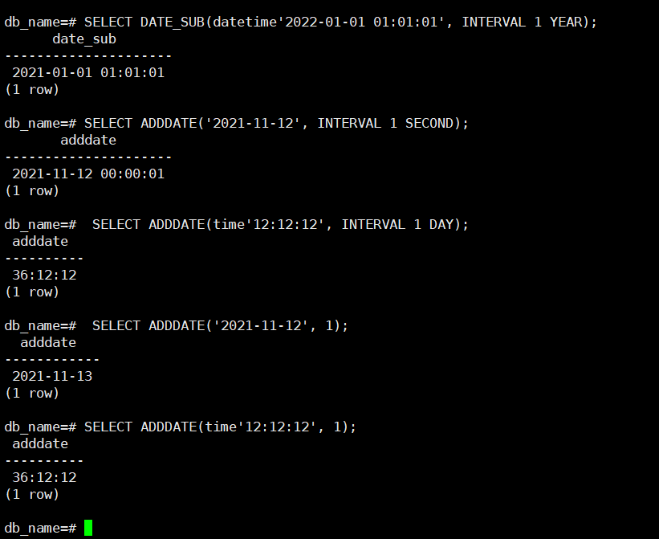

```
openGauss=# SELECT ADDTIME('11:22:33','10:20:30');
addtime  
----------
21:43:03
(1 row)

openGauss=# SELECT ADDTIME('2020-03-04 11:22:33', '-10:20:30');
addtime       
---------------------
2020-03-04 01:02:03
(1 row)

```
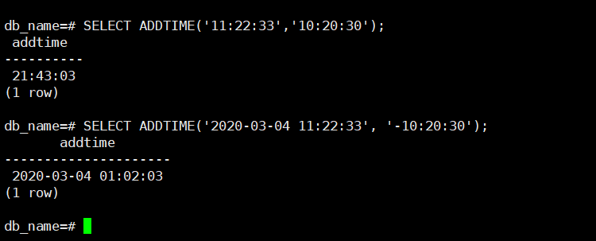

```
openGauss=# select get_format(datetime, 'iso');
    get_format
-------------------
%Y-%m-%d %H:%i:%s
(1 row)

```


```
openGauss=# set dolphin.b_compatibility_mode = true;
SET

openGauss=# select extract(year from '2021-11-12 12:12:12.000123');
extract
---------
    2021
(1 row)

openGauss=# select extract(day_microsecond from '2021-11-12 12:12:12.000123');
    extract
----------------
12121212000123
(1 row)

openGauss=# select extract(hour_microsecond from '2021-11-12 12:12:12.000123');
  extract
--------------
121212000123
(1 row)

openGauss=# set dolphin.b_compatibility_mode = false;
SET

```
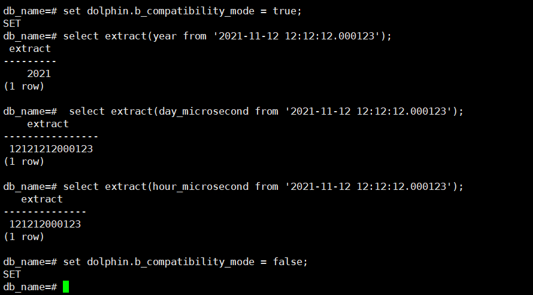

```
-- 将日期格式化为指定内容
openGauss=# select date_format('2001-01-01 12:12:12','%Y %M %H');
date_format   
-----------------
2001 January 12
(1 row)

-- 将日期格式化为所在周数或者工作日
openGauss=# select date_format('2001-01-01 12:12:12','%V %v %U %u %W %w');
    date_format
----------------------
53 01 00 01 Monday 1
(1 row)

```
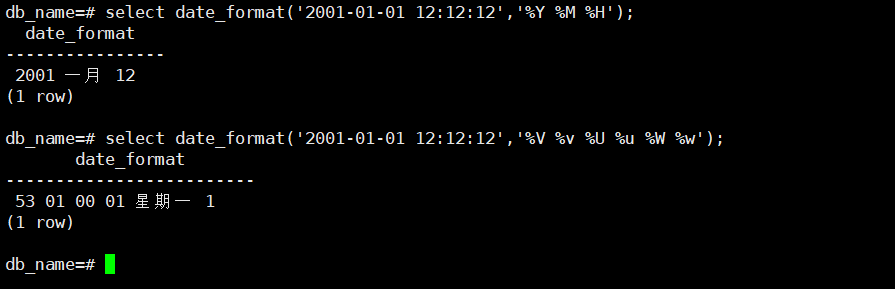

```
openGauss=# select from_unixtime(1);
    from_unixtime
---------------------
1970-01-01 08:00:01
(1 row)

openGauss=# select from_unixtime(1,'%Y');
from_unixtime 
---------------
1970
(1 row)

openGauss=# select from_unixtime(2147483647);
    from_unixtime
---------------------
2038-01-19 11:14:07
(1 row)

openGauss=# select from_unixtime(2147483648);
from_unixtime
---------------

(1 row)

```
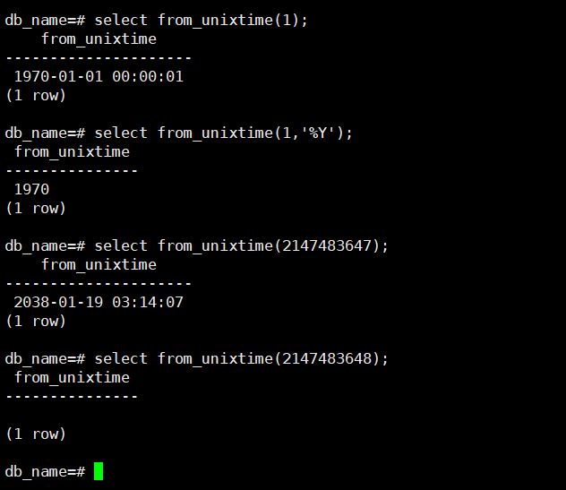

```
-- 普通构造日期
openGauss=# select str_to_date('01,5,2013','%d,%m,%Y');
str_to_date
-------------
2013-05-01
(1 row)

-- 使用年份，周数，工作日构造日期
openGauss=# select str_to_date('200442 Monday', '%X%V %W');
str_to_date
-------------
2004-10-18
(1 row)

-- 使用年份，天数构造日期
openGauss=# select str_to_date('2004 100', '%Y %j');
str_to_date
-------------
2004-04-09
(1 row)

-- 构造时间
openGauss=# set dolphin.sql_mode = 'sql_mode_strict,sql_mode_full_group,pipes_as_concat,ansi_quotes';
SET
openGauss=# select str_to_date('1:12:12 pm', '%r');
str_to_date
-------------
13:12:12
(1 row)


```
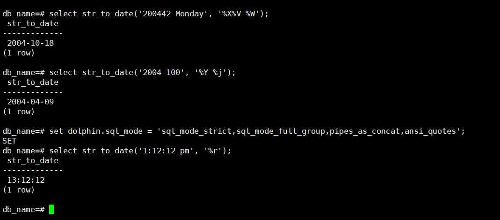

```
openGauss=# SELECT sleep(1);
sleep 
-------
    0
(1 row)

```


### (14)网络地址函数和操作符
```
openGauss=# select is_ipv4('192.168.0.1');
 is_ipv4
---------
       1
(1 row)
openGauss=# select is_ipv4('192.168.0.1'::inet);
 is_ipv4
---------
       1
(1 row)

```
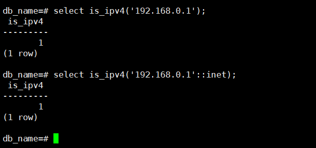

```
openGauss=# select is_ipv6('2403:A200:A200:0:AFFF::3');
 is_ipv6
---------
       1
(1 row)
openGauss=# select is_ipv6('2403:A200:A200:0:AFFF::3'::inet);
 is_ipv6
---------
       1
(1 row)

```
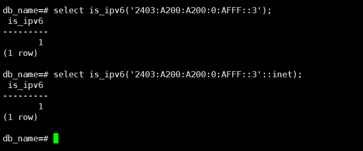

```
openGauss=# SELECT INET_ATON('10.0.5.9');
 inet_aton
-----------
 167773449
 (1 row)
openGauss=# SELECT INET_NTOA(167773449);
 inet_ntoa
-----------
 10.0.5.9
(1 row)

```
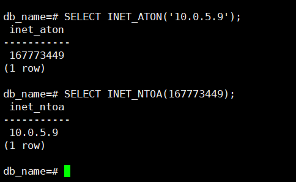

```
openGauss=# SELECT HEX(INET6_ATON('fdfe::5a55:caff:fefa:9089'));
              hex
----------------------------------
 FDFE0000000000005A55CAFFFEFA9089
(1 row)
 openGauss=# SELECT HEX(INET6_ATON('10.0.5.9'));
   hex
----------
 0A000509
(1 row)

```
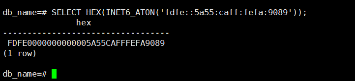

```
openGauss=# SELECT INET6_NTOA(INET6_ATON('fdfe::5a55:caff:fefa:9089'));
 inet6_ntoa
---------------------------
fdfe::5a55:caff:fefa:9089
(1 row)
openGauss=# SELECT INET6_NTOA(INET6_ATON('10.0.5.9'));
 inet6_ntoa
------------
 10.0.5.9
(1 row)

```
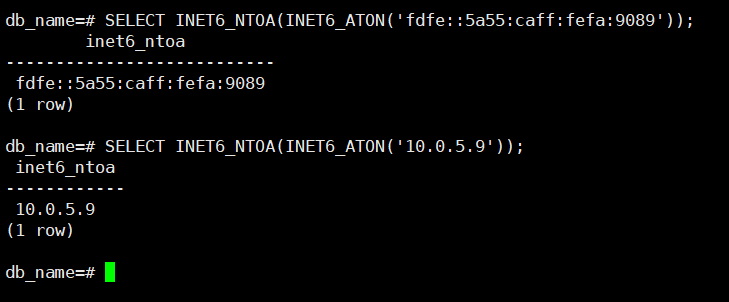

```
openGauss=# SELECT IS_IPV4_COMPAT(INET6_ATON('::10.0.5.9'));
 is_ipv4_compat 
----------------
              1
(1 row)
openGauss=# SELECT IS_IPV4_COMPAT(INET6_ATON('::ffff:10.0.5.9'));
 is_ipv4_compat 
----------------
              0
(1 row)

```
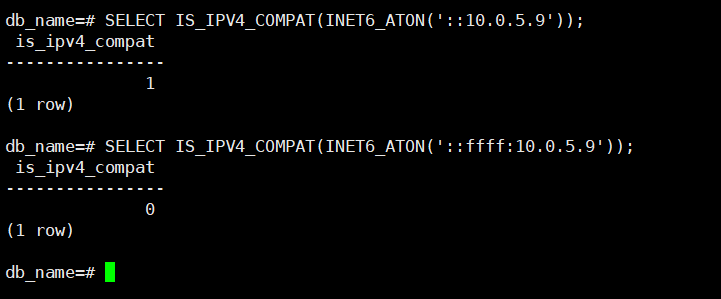

```
openGauss=# SELECT IS_IPV4_MAPPED(INET6_ATON('::10.0.5.9'));
 is_ipv4_mapped 
----------------
              0
(1 row)

openGauss=# SELECT IS_IPV4_MAPPED(INET6_ATON('::ffff:10.0.5.9'));
 is_ipv4_mapped 
----------------
              1
(1 row)

```
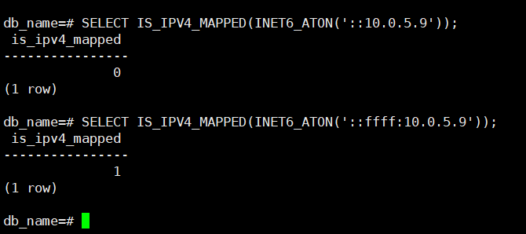

### (15)条件表达式函数

```
openGauss=# select if(true, 1, 2);
 case
------
    1
(1 row)
openGauss=# select if(false, 1, 2);
 case
------
    2
(1 row)

```
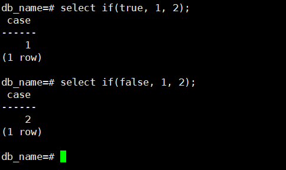

```
openGauss=# SELECT ifnull('hello','world');
  nvl  
-------
 hello
(1 row)
openGauss=# SELECT isnull('hello');
?column?  
--------
      f 
(1 row)

```
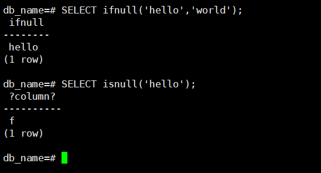

```
openGauss=# SELECT interval(5,2,3,4,6,7);
 interval
----------
        3
(1 row)
openGauss=# SELECT interval(false,-1,0,true,2);
 interval
----------
        2
(1 row)
openGauss=# SELECT interval('2022-12-12'::timestamp,'asdf','2020-12-12'::date,2023);
 interval
----------
        **2**
(1 row)

```
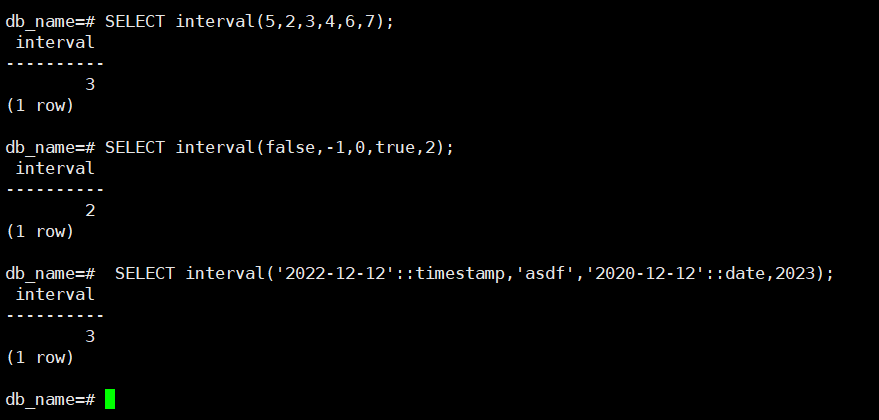

```
openGauss=# SELECT strcmp('asd','asd');
 strcmp 
--------
      0
(1 row)
openGauss=# SELECT strcmp(312,311);
 strcmp 
--------
      1
(1 row)
openGauss=# SELECT strcmp('2021-12-12'::timestamp,20210::float8);
 strcmp 
--------
     -1
(1 row)

```
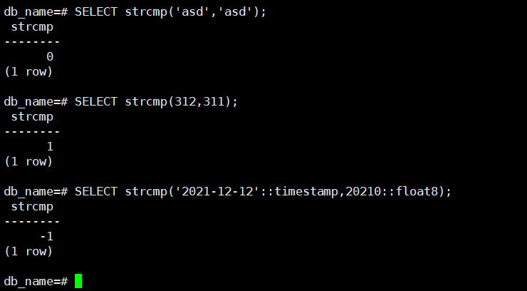


### (16)聚集函数
```
openGauss=# create table test_any_value(a int, b int);
CREATE TABLE
openGauss=# insert into test_any_value values(1,1),(2,1),(3,2),(4,2);
INSERT 0 4
openGauss=# select any_value(a), b from test_any_value group by b;
any_value | b
-----------+---
        1 | 1
        3 | 2
(2 rows)

```
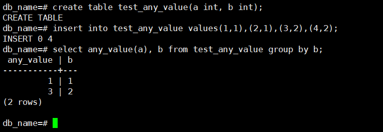

```
openGauss=# create database test dbcompatibility 'B';
CREATE DATABASE
openGauss=# \c test
Non-SSL connection (SSL connection is recommended when requiring high-security)
You are now connected to database "test" as user "test".
test=# CREATE TABLE TEST(id int default 100, stime timestamp default now());
CREATE TABLE
test=# insert into test values(1, now());
INSERT 0 1
test=# select default(id) from test;
mode_b_default
----------------
            100
(1 row)

test=# select default(stime) from test;
mode_b_default
----------------

(1 row)

test=# insert into test values(default(id) + 10);
INSERT 0 1
test=# update test set id = default(id) - 10;
UPDATE 2
test=# delete from test where id = default(id) - 10;
DELETE 2

```
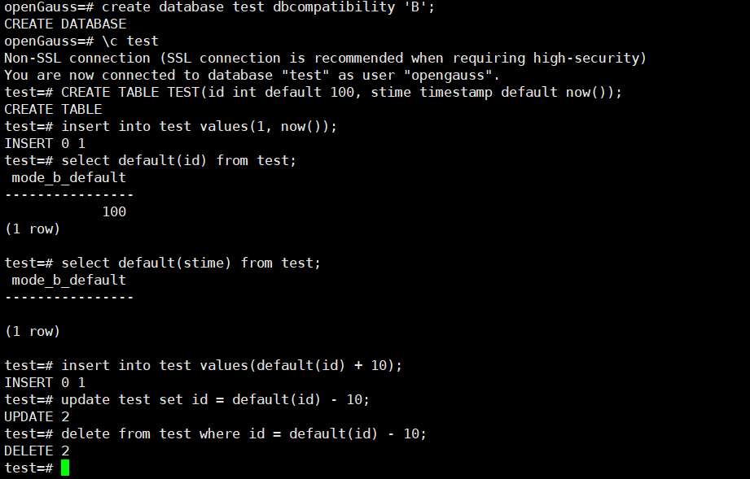

### (17)系统信息函数
```
openGauss=# SELECT database();
 database
----------
 public
(1 row)
openGauss=# SELECT current_role();
 current_user
----------
 omm
(1 row)

```
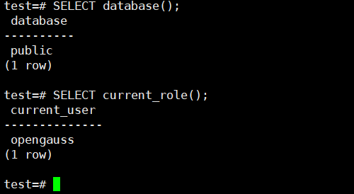

```
openGauss=# select uuid_short();
    uuid_short    
------------------
3939644819374082
(1 row)
openGauss=# SELECT dolphin_version();
    dolphin_version
------------------------
 dolphin build 511401b6
(1 row)
openGauss=# SELECT dolphin_types();
                    dolphin_types
----------------------------------------------------------------------------------------------------------------------------------------------
{{uint1,false,false},{uint2,false,false},{uint4,false,false},{uint8,false,false},{year,true,false},{binary,true,false},{varbinary,true,false},{tinyblob,false,false},{mediumblob,false,false},{longblob,false,false},{set,false,false},{enum,false,false}}
(1 row)

```
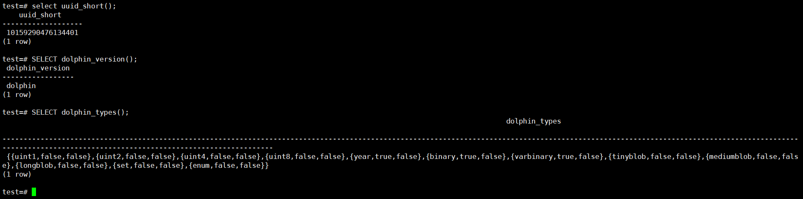

```
openGauss=# select uuid_short();
    uuid_short    
------------------
3939644819374082
(1 row)
openGauss=# SELECT dolphin_version();
    dolphin_version
------------------------
 dolphin build 511401b6
(1 row)
openGauss=# SELECT dolphin_types();
                    dolphin_types
----------------------------------------------------------------------------------------------------------------------------------------------
{{uint1,false,false},{uint2,false,false},{uint4,false,false},{uint8,false,false},{year,true,false},{binary,true,false},{varbinary,true,false},{tinyblob,false,false},{mediumblob,false,false},{longblob,false,false},{set,false,false},{enum,false,false}}
(1 row)

```


### (18)密码函数
```
openGauss=# select set_native_password('omm', 'xxxxxx');
    set_native_password            
------------------------------------------
**676a8fd5633248f6f59e17d4939f7f6e7093c350**
(1 row)

```
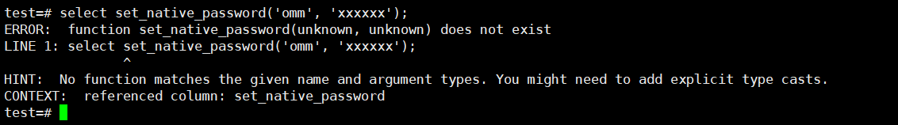

### (19)逻辑操作符
```
openGauss=# SELECT 1 && 1;
?column?
----------
       t
（1 row）
openGauss=# SELECT 0 || 0;
?column?
----------
      ** f**
（1 row）

```

```
select '2022-1-12 12:23:23' and '19980112122324';
select '2022-1-12 12:23:23'::datetime and  '20220112122324';
select '2022-1-12 12:23:23' and  '20220112122324':: timestamp;
select '20201229' and '0000-00-00 00:00:00';
select '00000000' and '0000-00-00 00:00:00';
select null and '2022-1-12 12:23:23'::datetime;
 ?column?
----------
 t
(1 row)

 ?column?
----------
 t
(1 row)

 ?column?
----------
 t
(1 row)

 ?column?
----------
 f
(1 row)

 ?column?
----------
 f
(1 row)

 ?column?
----------

(1 row)

```
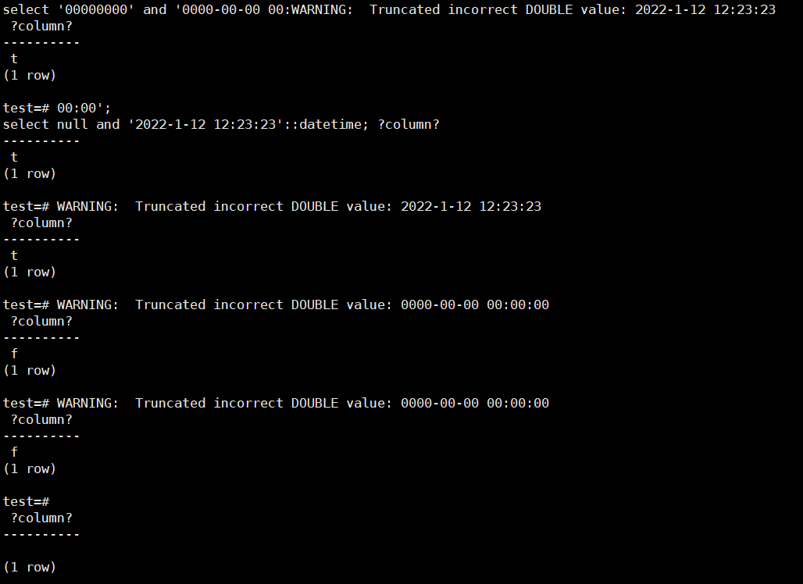


```
select datetime '2022-1-12 12:23:23' or  timestamp '20220112122324';
select NULL or timestamp '20220112122324';
select date '0000-00-00 00:00:00' or  date '20201229';
select '0000-00-00 00:00:00' or '00000000000000':: datetime;
select '0000-00-00 00:00:00' or NULL;
 ?column?
----------
 t
(1 row)

 ?column?
----------
 t
(1 row)

 ?column?
----------
 **t**
(1 row)

 ?column?
----------
 **f**
(1 row)

 ?column?
----------

(1 row)

```
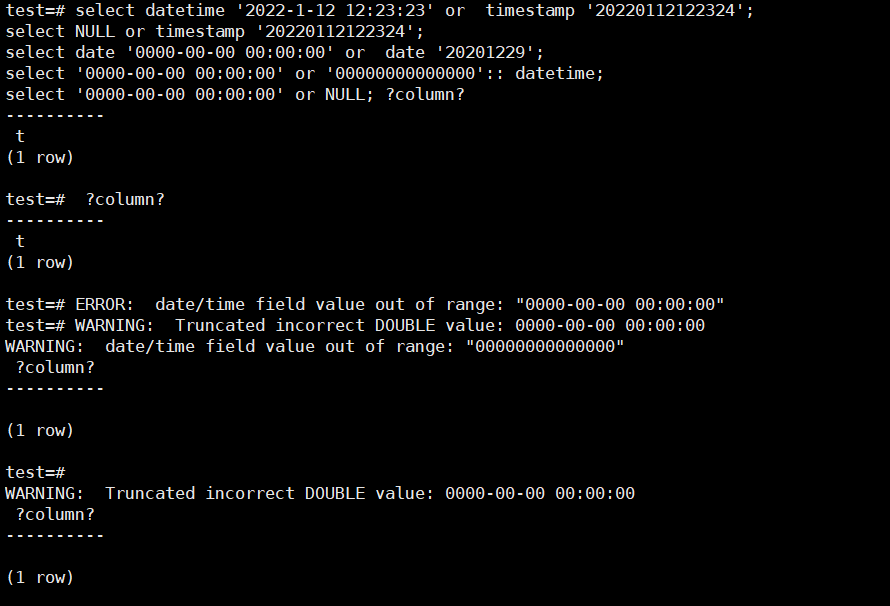

### (20)位串操作函数和操作符
```
openGauss=# select bit_bool('11111');
 bit_bool 
----------
 t
(1 row)
openGauss=# select bit_bool('00001');
 bit_bool 
----------
 t
(1 row)
openGauss=# select bit_bool('00000');
 bit_bool 
----------
 f
(1 row)

```
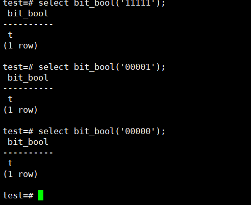

```
openGauss=# select 11 ^ 3;
 ?column? 
----------
 8
(1 row)

openGauss=# select b'1001'^b'1100';
 ?column? 
----------
 5
(1 row)

openGauss=# select b'1001'::blob^b'1100'::blob;
 ?column? 
----------
 \x05
(1 row)

```
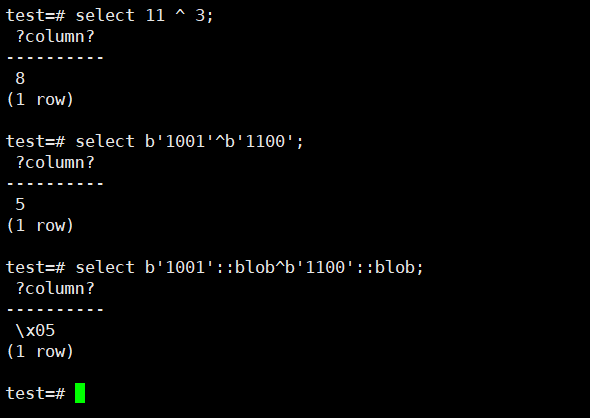

```
openGauss=# SELECT bit_count(29);
 bit_count 
----------
 4
(1 row)
openGauss=# SELECT bit_count(b'101010');
 bit_count 
----------
 3
(1 row)

```
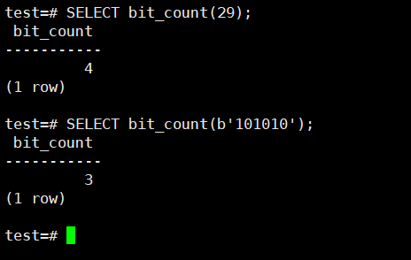

```
openGauss=# INSERT INTO bit_xor_int4(a) values(-1.11);
INSERT 0 1
openGauss=# SELECT BIT_XOR(a) from bit_xor_int4;
bit_xor 
---------
18446744073709551615
(1 row)

openGauss=# INSERT INTO bit_xor_int4(a) values(1.11);
INSERT 0 1
openGauss=# SELECT BIT_XOR(a) from bit_xor_int4;
bit_xor 
---------
18446744073709551614
(1 row)

```
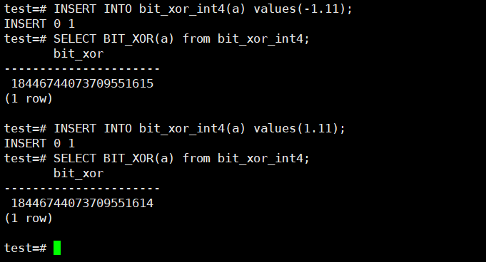


### (21)JSON-JSONB函数和操作符
```
opengauss=# select json_array(1,'a','b',true,null);

        json_array         
---------------------------

 [1, "a", "b", true, null]
(1 row)


```
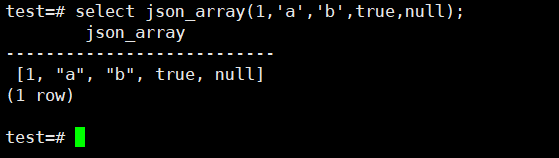

```
opengauss=# SET dolphin.b_compatibility_mode = 1;
SELECT JSON_OBJECT(
    'name', 'Tim',          -- 添加键值对 'name' : 'Tim'
    'age', 20,              -- 添加键值对 'age' : 20
    'friend', JSON_OBJECT(  -- 添加键值对 'friend'，其值是一个嵌套的 JSON 对象
        'name', 'Jim',      -- 嵌套对象中的键值对 'name' : 'Jim'
        'age', 20           -- 嵌套对象中的键值对 'age' : 20
    ),
    'hobby', JSON_BUILD_ARRAY('games', 'sports') -- 添加键值对 'hobby'，其值是一个 JSON 数组 ['games', 'sports']
) AS object;

    object                                                
------------------------------------------------------------------------------------------------------

 {"age" : 20, "name" : "Tim", "hobby" : ["games", "sports"], "friend" : {"age" : 20, "name" : "Jim"}}
(1 row)

opengauss=# SET dolphin.b_compatibility_mode = 0;
opengauss=# select json_object('{a,b,"a b c"}', '{a,1,1}');
              json_object              
---------------------------------------
 {"a" : "a", "b" : "1", "a b c" : "1"}
(1 row)
```
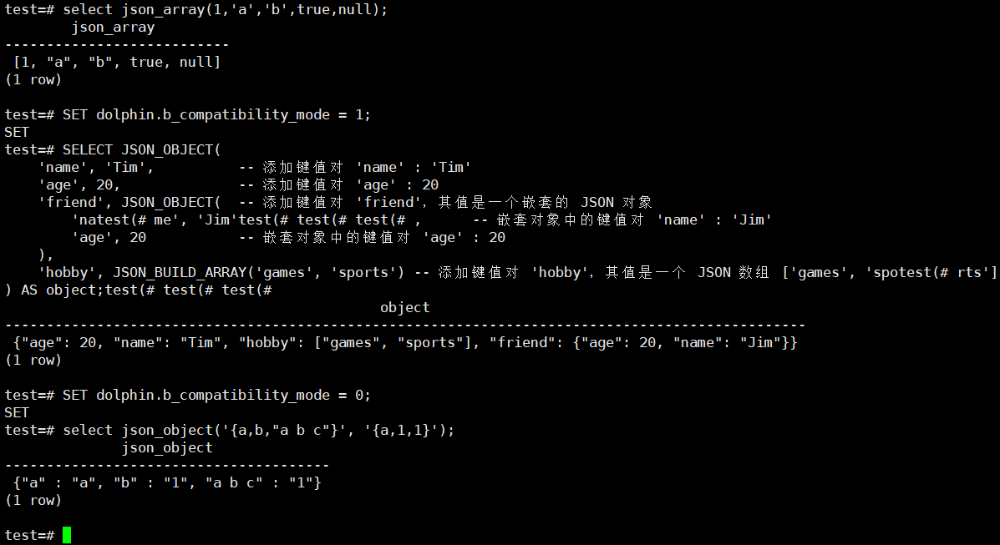

```
opengauss=# select json_quote('gauss');
 json_quote 
------------
 "gauss"
(1 row)

#opengauss反斜杠非转译模式
opengauss=# select json_quote('\\t\\u0032');
    json_quote    
------------------
 "\\\\t\\\\u0032"
(1 row)

#opengauss反斜杠转译模式
opengauss=# select json_quote(E'\\t\\u0032');
  json_quote  
--------------
 "\\t\\u0032"
(1 row)

#opengauss支持数值型
opengauss=# select json_quote(1);
 json_quote 
------------
 "1"
(1 row)

```
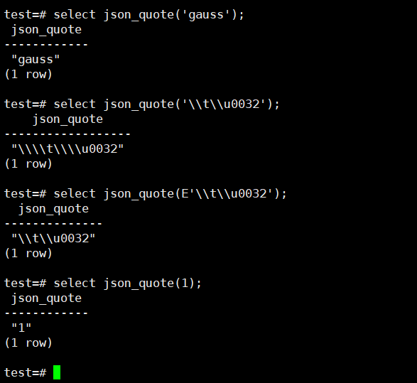

```
openGauss=# select json_contains('[1,2,3,4,5]','[3,5]');
 json_contains 
---------------
 t
(1 row)

openGauss=# select json_contains('[1,2,3,4,5]','6');
 json_contains 
---------------
 f
(1 row)

openGauss=# select json_contains('{"a":[null,true,false]}','{"a":false}');
 json_contains 
---------------
 t
(1 row)

openGauss=# select json_contains('{"a":[1,2,3]}','3');
 json_contains 
---------------
 f
(1 row)

openGauss=# select json_contains('{"a":[1,2,3]}','3','$.a');
 json_contains 
---------------
 t
(1 row)

openGauss=# select json_contains('{"a":[1,2,3]}','3','$.b');
 json_contains 
---------------

(1 row)

```
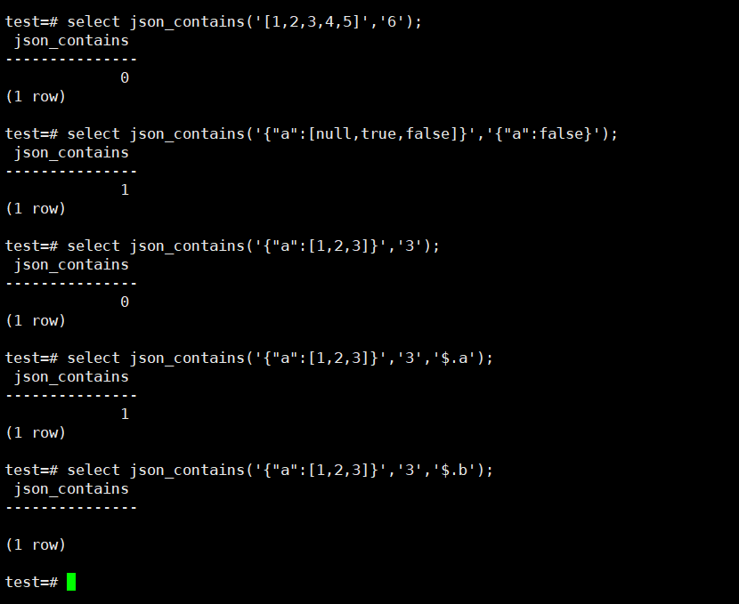


```
openGauss=# select json_contains_path('{"a": 1, "b": 2, "c": {"d": 4}}', 'one', '$.a', '$.e');
 json_contains_path 
--------------------
 t
(1 row)

openGauss=# select json_contains_path('{"a": 1, "b": 2, "c": {"d": 4}}', 'all', '$.a', '$.b','$."c".d');
 json_contains_path 
--------------------
 t
(1 row)

openGauss=# select json_contains_path('{"a": 1, "b": 2, "c": {"d": [3,4,5]}}', 'one', '$.c.d[3]');
 json_contains_path 
--------------------
 f
(1 row)

openGauss=# select json_contains_path('{"a": 1, "b": 2, "c": {"d": 4}}', 'all', '$.a.d');
 json_contains_path 
--------------------
 f
(1 row)

openGauss=# select json_contains_path('[1,2,3]',null,'$[0]');
 json_contains_path 
--------------------

(1 row)

openGauss=# select json_contains_path('[1,2,3]','one','$[0]',null,'$[1]');
 json_contains_path 
--------------------
 t
(1 row)

openGauss=# select json_contains_path('[1,2,3]','one','$[3]',null,'$[1]');
 json_contains_path 
--------------------

(1 row)

openGauss=# select json_contains_path('[1,2,3]','all','$[0]',null,'$[1]');
 json_contains_path 
--------------------

(1 row)

openGauss=# select json_contains_path('[1,2,3]','all','$[3]',null,'$[1]');
 json_contains_path 
--------------------
 f
(1 row)

```
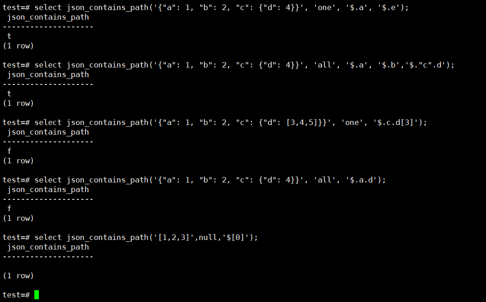


```
opengauss=# select json_extract('{"f2":{"f3":1},"f4":{"f5":99,"f6":"stringy"}}', '$.f4.f6');
 json_extract 
--------------
 "stringy"
(1 row)
opengauss=# select json_unquote('"dajifa\\tIMIDF"');
 json_unquote  
---------------
 dajifa  IMIDF
(1 row)
opengauss=# select json_unquote(json_extract('{"a": "lihua"}', '$.a'));
 json_unquote 
--------------
 lihua
(1 row)
opengauss=# SELECT JSON_KEYS('{"a":123,"b":{"c":"qwe"}}');

 json_keys 
-----------

 ["a","b"]
(1 row)

```


```
opengauss=# select json_search('"abc"','one','abc',true);    
 json_search 
-------------
 "$"
(1 row)

opengauss=# select json_search('"a%c"','all','a1%c',1);
 json_search 
-------------
 "$"
(1 row)

opengauss=# select json_search('"abc"','one','abc','&','$',null);
 json_search 
-------------

(1 row)

opengauss=# select json_search('"1.2"','one',1.2);
 json_search 
-------------
 "$"
(1 row)

opengauss=# select json_search('{"a":[{"b":["abc","abc"]},"ac"],"c":["abbc","abcc"]}','all','a%c',null,'$.*[*]');
                         json_search                          
--------------------------------------------------------------
 ["$.a[0].b[0]", "$.a[0].b[1]", "$.a[1]", "$.c[0]", "$.c[1]"]
(1 row)


```
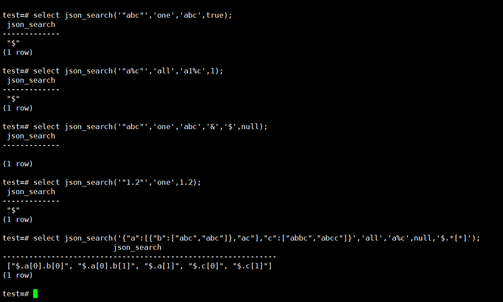

```
opengauss=# select JSON_ARRAY_APPEND('{"name": "Tim", "hobby": "car"}', '$.name', 'food');

             json_array_append             
-------------------------------------------

 {"name": ["Tim", "food"], "hobby": "car"}
(1 row)
opengauss=# select JSON_ARRAY_APPEND('{"name": "Tim", "hobby": "car"}', '$.name', 'food');

             json_array_append             
-------------------------------------------

 {"name": ["Tim", "food"], "hobby": "car"}
(1 row)

```
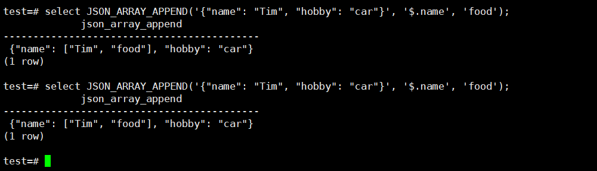

```
opengauss=# select json_array_insert('[1, [2, 3], {"a": [4, 5]}]', '$[0]', 0);
      json_array_insert       
-------------------------------
[0, 1, [2, 3], {"a": [4, 5]}]
(1 row)

opengauss=# select json_array_insert('[1, [2, 3], {"a": [4, 5]}]', '$[9]', 4);
      json_array_insert       
-------------------------------
[1, [2, 3], {"a": [4, 5]}, 4]
(1 row)

```
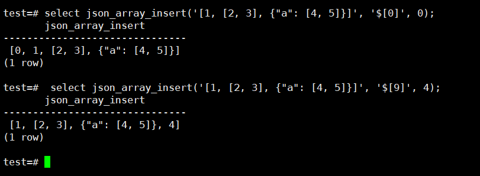

```
opengauss=# select json_insert('{"x": 1}','$.y',true);
     json_insert     
---------------------
 {"x": 1, "y": true}
(1 row)
openGauss=# select json_merge('"opengauss"', '[[1,2],3,"test"]');
            json_merge            
----------------------------------
 ["opengauss", [1, 2], 3, "test"]
(1 row)

```
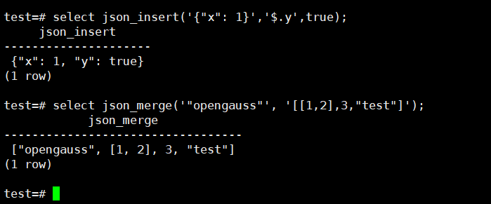

```
openGauss=# select json_merge_preserve('{"a":"abc"}', '[1,true,null]');
      json_merge_preserve      
-------------------------------
 [{"a": "abc"}, 1, true, null]
(1 row)

openGauss=# select json_merge_preserve('1', '"b"', 'true');
 json_merge_preserve 
---------------------
 [1, "b", true]
(1 row)

openGauss=# select json_merge_preserve('[1,{"a":"abc"}]', '["b",false]');
      json_merge_preserve      
-------------------------------
 [1, {"a": "abc"}, "b", false]
(1 row)

openGauss=# select json_merge_preserve('{"b":"abc"}', '{"a":"jks"}');
   json_merge_preserve    
--------------------------
 {"a": "jks", "b": "abc"}
(1 row)

openGauss=# select json_merge_preserve(NULL, '1');
 json_merge_preserve 
---------------------

(1 row)


```
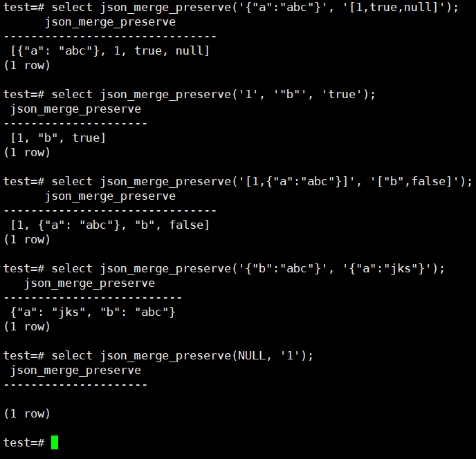

```
openGauss=# select json_merge_patch('{"a":1}', '{"b":2}');
 json_merge_patch 
------------------
 {"a": 1, "b": 2}
(1 row)

openGauss=# select json_merge_patch('{"a":1}', '{"a":2}');
 json_merge_patch 
------------------
 {"a": 2}
(1 row)

openGauss=# select json_merge_patch('{"a":{"b":"abc"}}', '{"a":{"b":null}}');
 json_merge_patch 
------------------
 {"a": {}}
(1 row)

openGauss=# select json_merge_patch('{"a":1}', 'true');
 json_merge_patch 
------------------
 true
(1 row)

openGauss=# select json_merge_patch('{"a":1}', NULL);
 json_merge_patch 
------------------

(1 row)

openGauss=# select json_merge_patch(NULL, '{"a":1}');
 json_merge_patch 
------------------

(1 row)

openGauss=# select json_merge_patch(NULL, '[1,2,3]');
 json_merge_patch 
------------------
 [1, 2, 3]
(1 row)


```
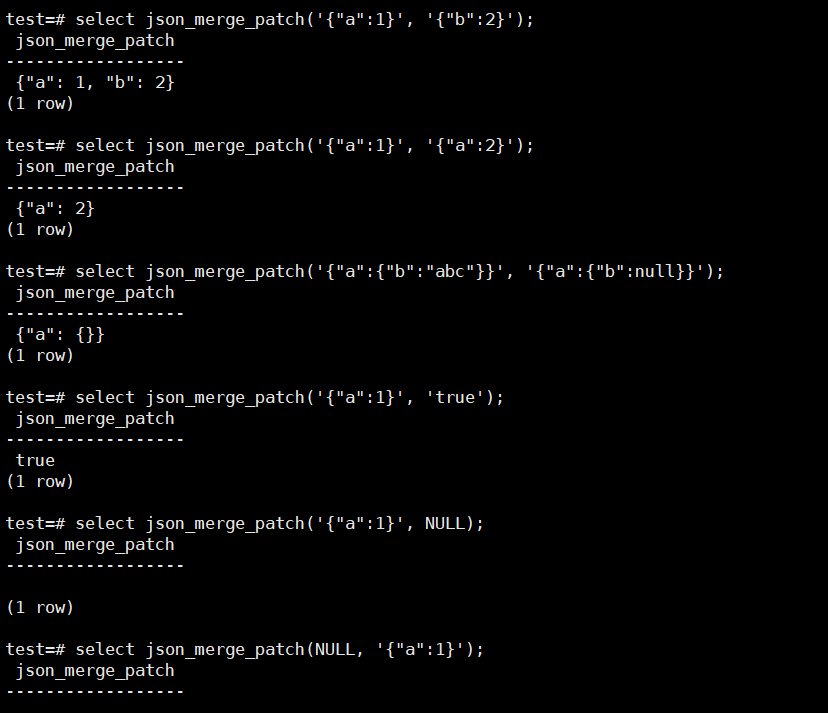
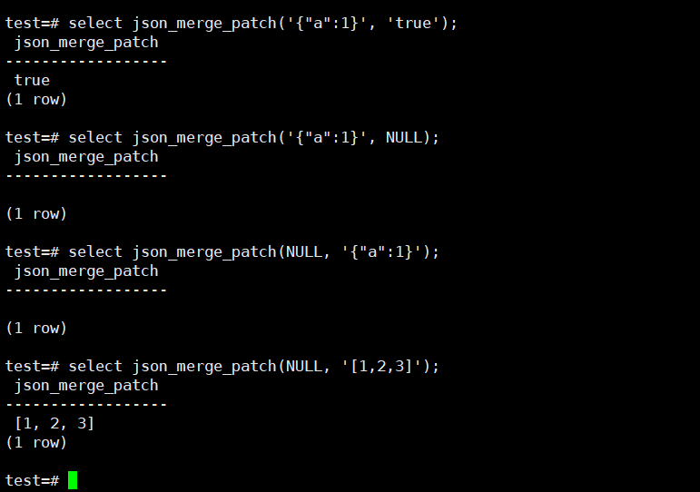

```
opengauss=# SELECT JSON_REMOVE('[0, 1, 2, [3, 4]]', '$[0]', '$[2]');
 json_remove 
-------------
 [1, 2]
(1 row)
opengauss=# SELECT JSON_REMOVE('{"x": 1, "y": 2}', '$.x');
 json_remove 
-------------
 {"y": 2}
(1 row)
opengauss=# SELECT JSON_REMOVE('{"x": {"z":2,"a":3}, "y": 2}', NULL);
 json_remove 
-------------

(1 row)
opengauss=# SELECT JSON_REMOVE(NULL, '$.x.z');
 json_remove 
-------------

(1 row)

```
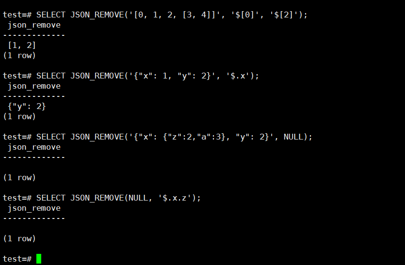


```
openGauss=# select json_replace('{"a": 1, "b": 2, "c": 3}', '$.b', 9);
  json_replace
-------------------
 {"a": 1, "b": 9, "c": 3}
(1 row)
opengauss=# select json_set('{"student":{"id":1,"gender":"man"}}','$.age',23,'$.student.id',3);
                   json_set                   
----------------------------------------------
 {"age":23,"student":{"id":3,"gender":"man"}}
(1 row)

```
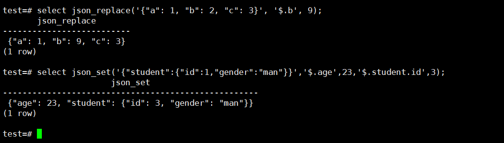

```
openGauss=# SELECT JSON_DEPTH('{}'), JSON_DEPTH('[]'), JSON_DEPTH('true');
 json_depth | json_depth | json_depth 
------------+------------+------------
          1 |          1 |          1
(1 row)
openGauss=# SELECT JSON_DEPTH('[10, 20]'), JSON_DEPTH('[[], {}]');
 json_depth | json_depth 
------------+------------
          2 |          2
(1 row)
openGauss=# SELECT JSON_DEPTH('[10, {"a": 20}]');
 json_depth 
------------
          3
(1 row)

```
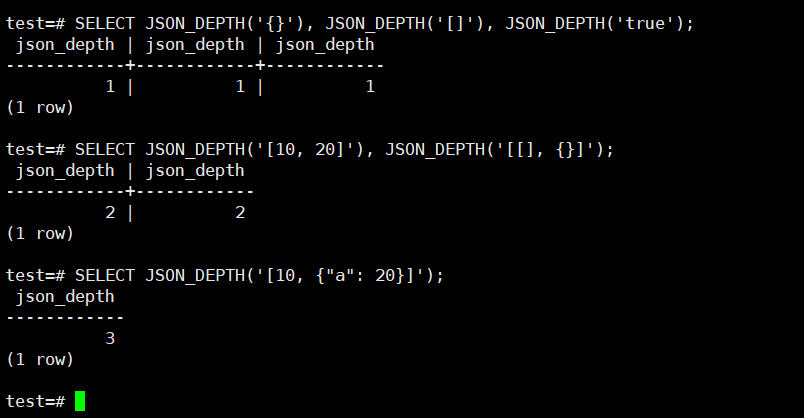


```
opengauss=# select json_length('null');
 json_length 
-------------
           1
(1 row)

opengauss=# select json_length('{}');
 json_length 
-------------
           0
(1 row)

opengauss=# select json_length('{"a":1,"b":2,"c":3,"d":4}');
 json_length 
-------------
           4
(1 row)

opengauss=# select json_length('{"a":"abc","b":"abc"}','$.a');
 json_length 
-------------
           1
(1 row)

```
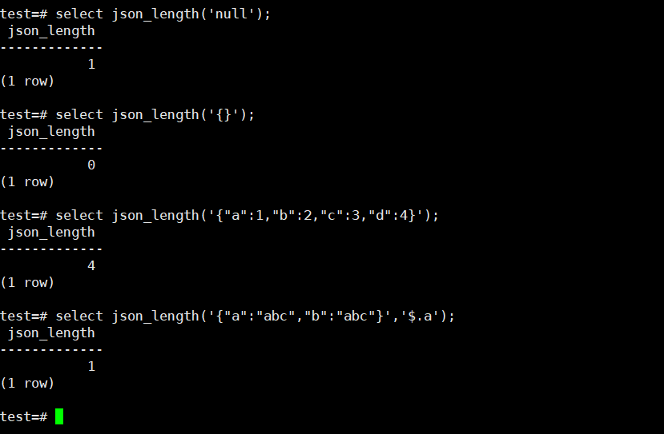


```
opengauss=# select json_type('"aa"');
 json_type 
-----------
 STRING
(1 row)

opengauss=# select json_type('null');
 json_type 
-----------
 NULL
(1 row)

opengauss=# select json_type('[1,2]');
 json_type 
-----------
 ARRAY
(1 row)

opengauss=# select json_type('{"w":1}');
 json_type 
-----------
 OBJECT
(1 row)

opengauss=# select json_type('11');
 json_type 
-----------
 INTEGER
(1 row)


```
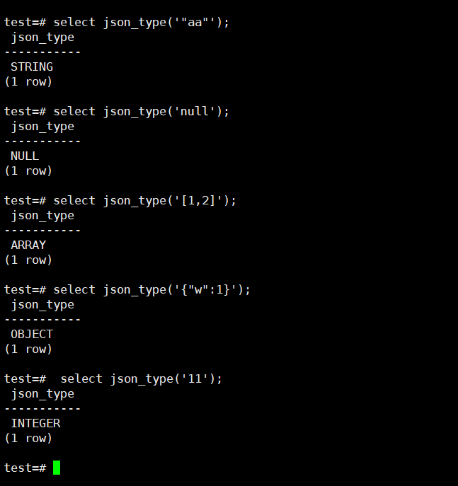

```
openGauss=# select json_valid('{"a":[1,2,3]}');
 json_valid 
------------
 t
(1 row)

openGauss=# select json_valid('{"a":[1,2,3]}');
 json_valid 
------------
 t
(1 row)

openGauss=# select json_valid('{"a":[[1,2,3]}');
 json_valid 
------------
 f
(1 row)

openGauss=# select json_valid('0.3135621312');
 json_valid 
------------
 t
(1 row)

openGauss=# select json_valid('03135621312');
 json_valid 
------------
 f
(1 row)

openGauss=# select json_valid('{"a":true}'::json);
 json_valid 
------------
 t
(1 row)


```
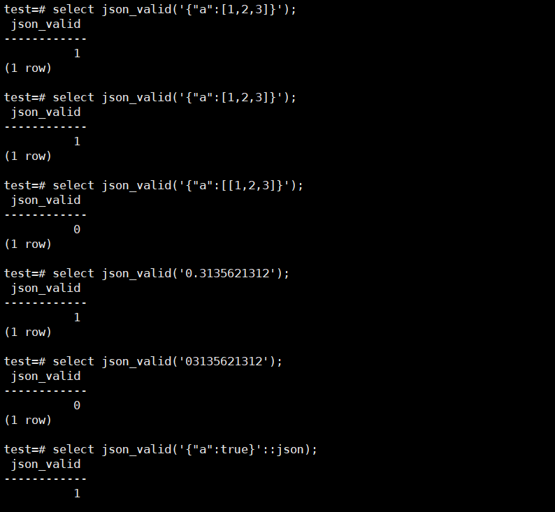

```
opengauss=# select JSON_PRETTY('{"a": 43}');
 json_pretty 
-------------
   {        +
   "a": 43  +
 }
(1 row)

opengauss=# select JSON_PRETTY('{}');
 json_pretty 
-------------
   {}
(1 row)

opengauss=# select JSON_PRETTY('{"a":[{"age": 43, "name": "lihua"}, [[[[43,33, []]]]], "hello"]}');
      json_pretty      
-----------------------
   {                  +
   "a": [             +
     {                +
       "age": 43,     +
       "name": "lihua"+
     },               +
     [                +
       [              +
         [            +
           [          +
             43,      +
             33,      +
             []       +
           ]          +
         ]            +
       ]              +
     ],               +
     "hello"          +
   ]                  +
 }
(1 row)


```
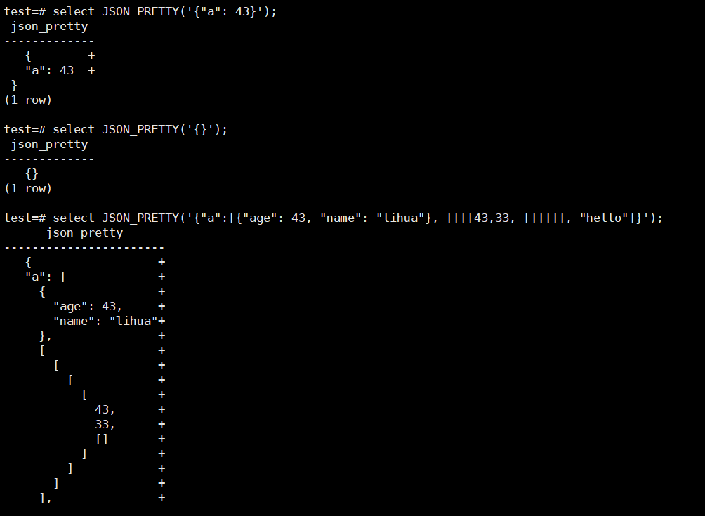
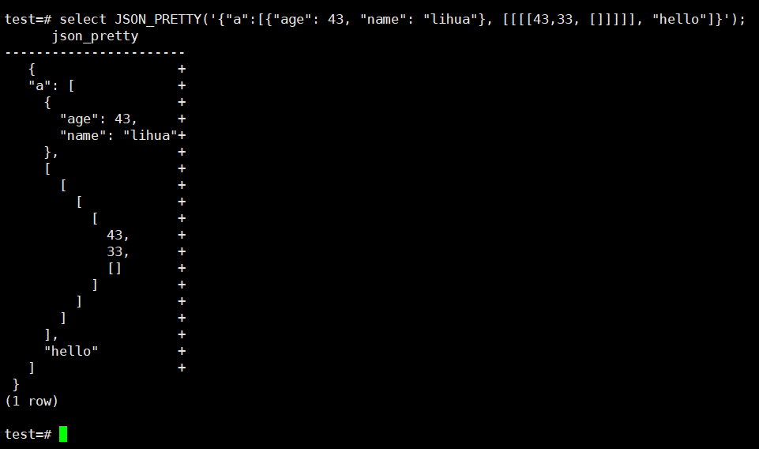

```
opengauss=# SELECT JSON_STORAGE_SIZE('0');
 json_storage_size 
-------------------
                 2
(1 row)

opengauss=# SELECT JSON_STORAGE_SIZE('"Hello World"');
 json_storage_size 
-------------------
                14
(1 row)

opengauss=# SELECT JSON_STORAGE_SIZE('[1, "abc", null, true, "10:27:06.000000", {"id": 1}]');
 json_storage_size 
-------------------
                53
(1 row)

opengauss=# SELECT JSON_STORAGE_SIZE('{"x": 1, "y": 2}');
 json_storage_size 
-------------------
                17
(1 row)

```
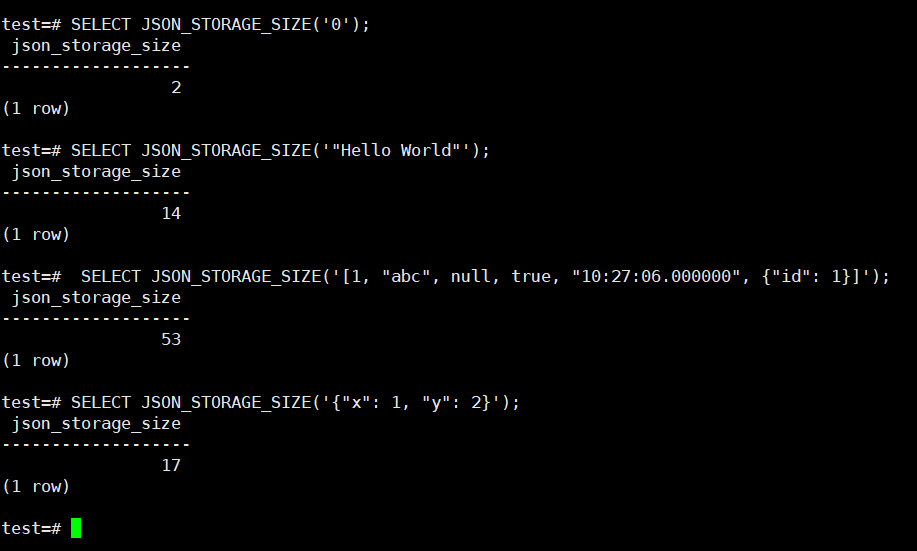


```
opengauss=# CREATE TEMP TABLE foo1 (serial_num int, name text, type text);
opengauss=# INSERT INTO foo1 VALUES (847001,'t15','GE1043');
opengauss=# INSERT INTO foo1 VALUES (847002,'t16','GE1043');
opengauss=# INSERT INTO foo1 VALUES (847003,'sub-alpha','GESS90');
opengauss=# SELECT json_arrayagg(serial_num)
FROM foo1;
      json_arrayagg       
--------------------------
 [847001, 847002, 847003]
(1 row)

opengauss=# SELECT json_arrayagg(type)
FROM foo1;
         json_arrayagg          
--------------------------------
 ["GE1043", "GE1043", "GESS90"]
(1 row)

```
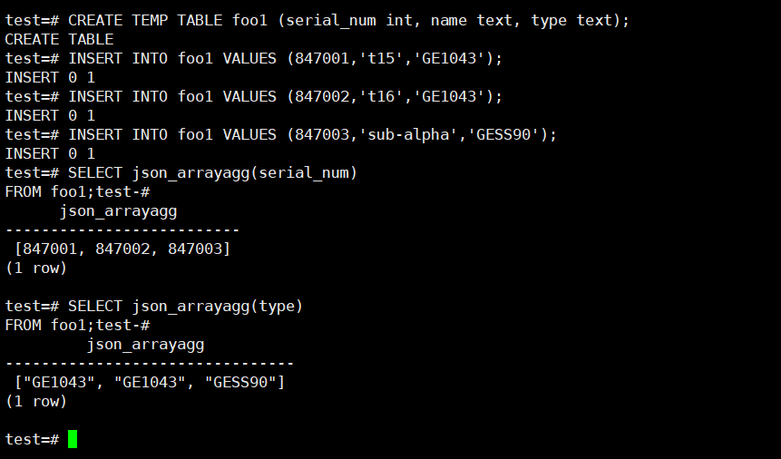


```
openGauss=# select * from City;
    district     |     name      | population 
-----------------+---------------+------------
 Capital Region  | Canberra      |     322723
 New South Wales | Sydney        |    3276207
 New South Wales | Newcastle     |     270324
 New South Wales | Central Coast |     227657
 New South Wales | Wollongong    |     219761
 Queensland      | Brisbane      |    1291117
 Queensland      | Gold Coast    |     311932
 Queensland      | Townsville    |     109914
 Queensland      | Cairns        |      92273
 South Australia | Adelaide      |     978100
 Tasmania        | Hobart        |     126118
 Victoria        | Melbourne     |    2865329
 Victoria        | Geelong       |     125382
 West Australia  | Perth         |    1096829
(14 rows)

openGauss=# SELECT 
openGauss-#   District AS State,
openGauss-#   JSON_OBJECTAGG(Name, Population) AS "City/Population"
openGauss-# FROM City
openGauss-# GROUP BY State;
      state      |                                     City/Population                                     
-----------------+-----------------------------------------------------------------------------------------
 West Australia  | {"Perth": 1096829}
 Queensland      | {"Cairns": 92273, "Brisbane": 1291117, "Gold Coast": 311932, "Townsville": 109914}
 New South Wales | {"Sydney": 3276207, "Newcastle": 270324, "Wollongong": 219761, "Central Coast": 227657}
 Tasmania        | {"Hobart": 126118}
 Victoria        | {"Geelong": 125382, "Melbourne": 2865329}
 South Australia | {"Adelaide": 978100}
 Capital Region  | {"Canberra": 322723}
(7 rows)

```
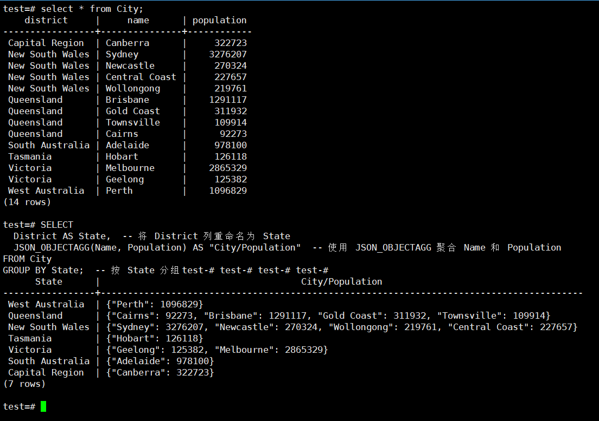

```
opengauss=# create table test(data json);
CREATE TABLE
opengauss=# insert into test values('{"a":"lihua"}');
INSERT 0 1
opengauss=# select data->'$.a' from test;
 ?column? 
----------
 "lihua"
(1 row)

```
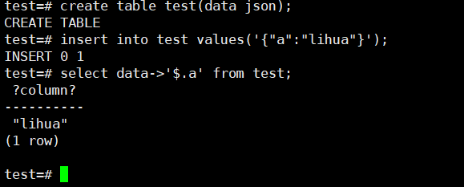


```
opengauss=# create table test(data json);
CREATE TABLE
opengauss=# insert into test values('{"a":"lihua"}');
INSERT 0 1
opengauss=# select data->>'$.a' from test;
 ?column? 
----------
  lihua
(1 row)

```
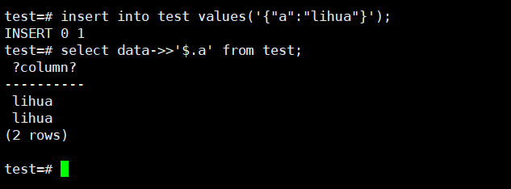


### (22)类型转换函数
```
openGauss=# set dolphin.b_compatibility_mode=on;

openGauss=# SELECT cast('abc' as char(10));
 varchar
---------
 abc
(1 row)

**openGauss=# SELECT dolphin.b_compatibility_mode=off;

openGauss=# SELECT cast('abc' as char(10));
   bpchar
------------
 abc
(1 row)

```
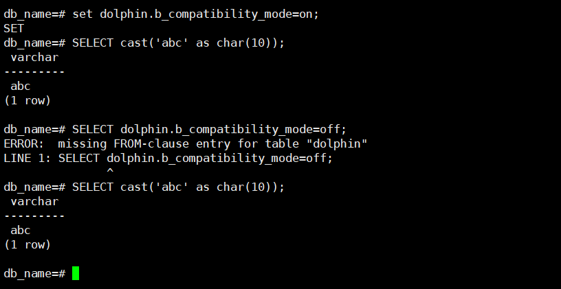

```
--- 超出范围，严格模式下报错，宽松模式下告警
openGauss=# set dolphin.sql_mode ='';
SET
--- 默认为dolphin.b_compatibility_mode=off
openGauss=# select cast('9223372036854775808' as signed);
WARNING:  value "9223372036854775808" is out of range for type bigint
LINE 1: select cast('9223372036854775808' as signed);
                ^
CONTEXT:  referenced column: int8
        int8         
---------------------
 9223372036854775807
(1 row)

--- 打开参数后应用mysql兼容性表现
openGauss=# set dolphin.b_compatibility_mode = on;
SET
openGauss=# select cast('9223372036854775808' as signed);
WARNING:  bigint out of range
CONTEXT:  referenced column: int8
         int8         
----------------------
-9223372036854775808
(1 row)

```


```
CREATE CAST (timestamp AS uint8) WITH FUNCTION timestamp_uint8(timestamp) AS ASSIGNMENT;
CREATE CAST (money AS uint8) WITH FUNCTION cash_uint(money) AS ASSIGNMENT;

```
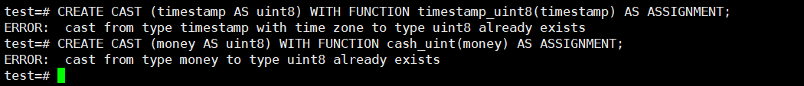

```
 openGauss=# SELECT CAST('$2'::money as unsigned);
  uint8
  -------
  2
  (1 row)
 openGauss=# SELECT CAST(CURRENT_TIMESTAMP::TIMESTAMP AS UNSIGNED);
  current_timestamp
  -------------------
  20230103023621
  (1 row)

```
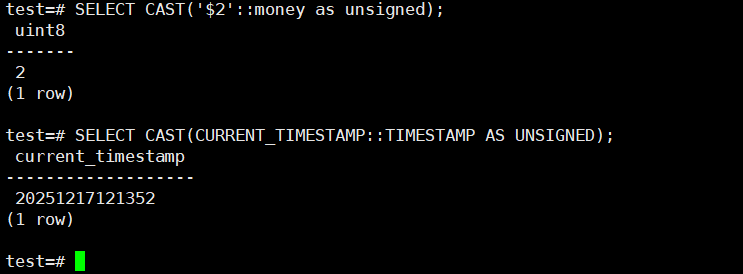


### (23)操作符运算兼容

```
create database test_db dbcompatibility 'B';
\c test_db 
set dolphin.b_compatibility_mode to on;
-- 整型 X 整型
select 1::int4 + 1::int4;
select 1::int4 - 1::int4;
select 1::int4 * 1::int4;
select 1::int4 / 1::int4;

-- 整型 X 整型(带无符号)
select 1::int4 + 1::uint4;
select 1::int4 - 1::uint4;
select 1::int4 * 1::uint4;
select 1::int4 / 1::uint4;

-- 整型 X 定点型
select 1::int4 + 1::numeric;
select 1::int4 - 1::numeric;
select 1::int4 * 1::numeric;
select 1::int4 / 1::numeric;

-- 整型 X 浮点型
select 1::int4 + 1::float8;
select 1::int4 - 1::float8;
select 1::int4 * 1::float8;
select 1::int4 / 1::float8;

-- 定点型 X 浮点型
select 1::numeric + 1::float8;
select 1::numeric - 1::float8;
select 1::numeric * 1::float8;
select 1::numeric / 1::float8;

-- 整型 X 字符串
select 1::int4 + '1.23'::text;
select 1::int4 - '1.23'::text;
select 1::int4 * '1.23'::text;
select 1::int4 / '1.23'::text;

-- 整型 X 日期
select 1::int4 + '2022-01-01'::date;
select 1::int4 - '2022-01-01'::date;
select 1::int4 * '2022-01-01'::date;
select 1::int4 / '2022-01-01'::date;

-- 整型 X 时间(不带微秒)
select 1::int4 + '12:12:12'::time;
select 1::int4 - '12:12:12'::time;
select 1::int4 * '12:12:12'::time;
select 1::int4 / '12:12:12'::time;

-- 整型 X 时间(带微秒)
select 1::int4 + '12:12:12.36'::time(3);
select 1::int4 - '12:12:12.36'::time(3);
select 1::int4 * '12:12:12.36'::time(3);
select 1::int4 / '12:12:12.36'::time(3);

-- 数字类型/字符串类型/时间日期类型 X INTERVAL表达式
select '2020-01-01'::text + interval 1 day;
select interval 1 hour + '2020-01-01'::date;
select 20200101::int4 - interval 1 minute;
结果：
openGauss=# create database test_db dbcompatibility 'B';
CREATE DATABASE
openGauss=# \c test_db 
test_db=# set dolphin.b_compatibility_mode to on;
SET
test_db=# -- 整型 X 整型
test_db=# select 1::int4 + 1::int4;
 ?column? 
----------
        2
(1 row)

test_db=# select 1::int4 - 1::int4;
 ?column? 
----------
        0
(1 row)

test_db=# select 1::int4 * 1::int4;
 ?column? 
----------
        1
(1 row)

test_db=# select 1::int4 / 1::int4;
        ?column?        
------------------------
 1.00000000000000000000
(1 row)

test_db=# -- 整型 X 整型(带无符号)
test_db=# select 1::int4 + 1::uint4;
 ?column? 
----------
 2
(1 row)

test_db=# select 1::int4 - 1::uint4;
 ?column? 
----------
 0
(1 row)

test_db=# select 1::int4 * 1::uint4;
 ?column? 
----------
 1
(1 row)

test_db=# select 1::int4 / 1::uint4;
        ?column?        
------------------------
 1.00000000000000000000
(1 row)

test_db=# -- 整型 X 定点型
test_db=# select 1::int4 + 1::numeric;
 ?column? 
----------
        2
(1 row)

test_db=# select 1::int4 - 1::numeric;
 ?column? 
----------
        0
(1 row)

test_db=# select 1::int4 * 1::numeric;
 ?column? 
----------
        1
(1 row)

test_db=# select 1::int4 / 1::numeric;
        ?column?        
------------------------
 1.00000000000000000000
(1 row)

test_db=# -- 整型 X 浮点型
test_db=# select 1::int4 + 1::float8;
 ?column? 
----------
        2
(1 row)

test_db=# select 1::int4 - 1::float8;
 ?column? 
----------
        0
(1 row)

test_db=# select 1::int4 * 1::float8;
 ?column? 
----------
        1
(1 row)

test_db=# select 1::int4 / 1::float8;
 ?column? 
----------
        1
(1 row)

test_db=# -- 定点型 X 浮点型
test_db=# select 1::numeric + 1::float8;
 ?column? 
----------
        2
(1 row)

test_db=# select 1::numeric - 1::float8;
 ?column? 
----------
        0
(1 row)

test_db=# select 1::numeric * 1::float8;
 ?column? 
----------
        1
(1 row)

test_db=# select 1::numeric / 1::float8;
 ?column? 
----------
        1
(1 row)

test_db=# -- 整型 X 字符串
test_db=# select 1::int4 + '1.23'::text;
 ?column? 
----------
     2.23
(1 row)

test_db=# select 1::int4 - '1.23'::text;
 ?column? 
----------
    -0.23
(1 row)

test_db=# select 1::int4 * '1.23'::text;
 ?column? 
----------
     1.23
(1 row)

test_db=# select 1::int4 / '1.23'::text;
     ?column?      
-------------------
 0.813008130081301
(1 row)

test_db=# -- 整型 X 日期
test_db=# select 1::int4 + '2022-01-01'::date;
 ?column? 
----------
 20220102
(1 row)

test_db=# select 1::int4 - '2022-01-01'::date;
 ?column?  
-----------
 -20220100
(1 row)

test_db=# select 1::int4 * '2022-01-01'::date;
 ?column? 
----------
 20220101
(1 row)

test_db=# select 1::int4 / '2022-01-01'::date;
          ?column?          
----------------------------
 0.000000049455737139987580
(1 row)

test_db=# -- 整型 X 时间(不带微秒)
test_db=# select 1::int4 + '12:12:12'::time;
 ?column? 
----------
   121213
(1 row)

test_db=# select 1::int4 - '12:12:12'::time;
 ?column? 
----------
  -121211
(1 row)

test_db=# select 1::int4 * '12:12:12'::time;
 ?column? 
----------
   121212
(1 row)

test_db=# select 1::int4 / '12:12:12'::time;
          ?column?          
----------------------------
 0.000008250008250008250008
(1 row)

test_db=# -- 整型 X 时间(带微秒)
test_db=# select 1::int4 + '12:12:12.36'::time(3);
   ?column?    
---------------
 121213.360000
(1 row)

test_db=# select 1::int4 - '12:12:12.36'::time(3);
    ?column?    
----------------
 -121211.360000
(1 row)

test_db=# select 1::int4 * '12:12:12.36'::time(3);
   ?column?    
---------------
 121212.360000
(1 row)

test_db=# select 1::int4 / '12:12:12.36'::time(3);
          ?column?          
----------------------------
 0.000008249983747532017362
(1 row)

test_db=# -- 数字类型/字符串类型/时间日期类型 X INTERVAL表达式
test_db=# select '2020-01-01'::text + interval 1 day;
  ?column?  
------------
 2020-01-02
(1 row)

test_db=# select interval 1 hour + '2020-01-01'::date;
      ?column?       
---------------------
 2020-01-01 01:00:00
(1 row)

test_db=# select 20200101::int4 - interval 1 minute;
      ?column?       
---------------------
 2019-12-31 23:59:00
(1 row)

```
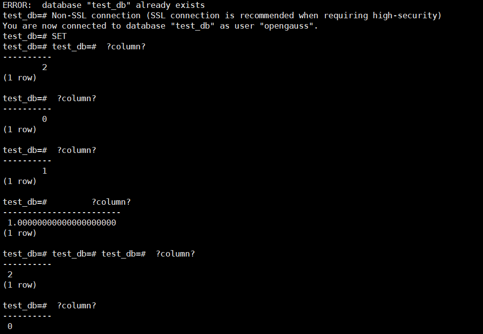
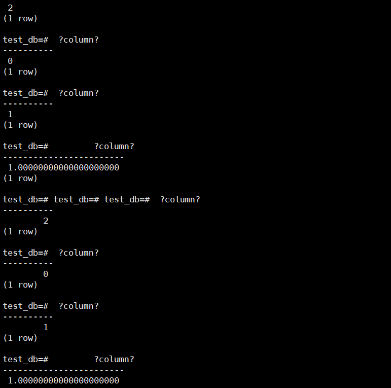
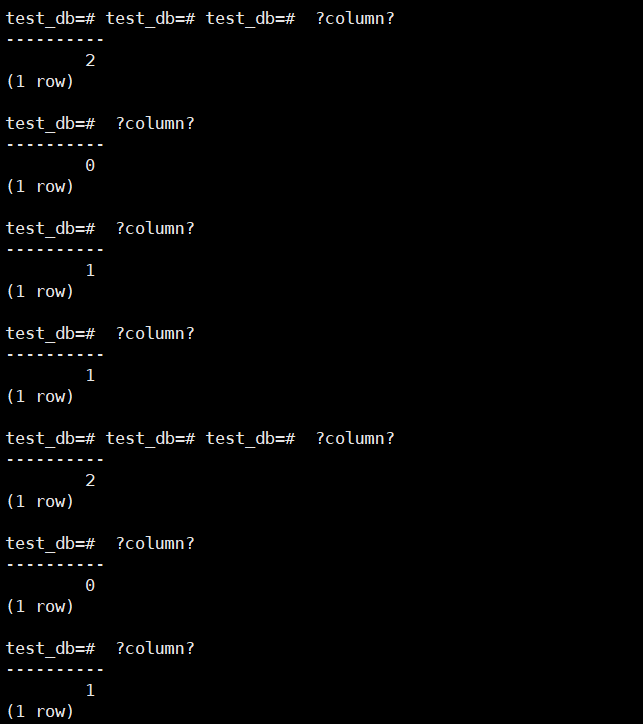
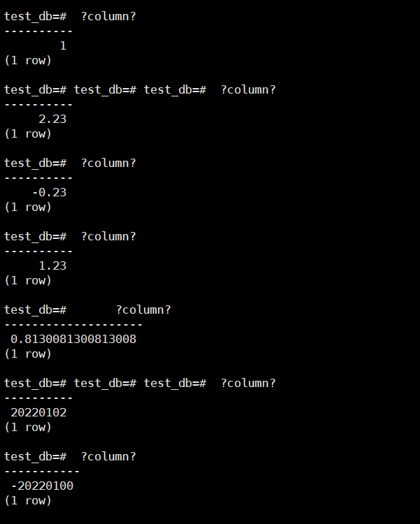
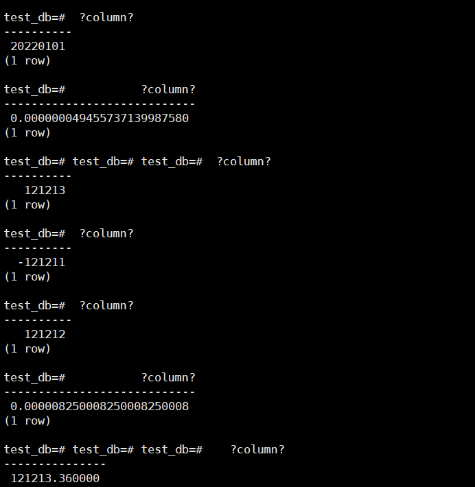
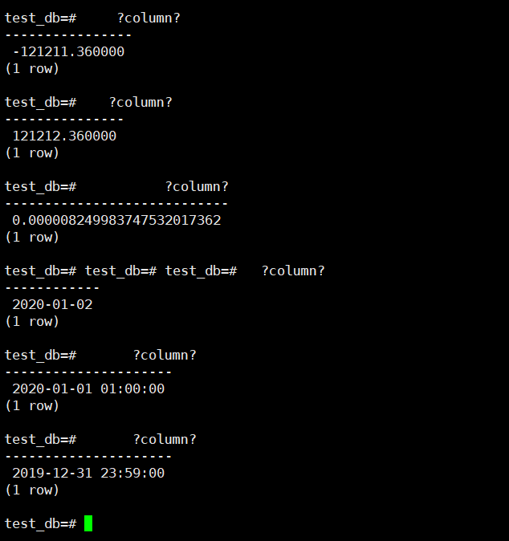


### (24)注释操作符
```
openGauss=# SELECT lower('TOM') #1234;
openGauss=# ;
lower
-------
tom

```
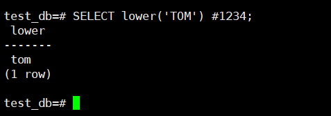


### (25)条件表达式
```
openGauss=# SELECT ifnull(null,1);
ifnull 
-------
 1
(1 row)
openGauss=# SELECT ifnull ('Hello World' ,1);
   ifnull
-------------
 Hello World
(1 row)

```
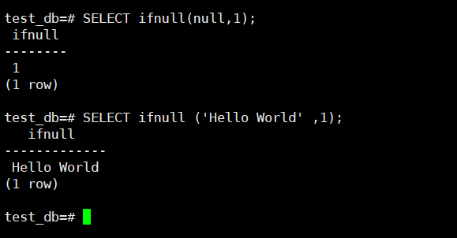


```
openGauss=# CREATE TABLE case_when_t1(CW_COL1 INT);

openGauss=# INSERT INTO case_when_t1 VALUES (1), (2), (3);

openGauss=# SELECT * FROM case_when_t1;
cw_col1 
---------
 1
 2
 3
(3 rows)

openGauss=# SELECT CW_COL1, IF(CW_COL1=1, 'one', 'other') FROM case_when_t1 ORDER BY 1;
 cw_col1 | case  
---------+-------
       1 | one
       2 | other
       3 | other
(3 rows)

openGauss=# DROP TABLE case_when_t1;

```
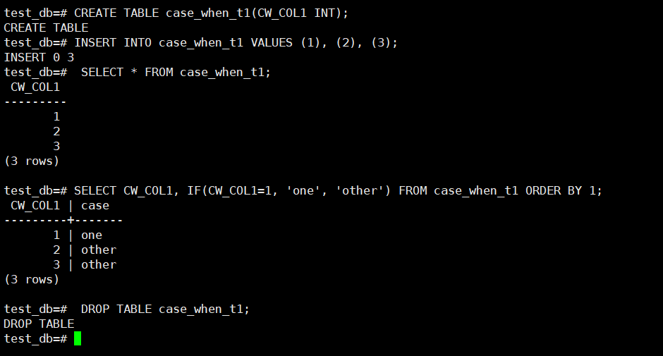

### (26)时间间隔表达式
```
openGauss=# create database test_db dbcompatibility 'B';
CREATE DATABASE
openGauss=# \c test_db 
test_db=# set dolphin.b_compatibility_mode to on;
SET
test_db=# select date_add('1997-12-31 23:59:59',INTERVAL 1 MICROSECOND);
          date_add          
----------------------------
 1997-12-31 23:59:59.000001
(1 row)

test_db=# select date_add('1997-12-31 23:59:59',INTERVAL '1.111' SECOND_MICROSECOND);
        date_add         
-------------------------
 1998-01-01 00:00:00.111
(1 row)

test_db=# select '1997-12-11' + interval '1 10' day_second;
      ?column?       
---------------------
 1997-12-11 00:01:10
(1 row)

-- 运算表达式
test_db=# select '1997-12-11' + interval 1 + 2 * 3 day;
  ?column?  
------------
 1997-12-18
(1 row)

-- 列引用
test_db=# create table t1 (c1 int);
CREATE TABLE
test_db=# insert into t1 values(1);
INSERT 0 1
test_db=# select '1997-12-11' + interval c1 + 2 year from t1;
  ?column?  
------------
 2000-12-11
(1 row)

-- 绑定参数
test_db=# prepare stmt as 'select ? + interval ? hour';
PREPARE
test_db=# execute stmt('1997-12-11', 20);
      ?column?       
---------------------
 1997-12-11 20:00:00
(1 row)

```
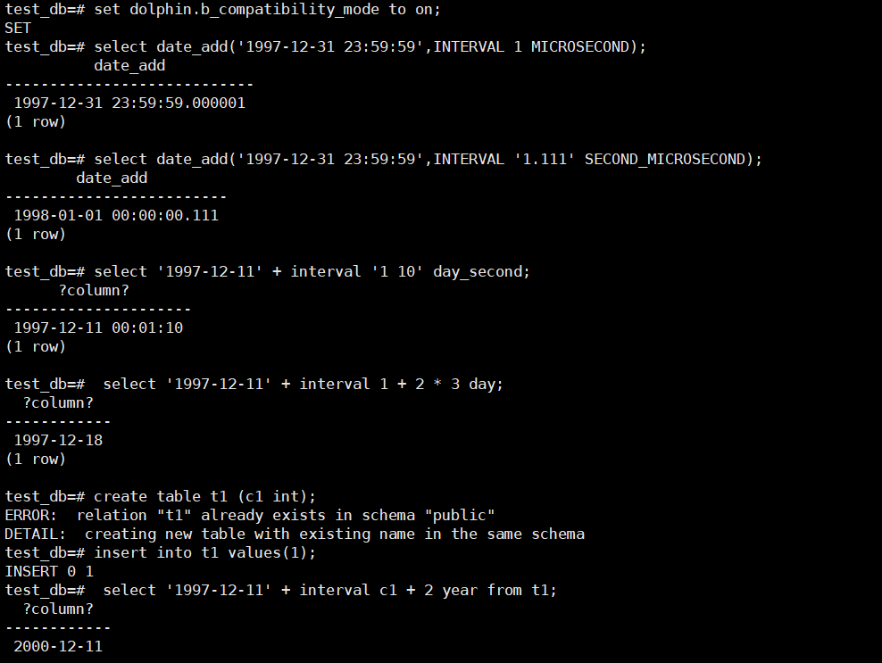
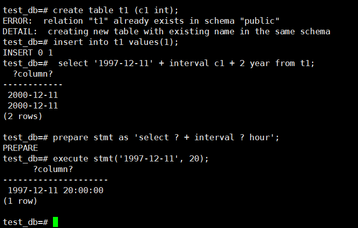

## 测试结果：
基本测试通过，但以下测试用例存在问题
```
SELECT dolphin.b_compatibility_mode=off;
select date '0000-00-00 00:00:00' or  date '20201229';
select '0000-00-00 00:00:00' or '00000000000000':: datetime;
select '0000-00-00 00:00:00' or NULL;
SELECT 0 || 0;
select set_native_password('omm', 'xxxxxx');
SELECT interval('2022-12-12'::timestamp,'asdf','2020-12-12'::date,2023);
select date_bool('0000-00-00');
set b_compatibility_mode = 1;
select convert('a', bytea); 
SELECT CT_COL1,length(CT_COL1) FROM char_type_t1;
\d dec_type_t1

```

# 二、spqplugin
openGauss提供spqpluign Extension（版本为spqplugin-1.0.0）。SPQ(SharedEverything Parallel Query)是在openGauss开源数据库上的一个多机并行查询框架，该框架部署在资源池化场景内，该场景下集群部署的为一写多读架构，集群下存在一个写/读节点和多个读节点，目前的集群只存在同时一个读节点查询的能力，集群的查询性能非常受限。 SPQ基于的是sharedEverything分布式架构，所有节点都共享集群内的资源，通过执行计划的split和执行、汇聚等实现所有读节点并行查询，充分发挥集群的OLAP能力。使资源池化同时具备较强的TP和AP能力。

## 1.spqplugin安装
编译安装
编译安装openGauss。

将spqplugin源码拷贝到openGauss-server源码的contrib目录下。

进入spq_plugin目录执行make install。

```
vim /var/lib/opengauss/data/postgresql.conf
# 配置 shared_preload_libraries = 'spqplugin'
gs_ctl -D $HOME/data reload
# reload后即可生效
```

## 2.SQL参考
### (1)SELECT
```
--创建表t1、t2。
openGauss=# create table t1(c1 int, c2 char);
CREATE TABLE
openGauss=# insert into t1 values(1, 'a');
INSERT 0 1
openGauss=# create table t2(c1 int, c2 char);
CREATE TABLE
openGauss=# insert into t2 values(1, 'b');
INSERT 0 1

--开启spq。
openGauss=# set spqplugin.enable_spq = on;
SET

--执行联表查询。
openGauss=# explain select * from t1, t2 where t1.c1 = t2.c1;
                                           QUERY PLAN
-------------------------------------------------------------------------------------------------
 Streaming (type: GATHER)  (cost=0.00..862.00 rows=1 width=10)
   ->  Streaming(type: LOCAL GATHER dop: 1/2)  (cost=0.00..862.00 rows=1 width=10)
         ->  Hash Join  (cost=0.00..862.00 rows=1 width=10)
               Hash Cond: (t1.c1 = t2.c1)
               ->  Spq Seq Scan on t1  (cost=0.00..431.00 rows=1 width=5)
               ->  Hash  (cost=431.00..431.00 rows=6 width=5)
                     ->  Streaming(type: BROADCAST dop: 2/2)  (cost=0.00..431.00 rows=6 width=5)
                           ->  Spq Seq Scan on t2  (cost=0.00..431.00 rows=1 width=5)
(8 rows)

--删除表。
openGauss=# drop table t1;
openGauss=# drop table t2;

```
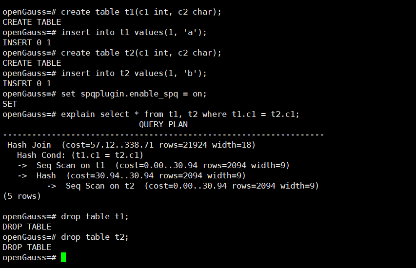

### (2)CREATE INDEX
```
--创建表t1。
openGauss=# create table t1(c1 int, c2 char);
CREATE TABLE
openGauss=# insert into t1 values(1, 'a');
INSERT 0 1

--在表t1上的c1字段上创建默认B-tree索引。
openGauss=# set spqplugin.spq_enable_btbuild = on;
SET
openGauss=# create index idx1 on t1 (c1) with (spq_build=on);
CREATE INDEX
openGauss=# \d+ t1
                             Table "public.t1"
 Column |     Type     | Modifiers | Storage  | Stats target | Description
--------+--------------+-----------+----------+--------------+-------------
 c1     | integer      |           | plain    |              |
 c2     | character(1) |           | extended |              |
Indexes:
    "idx1" btree (c1) WITH (spq_build=finish) TABLESPACE pg_default
Has OIDs: no
Options: orientation=row, compression=no

--删除索引。
openGauss=# drop index idx1;

--在表t1上的c1字段上创建在线B-tree索引。
openGauss=# set spqplugin.spq_enable_btbuild = on;
openGauss=# set spqplugin.spq_enable_btbuild_cic = on;
SET
SET
openGauss=# create index concurrently idx1 on t1 (c1) with (spq_build=on);
CREATE INDEX
openGauss=# \d+ t1
                             Table "public.t1"
 Column |     Type     | Modifiers | Storage  | Stats target | Description
--------+--------------+-----------+----------+--------------+-------------
 c1     | integer      |           | plain    |              |
 c2     | character(1) |           | extended |              |
Indexes:
    "idx1" btree (c1) WITH (spq_build=finish) TABLESPACE pg_default
Has OIDs: no
Options: orientation=row, compression=no

--删除索引、表。
openGauss=# drop index idx1;
openGauss=# drop table t1;


```
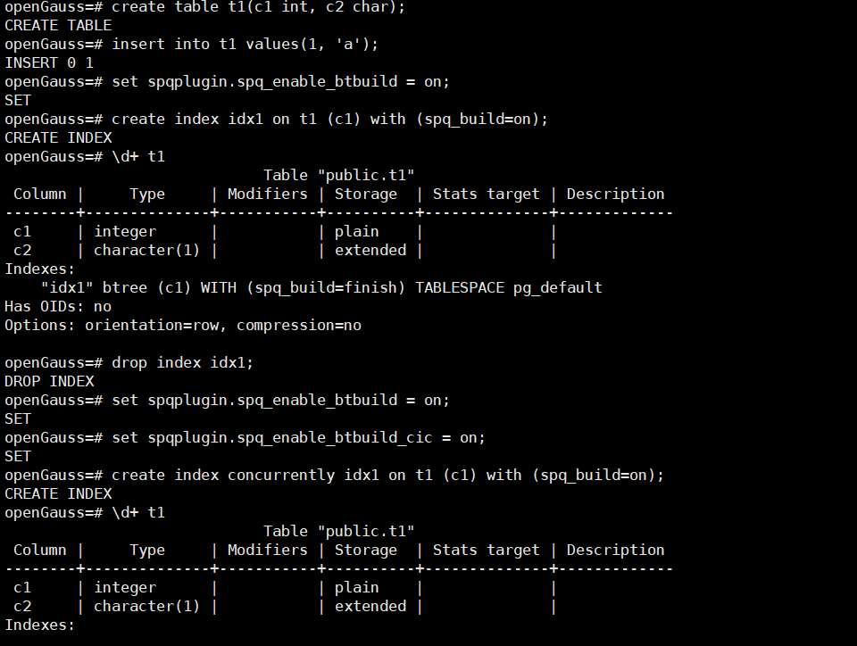
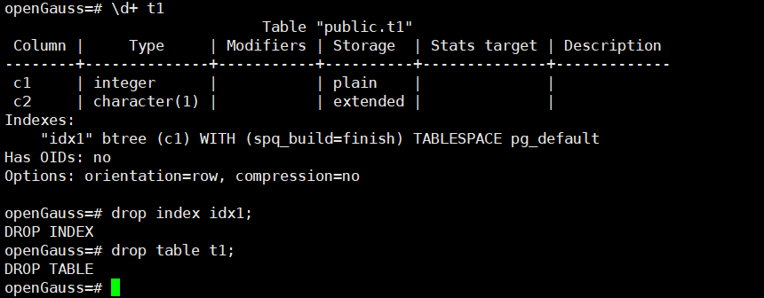


### (3)INSERT
```
--创建表t1、t2。
openGauss=# create table t1(c1 int, c2 char);
CREATE TABLE
openGauss=# insert into t1 values(1, 'a');
INSERT 0 1
openGauss=# create table t2(c1 int, c2 char);
CREATE TABLE
openGauss=# insert into t2 values(1, 'b');
INSERT 0 1

--开启spq insert。
openGauss=# set spqplugin.enable_spq = on;
SET
openGauss=# set spqplugin.spq_optimizer_enable_dml = true;
SET
openGauss=# set spqplugin.spq_optimizer_enable_dml_constraints = true;
SET
openGauss=# set spqplugin.spq_enable_insert_select = on;
SET
openGauss=# set query_dop = 2;
SET

--查看多机计划。
openGauss=# explain insert into t2 select * from t1;
                                               QUERY PLAN
---------------------------------------------------------------------------------------------------
 Streaming (type: GATHER)  (cost=0.00..0.00 rows=0 width=5)
   ->  Insert on t2  (cost=0.00..431.01 rows=1 width=5)
         ->  SPQ Result  (cost=0.00..0.00 rows=0 width=0)
               ->  Streaming(type: DML REDISTRIBUTE dop: 1/2)  (cost=0.00..431.00 rows=1 width=16)
                     ->  Spq Seq Scan on t1  (cost=0.00..431.00 rows=1 width=5)
(5 rows)


--删除表。
openGauss=# drop table t1;
openGauss=# drop table t2;


```
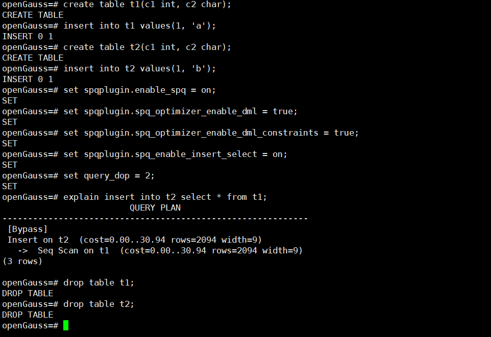


### (4)DELETE
```
--创建表t1。
openGauss=# create table t1(c1 int, c2 char);
CREATE TABLE
openGauss=# insert into t1 values(1, 'a');
INSERT 0 1

--开启spq delete。
openGauss=# set spqplugin.enable_spq = on;
SET
openGauss=# set spqplugin.spq_optimizer_enable_dml = true;
SET
openGauss=# set spqplugin.spq_enable_delete = on;
SET
openGauss=# set query_dop = 2;
SET
--查看多机计划。
openGauss=# explain delete from t1 where c1 = 1;
                                              QUERY PLAN
---------------------------------------------------------------------------------------------------
 Streaming (type: GATHER)  (cost=0.00..0.00 rows=0 width=1)
   ->  Delete on t1  (cost=0.00..431.01 rows=1 width=1)
         ->  SPQ Result  (cost=0.00..431.00 rows=1 width=22)
               ->  Streaming(type: DML REDISTRIBUTE dop: 1/2)  (cost=0.00..431.00 rows=1 width=11)
                     ->  Spq Seq Scan on t1  (cost=0.00..431.00 rows=1 width=11)
                           Filter: (c1 = 1)
(6 rows)

--删除表。
openGauss=# drop table t1;


```
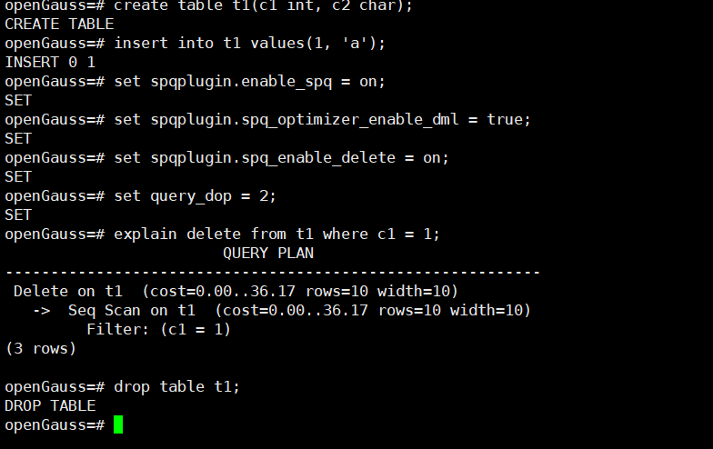


### (5)UPDATE
```
--创建表t1。
openGauss=# create table t1(c1 int, c2 char);
CREATE TABLE
openGauss=# insert into t1 values(1, 'a');
INSERT 0 1

--开启spq update。
openGauss=# set spqplugin.enable_spq = on;
SET
openGauss=# set spqplugin.spq_optimizer_enable_dml = true;
SET
openGauss=# set spqplugin.spq_optimizer_enable_dml_constraints = true;
SET
openGauss=# set spqplugin.spq_enable_update = on;
SET
openGauss=# set query_dop = 2;
SET
--查看多机计划。
openGauss=# explain update t1 set c1 = 2 where c1 < 2;
                                               QUERY PLAN
---------------------------------------------------------------------------------------------------
 Streaming (type: GATHER)  (cost=0.00..0.00 rows=0 width=1)
   ->  Update on t1  (cost=0.00..431.03 rows=1 width=1)
         ->  SPQ Result  (cost=0.00..0.00 rows=0 width=0)
               ->  Streaming(type: DML REDISTRIBUTE dop: 1/2)  (cost=0.00..431.00 rows=2 width=22)
                     ->  Split  (cost=0.00..431.00 rows=2 width=22)
                           ->  Spq Seq Scan on t1  (cost=0.00..431.00 rows=1 width=11)
                                 Filter: (c1 < 2)
(7 rows)

--删除表。
openGauss=# drop table t1;


```
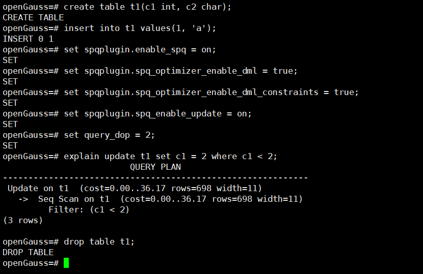

## 测试结果：
spqplugin基本测试通过

# 三、dblink
dblink是一个可以在一个openGauss数据库会话中连接到其它openGauss数据库的工具，同libpq支持的连接参数一致，可参考**链接参数**。openGauss默认不编译dblink，下面依次介绍如何编译和使用dblink。

## 1.编译安装
编译dblink
当前dblink的源码放在contrib/dblink目录中。在编译安装完openGauss数据库之后，如果用户需要使用dblink，只需要进入上述目录执行如下即可完成dblink的编译安装。
```
make
make install

```

## 2.使用

```
--  创建扩展
CREATE EXTENSION IF NOT EXISTS dblink;

--  本地连接
SELECT dblink_connect('local_conn',
                      'dbname=postgres user=xiaofan password=xiaofan@2024');

-- 查询
SELECT *
FROM dblink('local_conn',
            'SELECT version(), current_user, inet_server_port()') AS t(v text, u text, p int);

-- 断开
SELECT dblink_disconnect('local_conn');

-- 确认无残留
SELECT dblink_get_connections();
```
  

## 测试结果：
dblink基本测试通过


# 四、Apache AGE (incubating) for openGauss
图数据库由于能够处理数据之前的复杂关系，近年来得到了广泛的应用。与传统关系型数据库不同，图数据库将数据表示为节点、边和属性。节点表示实体，边表示实体之间的关系，属性表示两者的属性。

Apache AGE是基于PostgreSQL开发的图数据库引擎，AGE的所有组件都运行在PostgreSQL事务缓存层和存储层之上，AGE实现了一个存储引擎同时处理关系型和图数据模型，用户可使用标准的ANSI SQL和图查询语言openCypher对数据进行查询。

Apache AGE在数据库内核的查询解析，查询重写，查询计划，查询执行，数据存储均有涉及，数据存储方面定义了图数据库的存储模型。openGauss在其他方面使用数据库内核的hook点，对Cypher语言进行了支持，实现了同时处理关系型和图数据的能力。

## 1.安装
编译安装
age源码地址：https://gitcode.com/opengauss/Plugin/tree/master/contrib/age

方式一（同openGauss一起安装）
将age源码放到openGauss-server源码的contrib目录下，直接编译安装openGauss-server，age会自动编译安装

此方式适用于openGauss-server同时编译安装

方式二（使用openGauss源码安装）
将age源码 放到openGauss-server的源码 contrib 目录下
进入 contrib/age 目录,在age的目录下执行 make install
此方式适用于openGauss-servery已经使用源码编译安装, 并且源码及编译环境依旧保存，可以使用此方式安装age

安装方式三（使用PGXS安装）

安装必要依赖
```
yum install gcc glibc glib-common readline readline-devel zlib zlib-devel flex bison perl
```
gcc 版本需要>=7.3.0

需要将openGauss安装目录的bin目录配置到环境变量中   
执行命令
which pg_config
确认pg_config 是 openGauss 安装目录下的 pg_config

进入age根目录 执行
```
make install USE_PGXS=true
```
此方式适用于直接使用安装包安装openGauss的方式。这里不建议使用PGXS安装方式， 随着openGauss的升级，必要的头文件不会全部安装到安装目录，因此会存在编译时缺少头文件的问题,可以按照错误提示从openGauss的 头文件拷贝到openGauss安装目录include/postgresql/server/ 文件夹下

安装必要的依赖
前提条件：openGauss正常编译安装，并且配置到了环境变量中 在age的源码目录执行命令
```
make install USE_PGXS=true
```


## 2.使用

### (1)创建插件
```
openGauss=# create extension age;
CREATE EXTENSION


```
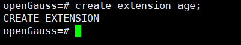  


### (2)设置查询空间
```
openGauss=# SET search_path TO ag_catalog;
SET

```
  

### (3)加载插件
```
openGauss=# load 'age';
LOAD

```
  


### (4)创建图空间
```
openGauss=# SELECT create_graph('test');
NOTICE:  CREATE TABLE / PRIMARY KEY will create implicit index "_ag_label_vertex_pkey" for table "_ag_label_vertex"
CONTEXT:  referenced column: create_graph
NOTICE:  CREATE TABLE / PRIMARY KEY will create implicit index "_ag_label_edge_pkey" for table "_ag_label_edge"
CONTEXT:  referenced column: create_graph
NOTICE:  graph "test" has been created
CONTEXT:  referenced column: create_graph
 create_graph
--------------

(1 row)

```
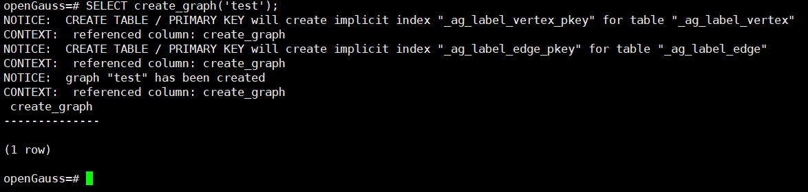  


### (5)执行cypher语句
```
openGauss=# SELECT * FROM cypher('test', $$CREATE (:v {i: 0})$$) AS (a agtype);
a
---
(0 rows)

openGauss=# SELECT * FROM cypher('test', $$MATCH (n:v) RETURN n$$) AS (n agtype);
n
-----------------------------------------------------------------------
{"id": 844424930131969, "label": "v", "properties": {"i": 0}}::vertex
(1 row)

```
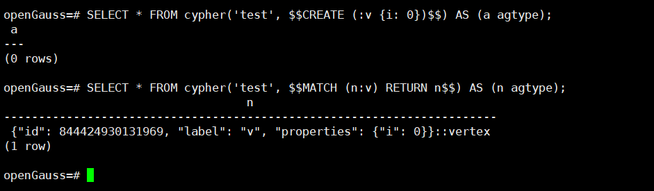  


## 测试结果：
AGE基本测试通过


# 五、TimescaleDB
TimescaleDB是一个开源的时间序列数据库，专门用于高性能和可扩展的时间序列数据存储和分析。它结合了关系型数据库的功能和优势，以及时间序列数据库的特性，提供了一套强大的功能来处理大规模时间序列数据。基于以上描述，TimescaleDB 在以下场景中非常适用：

物联网（IoT）应用：物联网应用通常会产生大量的时间序列数据，例如传感器数据、设备监控数据等。TimescaleDB 的高性能和数据分区功能可以有效地处理这些数据，并支持快速的实时查询和分析。
金融和交易数据：金融行业需要对交易数据进行高效的存储和分析。TimescaleDB 的连续聚合和数据保留策略功能可以方便地计算和维护聚合数据，同时自动删除过期的数据。
日志和监控数据：在日志和监控系统中，需要对大量的事件和指标数据进行存储和分析。TimescaleDB 的数据连续性和数据压缩功能可以满足高并发的写入需求，并减少存储空间的使用。
时间序列分析：对于需要进行时间序列分析的场景，TimescaleDB 提供了 SQL 接口和丰富的时间序列函数，可以方便地进行复杂的查询和分析操作。
TimescaleDB能够以插件化的形式，很方便的处理时序数据，随着openGauss的发展，对时序数据的处理能力也成为了开发组重点考虑的功能，而且openGauss基于PostgreSQL 9.2.4版本优化，所以从PostgreSQL数据库将TimescaleDB扩展迁移过来是一项满足经济性和科学性的决定。

## 1. TimescaleDB安装方法
### 1.1. 源码安装
从Plugin仓下载好TimescaleDB源码，解压完成后，放入openGauss-server/contrib目录下，在脚本所在目录执行
```
./bootstrap -DUSE_OPENSSL=0 -DREGRESS_CHECKS=OFF
cd contrib/timescaledb
./bootstrap -DUSE_OPENSSL=0 -DREGRESS_CHECKS=OFF 
```
进入./build文件夹中，执行
```make && make install```

在对应数据库配置文件（比如data/postgresql.conf）中的最后一行写入```shared_preload_libraries = '$libdir/timescaledb'```

启动数据库，进入到sql命令行界面，执行```create extension timescaledb;```，若出现以下结果，则说明安装成功
```
openguass=# create extension timescaledb;
WELCOME TO
 _____ _                               _     ____________  
|_   _(_)                             | |    |  _  \ ___ \ 
  | |  _ _ __ ___   ___  ___  ___ __ _| | ___| | | | |_/ / 
  | | | |  _ ` _ \ / _ \/ __|/ __/ _` | |/ _ \ | | | ___ \ 
  | | | | | | | | |  __/\__ \ (_| (_| | |  __/ |/ /| |_/ /
  |_| |_|_| |_| |_|\___||___/\___\__,_|_|\___|___/ \____/
               Running version 1.7.4
For more information on TimescaleDB, please visit the following links:

 1. Getting started: https://docs.timescale.com/getting-started
 2. API reference documentation: https://docs.timescale.com/api
 3. How TimescaleDB is designed: https://docs.timescale.com/introduction/architecture

Note: TimescaleDB collects anonymous reports to better understand and assist our users.
For more information and how to disable, please see our docs https://docs.timescaledb.com/using-timescaledb/telemetry.
CREATE EXTENSION
```
### 1.2. 流水线build.sh安装
将timescaledb源码 放到openGauss-server的源码 contrib 目录下，运行build.sh脚本，timescaledb会被自动编译安装

## 2.使用
### (1)创建超表
```
-- Do not forget to create timescaledb extension
-- CREATE EXTENSION timescaledb;

-- We start by creating a regular SQL table
CREATE TABLE conditions (
  time        TIMESTAMPTZ       NOT NULL,
  location    TEXT              NOT NULL,
  temperature DOUBLE PRECISION  NULL,
  humidity    DOUBLE PRECISION  NULL
);

-- Then we convert it into a hypertable that is partitioned by time
SELECT create_hypertable('conditions', 'time');
```
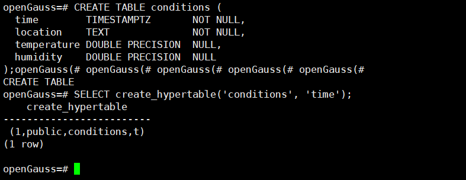  

### (2)插入和查询数据
```
INSERT INTO conditions(time, location, temperature, humidity)
  VALUES (NOW(), 'office', 70.0, 50.0);

SELECT * FROM conditions ORDER BY time DESC LIMIT 100;

SELECT time_bucket('15 minutes', time) AS fifteen_min,
    location, COUNT(*),
    MAX(temperature) AS max_temp,
    MAX(humidity) AS max_hum
  FROM conditions
  WHERE time > NOW() - interval '3 hours'
  GROUP BY fifteen_min, location
  ORDER BY fifteen_min DESC, max_temp DESC;
```
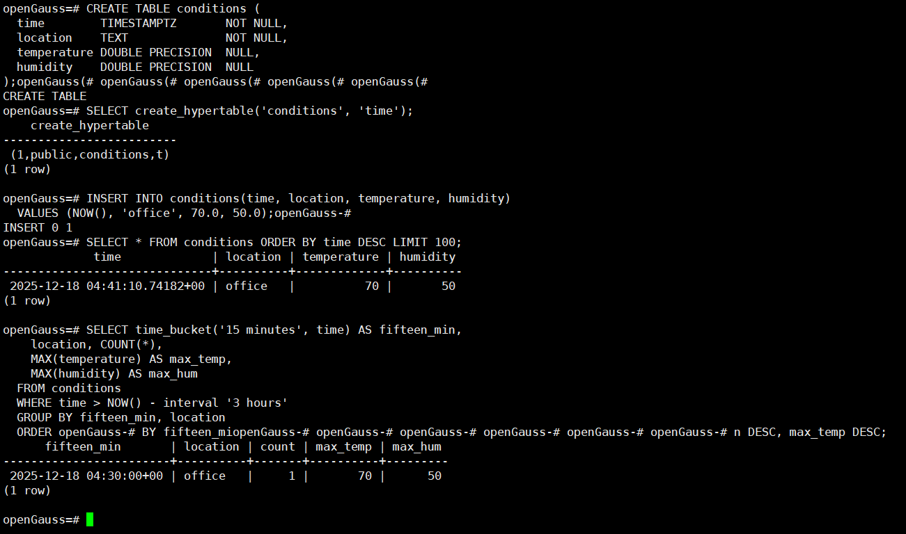  

## 测试结果：
TimescaleDB基本测试通过