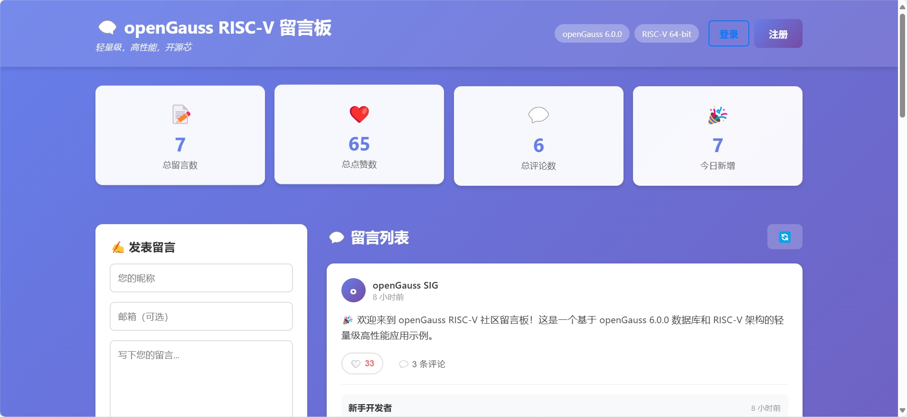

# openGauss RISC-V 社区留言板

> **Slogan**: 轻量级，高性能，开源芯 🚀

一个基于 openGauss 6.0.0-riscv64 的现代化社区留言板系统，支持用户注册、留言发表、评论互动等功能。

## ✨ 功能特性

- 🔐 **用户认证**: JWT令牌认证，支持注册登录
- 💬 **留言系统**: 发表留言，实时显示
- 💭 **评论功能**: 对留言进行评论互动
- 📊 **数据统计**: 实时统计留言和用户数据
- 📱 **响应式设计**: 支持桌面和移动端
- 🔧 **API文档**: 自动生成的API文档

## 界面截图

 

## 🏗️ 技术架构

### 后端技术栈
- **框架**: FastAPI (Python 3.11)
- **数据库**: openGauss 6.0.0-riscv64
- **ORM**: SQLAlchemy
- **认证**: JWT (JSON Web Tokens)
- **数据库驱动**: psycopg2-binary

### 前端技术栈
- **框架**: Vue 3 + Composition API
- **构建工具**: Vite
- **HTTP客户端**: Axios
- **UI组件**: 原生CSS + 响应式设计

### 部署技术栈
- **容器化**: Docker + Docker Compose
- **Web服务器**: Nginx
- **多架构支持**: qemu-user-static (x86_64运行RISC-V容器)

## 🚀 快速开始

### 本地开发

1. **克隆项目**
```bash
git clone <repository-url>
cd opengauss-riscv-messageboard
```

2. **启动服务**
```bash
# 一键启动
./start.sh

# 或手动启动
docker-compose up -d --build
```

3. **访问应用**
- 主页: http://localhost
- API文档: http://localhost/api/docs
- 健康检查: http://localhost/health


## 🔧 管理命令

### 查看服务状态
```bash
docker-compose ps
```

### 查看日志
```bash
# 查看所有服务日志
docker-compose logs

# 查看特定服务日志
docker-compose logs backend
docker-compose logs database
```

### 重启服务
```bash
docker-compose restart
```

### 停止服务
```bash
docker-compose down
```

### 清理数据
```bash
docker-compose down -v
docker system prune -f
```

## 🛠️ 故障排除

### 常见问题

#### 1. SASL认证错误
```
connection to server at "database" (172.26.0.2), port 5432 failed: 
none of the server's SASL authentication mechanisms are supported
```

**解决方案**: 
- 修改密码加密类型为MD5
- 重新创建数据库用户
- 应用数据库架构

#### 2. 架构不兼容错误
```
exec /bin/sh: exec format error
```

**解决方案**: 安装qemu-user-static支持
```bash
docker run --rm --privileged multiarch/qemu-user-static --reset -p yes
```

#### 3. 数据库连接失败
```bash
# 检查数据库状态
docker exec messageboard-db gsql -d postgres -c "SELECT 1;"

# 查看数据库日志
docker logs messageboard-db
```

#### 4. API服务异常
```bash
# 查看API日志
docker logs messageboard-api

# 检查健康状态
curl http://localhost/health
```

## 📊 项目结构

```
opengauss-riscv-messageboard/
├── backend/                 # 后端API服务
│   ├── main.py             # FastAPI应用主文件
│   ├── requirements.txt     # Python依赖
│   └── Dockerfile          # 后端容器配置
├── frontend/               # 前端Vue应用
│   ├── src/                # 源代码
│   ├── public/             # 静态资源
│   ├── package.json        # 依赖配置
│   └── Dockerfile          # 前端容器配置
├── init-db/                # 数据库初始化
│   ├── schema.sql          # 数据库架构
│   ├── data.sql            # 初始数据
│   ├── init.sh             # 初始化脚本
│   └── fix-auth.sh         # 认证修复脚本
├── docker-compose.yml      # Docker Compose配置
├── start.sh                # 本地启动脚本
├── deploy.sh               # 服务器部署脚本
├── deploy-to-server.sh     # 本地到服务器部署脚本
└── README.md               # 项目文档
```

## 🔒 安全配置

### 数据库安全
- 密码加密：MD5（兼容性最好）
- 用户权限：最小权限原则
- 连接安全：内网通信

### 应用安全
- JWT令牌认证
- CORS跨域配置
- 输入验证和过滤
- SQL注入防护

## 📈 性能优化

### 数据库优化
- 连接池配置：10个连接，最大20个溢出
- 索引优化：关键字段建立索引
- 查询优化：使用预编译语句

### 应用优化
- 静态资源缓存
- API响应压缩
- 健康检查机制
- 错误处理和重试

## 🌟 项目特色

### 技术亮点
- 🚀 **轻量级**: 最小化资源占用
- ⚡ **高性能**: 优化的数据库查询
- 🔧 **易部署**: 一键部署脚本
- 🛡️ **安全**: 多层安全防护
- 📱 **现代**: 响应式用户界面

### 创新点
- 首个基于openGauss RISC-V的留言板系统
- 支持x86_64服务器运行RISC-V容器
- 自动修复SASL认证问题
- 完整的用户认证和评论系统

## 📞 技术支持

### 问题反馈
- 查看日志: `docker-compose logs`
- 检查状态: `docker-compose ps`
- 重启服务: `docker-compose restart`

### 开发环境
- Python 3.11+
- Node.js 18+
- Docker 20.10+
- Docker Compose 2.0+

## 📄 许可证

本项目采用 MIT 许可证，详见 [LICENSE](LICENSE) 文件。

---

**openGauss RISC-V 社区留言板** - 轻量级，高性能，开源芯 🚀

## 🎯 快速开始

```bash
# 本地测试
./start.sh


