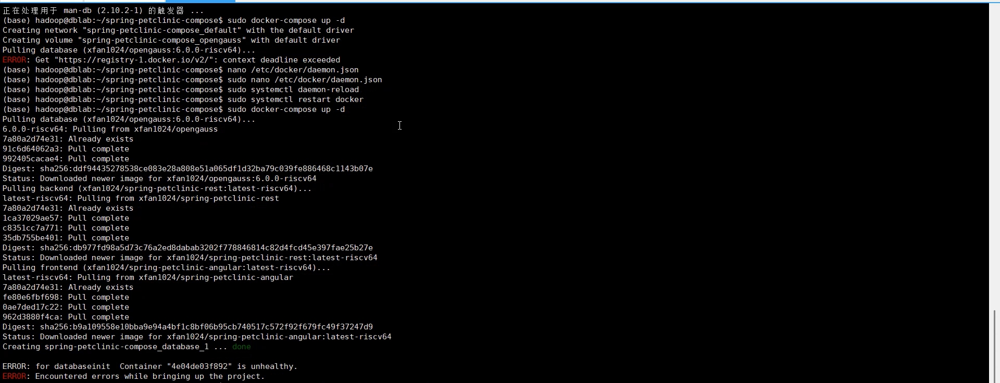
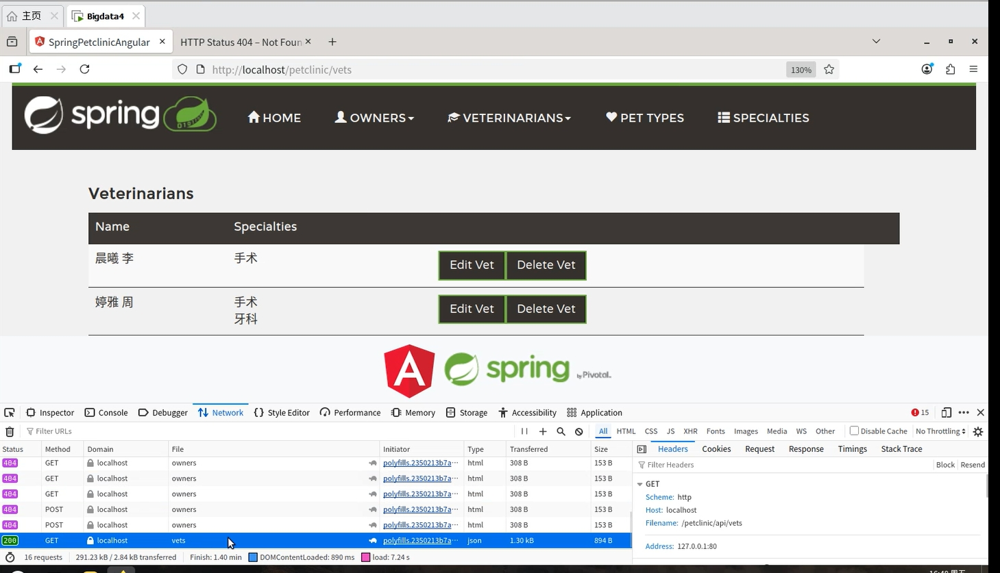
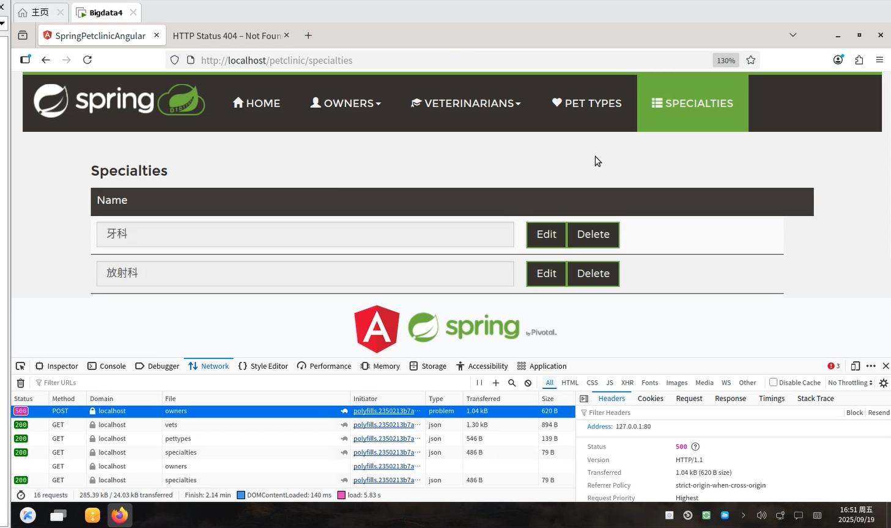
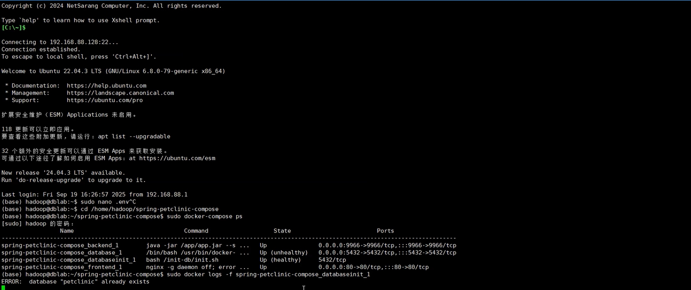

# x86-64 架构上使用 qemu-user-static 模拟 riscv64 架构完成spring-petclinic-compose的测试

## openGauss RISC-V 简介

openGauss RISC-V 是基于 openGauss 数据库系统，为国产开源指令集架构 RISC-V 平台适配和优化的版本。该版本致力于推动 openGauss 在多架构场景下的兼容性，完善国产软硬件协同生态，为自主可控数据库方案提供底层支撑。

openGauss是一款提供面向多核的极致性能、全链路的业务和数据安全，基于AI的调优和高效运维的能力，全面友好开放，携手伙伴共同打造全球领先的企业级开源关系型数据库，采用木兰宽松许可证v2发行。openGauss深度融合华为在数据库领域多年的研发经验，结合企业级场景需求，持续构建竞争力特性。

- #### 为什么要使用 openGauss RISC-V

  openGauss是一款支持SQL2003标准语法，支持主备部署的高可用关系型数据库。
  多种存储模式支持复合业务场景，新引入提供原地更新存储引擎。
  NUMA化数据结构支持高性能。
  Paxos一致性日志复制协议，主备模式，CRC校验支持高可用。
  支持全密态计算、账本数据库等安全特性，提供全方位端到端的数据安全保护。
  通过Table Access Method接口层支持多存储引擎。


## 一、操作步骤

### 环境要求

- #### git

  

- #### docker

  

- #### qemu
#### 应确保qemu-riscv64-static在命令行中可用。
##### 在ArchLinux中，确保包qemu-system-riscv、qemu-user-static已经安装
##### 在Debian中，确保包qemu-system-riscv、qemu-user-static已经安装（该包需要 Debian 13 Trixie）
-----


###  第零步 配置QEMU

> 对于直接使用riscv64架构的机器作为容器宿主机的用户，应考虑跳转至第一步

运行下述命令行以使用`multiarch/qemu-user-static`：

```bash
docker run --rm --privileged multiarch/qemu-user-static --reset -p yes 
```


### 第一步 容器配置

我们首先需要将spring-petclinic-compose的代码克隆到本地：

```bash
git clone https://gitee.com/xfan1024/spring-petclinic-compose
```

接着我们需要通过Docker构建一个用于编译该仓库中代码的容器：

```bash
cd spring-petclinic-compose # 切换到目标代码仓库的目录
cp .env.sample .env # 复制示例环境变量文件为正式配置文件 .env
docker-compose up -d # 以后台方式启动所有服务（数据库、初始化、后端、前端）
```
 

通过以上指令就成功启动了基于 OpenGauss 数据库的 Spring Boot + Angular 的宠物诊所示例项目。

**注：报错因为是测试环境使用的是qemu模拟的riscv64，数据库响应速度较慢导致unhealthy。**

如若拉取容器失败!

```
Error response from daemon: Get "https://registry-1.docker.io/v2/": net/http: request canceled while waiting for connection (Client.Timeout exceeded while awaiting headers)
```
则应修改创建或编辑 /etc/docker/daemon.json 配置文件：
```
{

 "registry-mirrors": [
   	 	"https://kr3cgcc9.mirror.aliyuncs.com",
    	"https://docker.rainbond.cc",
    	"https://do.nark.eu.org",
    	"https://dc.j8.work",
    	"https://docker.m.daocloud.io",
    	"https://dockerproxy.com",
    	"https://registry.docker-cn.com",
    	"https://docker.mirrors.ustc.edu.cn",
    	"https://hub-mirror.c.163.com",
   	 	"https://mirror.baidubce.com",
    	"https://docker.nju.edu.cn",
		"https://docker.1ms.run",
		"https://docker.xuanyuan.me",
		"https://dislabaiot.xyz",
		"https://hub.rat.dev",
		"https://doublezonline.cloud",
		"https://dislabaiot.xyz",
		"https://xdark.top",
		"https://04377491cb9d4b338d981991a9978a0c.mirror.swr.myhuaweicloud.com"
  ]
}
```
### 第二步 访问前端页面


```bash
在浏览器访问 http://localhost:80 即可进入前端页面
```
 


 


~~~bash
在终端输入 docker-compose ps
即可查看各个服务的运行状态，state为up(healthy)即正常运行，database_1状态为unhealthy主要是qemu模拟的riscv64响应速度较慢，
~~~

 
### 结论：成功在x86-64 架构上使用 qemu-user-static 模拟 riscv64 架构完成spring-petclinic-compose的测试，使用qemu运行该项目效果不是很理想。
#### 


### 


